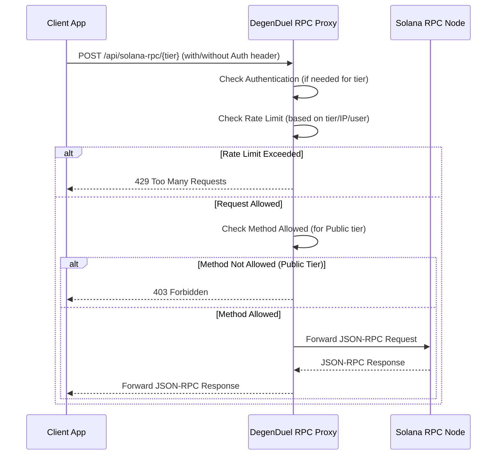
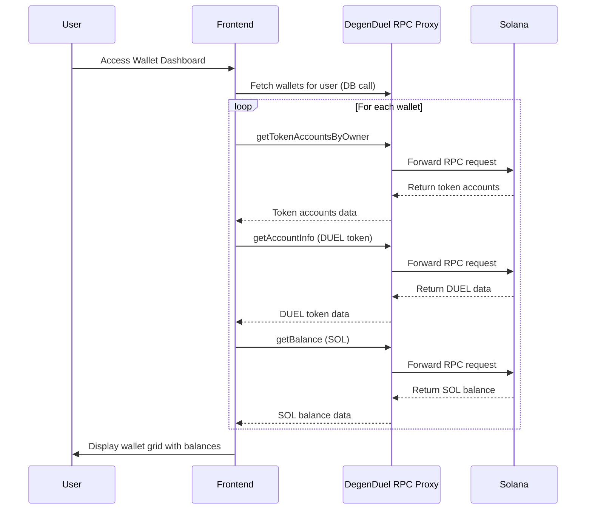
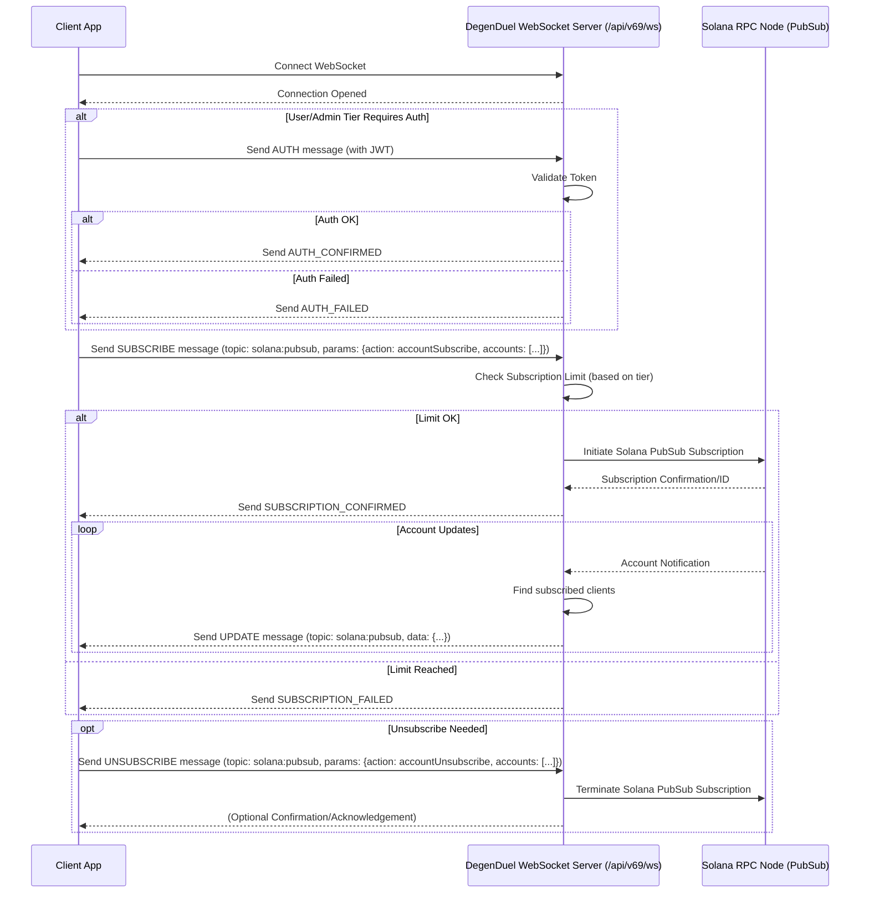

# DegenDuel RPC Proxy: Team Integration Guide
**Author:** BranchManager69
**Version:** 1.9.0
**Created:** 2025-04-28
**Updated:** 2025-04-30

---

## 1. Introduction

### 1.1 What is the DegenDuel RPC Proxy?  
The DegenDuel RPC Proxy is a secure gateway provided by the DegenDuel platform that allows client applications (frontend, bots, or other services) to interact with the Solana blockchain. It acts as an intermediary, forwarding your requests to our underlying Solana RPC nodes.

### 1.2 Why Use the Proxy?  
- **Security:** No need to manage or expose sensitive RPC node URLs or API keys in client-side code.  
- **Reliability:** Leverages DegenDuel's robust infrastructure and connection management.  
- **Rate Limiting:** Protects the underlying infrastructure and provides predictable access tiers.  
- **Simplicity:** Standardized endpoints for Solana interactions within the DegenDuel ecosystem.  
- **Observability:** Enables the DegenDuel team to monitor usage and troubleshoot issues effectively.  

### 1.3 High-Level Architecture

```mermaid
graph LR
    A[Client App (Frontend/Bot)] -- HTTPS/WSS Request --> B(DegenDuel RPC Proxy);
    B -- Processed RPC Request --> C[Solana RPC Node];
    C -- RPC Response --> B;
    B -- Proxied Response --> A;
```

---

## 2. Core Concepts: Access Tiers  

The proxy uses a tiered access system to manage usage and security. The tier determines your rate limits and allowed methods.

| Tier    | How to Access           | Authentication             | Rate Limit   | Max WS Subscriptions | Use Case                                          |
| :------ | :-----------------------| :------------------------- | :----------- | :------------------- | :------------------------------------------------ |
| Public  | `/public` endpoint      | None                       | 10 req/min   | 5 accounts           | Anonymous users, basic read-only operations       |
| User    | main endpoint           | DegenDuel JWT Token        | 120 req/min  | 10 accounts          | Logged-in DegenDuel users, standard usage         |
| Admin   | `/admin` endpoint       | DegenDuel JWT (Admin role) | 1000 req/min | 1000 accounts        | Internal tools, high-frequency operations         |

> **JWT Token:** Obtained through the standard DegenDuel authentication flow. The frontend is responsible for storing and providing this token securely.

---

## 3. HTTP RPC Proxy Integration  

Use this for standard Solana JSON-RPC calls (sending transactions, getting balances, fetching account data, etc.).

### 3.1 HTTP Request Flow Diagram



### 3.2 Endpoints  
- **Public Tier:**  
  ```http
  POST /api/solana-rpc/public
  ```  
- **User Tier:**  
  ```http
  POST /api/solana-rpc
  ```  
- **Admin Tier:**  
  ```http
  POST /api/solana-rpc/admin
  ```

### 3.3 Authentication  
- **Public:** No authentication needed.  
- **User/Admin:** Requires a valid DegenDuel JWT token passed in the `Authorization` header.

### 3.4 Request Format  
- **Method:** POST  
- **Headers:**  
  ```
  Content-Type: application/json
  Authorization: Bearer <token>   (for User/Admin tiers)
  ```  
- **Body:** A JSON-RPC 2.0 object:
  ```json
  {
    "jsonrpc": "2.0",
    "id": "<unique-request-id>",
    "method": "<solana-method-name>",
    "params": [ /* method parameters */ ]
  }
  ```

### 3.5 Response Format  
- **Success:**
  ```json
  {
    "jsonrpc": "2.0",
    "id": "<same-id-as-request>",
    "result": { /* method result */ }
  }
  ```  
- **Error:**
  ```json
  {
    "jsonrpc": "2.0",
    "id": "<same-id-as-request>",
    "error": {
      "code": <error-code>,
      "message": "<error-message>"
    }
  }
  ```

### 3.5 Public Tier Method Restrictions  
The Public tier (`/api/solana-rpc/public`) only allows a subset of safe, read-only methods. Attempting to call others returns **403 Forbidden**.  
**Allowed methods include** (but aren't limited to):  
```
getLatestBlockhash
getBalance
getAccountInfo
getTokenAccountsByOwner
getTokenAccountBalance
getSignatureStatuses
getBlockHeight
getSlot
getHealthStatus
getVersion
```  
For the definitive list, see the `/api/solana-rpc/info` endpoint or the `routes/solana-rpc-proxy.js` implementation.

### 3.6 Example (User Tier - Get Balance)  
```bash
curl -X POST https://<your-domain>/api/solana-rpc   -H "Content-Type: application/json"   -H "Authorization: Bearer <token>"   -d '{
    "jsonrpc": "2.0",
    "id": 1,
    "method": "getBalance",
    "params": ["<PublicKey>"]
  }'
```

### 3.7 Common Uses and Method Examples

Here are the most common use cases and Solana RPC methods your application might need. Examples are organized by tier based on typical usage patterns.

#### Public Tier Methods (Unauthenticated Access)

| Method | Description | Common Use Case | Example Params |
|--------|-------------|-----------------|----------------|
| `getBalance` | Get SOL balance of an address | Display a wallet's SOL balance | `["wallet_address"]` |
| `getTokenAccountsByOwner` | Find all token accounts owned by an address | Display a user's token holdings | `["wallet_address", { "programId": "TokenkegQfeZyiNwAJbNbGKPFXCWuBvf9Ss623VQ5DA" }]` |
| `getTokenAccountBalance` | Get a specific token's balance | Display a specific token's balance | `["token_account_address"]` |
| `getLatestBlockhash` | Get recent blockhash for transaction construction | Prepare transaction metadata | `[]` or `["finalized"]` |
| `getSlot` | Get current slot number | Display network status | `[]` |
| `getVersion` | Get Solana node version | Display network status | `[]` |
| `getAccountInfo` | Get account data | Display NFT/token metadata | `["account_address"]` |

**Example - Get SOL Price via Token Accounts:**
```javascript
// Get USDC/SOL token accounts from a popular liquidity pool 
// to approximate the SOL price in USDC
async function getApproximateSOLPrice() {
  const response = await fetch('/api/solana-rpc/public', {
    method: 'POST',
    headers: { 'Content-Type': 'application/json' },
    body: JSON.stringify({
      jsonrpc: '2.0',
      id: 'sol-price-check',
      method: 'getAccountInfo',
      params: [
        // Popular SOL/USDC pool account (example)
        'SwaPpA9LAaLfeLi3a68M4DjnLqgtticKg6CnyNwgAC8',
        { encoding: 'base64' }
      ]
    })
  });
  
  const result = await response.json();
  // Process account data to extract price information
  // This is simplified - actual implementation would decode the account data
  // console.log(result.result.value.data);
  
  return 'XX.XX'; // Actual extraction would return real price
}
```

#### User Tier Methods (Authenticated Users)

All Public tier methods, plus:

| Method | Description | Common Use Case | Example Params |
|--------|-------------|-----------------|----------------|
| `sendTransaction` | Send signed transaction | Submit trading transactions | `["encoded_transaction", { skipPreflight: false }]` |
| `getSignatureStatuses` | Check transaction confirmation | Confirm transaction success | `[["signature1", "signature2"]]` |
| `simulateTransaction` | Simulate a transaction without submitting | Validate transaction will succeed | `["encoded_transaction"]` |
| `getParsedTokenAccountsByOwner` | Get token accounts with parsed data | Show detailed token balances with metadata | `["wallet_address", { "programId": "TokenkegQfeZyiNwAJbNbGKPFXCWuBvf9Ss623VQ5DA" }, { "encoding": "jsonParsed" }]` |

**Example - Send Transaction (Trading Context):**
```javascript
async function submitTradeTransaction(signedTransaction, jwtToken) {
  const encodedTransaction = signedTransaction.serialize().toString('base64');
  
  const response = await fetch('/api/solana-rpc', {
    method: 'POST',
    headers: {
      'Content-Type': 'application/json',
      'Authorization': `Bearer ${jwtToken}`
    },
    body: JSON.stringify({
      jsonrpc: '2.0',
      id: 'trade-tx',
      method: 'sendTransaction',
      params: [encodedTransaction, { skipPreflight: false }]
    })
  });
  
  const result = await response.json();
  
  if (result.error) {
    console.error('Trade failed:', result.error.message);
    return null;
  }
  
  // Return transaction signature
  return result.result;
}

// Check transaction status
async function checkTransactionStatus(signature, jwtToken) {
  const response = await fetch('/api/solana-rpc', {
    method: 'POST',
    headers: {
      'Content-Type': 'application/json',
      'Authorization': `Bearer ${jwtToken}`
    },
    body: JSON.stringify({
      jsonrpc: '2.0',
      id: 'tx-status',
      method: 'getSignatureStatuses',
      params: [[signature]]
    })
  });
  
  const result = await response.json();
  return result?.result?.value?.[0]?.confirmationStatus || 'unknown';
}
```

#### Admin Tier Methods (Advanced Use Cases)

All User tier methods, plus:

| Method | Description | Common Use Case | Example Params |
|--------|-------------|-----------------|----------------|
| `getProgramAccounts` | Get all accounts owned by a program | Advanced data indexing | `["program_id", { filters: [...] }]` |
| `getMultipleAccounts` | Get multiple accounts in one call | Batch data fetching | `[["addr1", "addr2", ...]]` |
| `getBlockProduction` | Get block production information | Monitoring/analytics | `[]` |
| `getInflationReward` | Get inflation rewards data | Staking analytics | `[["stake1", "stake2"], { epoch: 123 }]` |

**Example - Batch Account Fetching:**
```javascript
async function getMultipleTokenPrices(tokenAddresses, adminToken) {
  // Fetch multiple accounts in one call (more efficient)
  const response = await fetch('/api/solana-rpc/admin', {
    method: 'POST',
    headers: {
      'Content-Type': 'application/json',
      'Authorization': `Bearer ${adminToken}`
    },
    body: JSON.stringify({
      jsonrpc: '2.0',
      id: 'batch-tokens',
      method: 'getMultipleAccounts',
      params: [tokenAddresses, { encoding: 'jsonParsed' }]
    })
  });
  
  const result = await response.json();
  // Process multiple accounts in one response
  return result.result.value;
}
```

### 3.8 Real-World Scenarios

Here are some common real-world scenarios your frontend might implement:

1. **Display Token Balances & Prices**
   * Use `getTokenAccountsByOwner` (Public tier)
   * Use `getAccountInfo` on pool accounts to derive prices

2. **Portfolio Tracking**
   * Use `getTokenAccountsByOwner` + token price data
   * Store/display user token holdings and values

3. **Transaction Submission & Monitoring** 
   * Use `getLatestBlockhash` → create transaction → `sendTransaction` (User tier)
   * Track with `getSignatureStatuses` until confirmed

4. **Token/NFT Metadata Display**
   * Use `getAccountInfo` on metadata accounts (Public tier)
   * Parse token metadata from account data  

5. **Market/Price Monitoring**
   * Use Public tier methods on DEX pools
   * Calculate prices based on pool token ratios

### 3.9 Core DegenDuel Use Case: Multi-Wallet Management & DUEL Token Swaps

This section outlines the specific RPC calls needed to implement the DegenDuel multi-wallet management view, where users (and admins) can view and manage multiple wallets and perform token swaps between SOL and DUEL tokens.

#### Wallet Dashboard Data Flow



#### 1. Fetching Multiple Wallet Balances Efficiently

For a dashboard displaying up to 200 wallets per user, optimizing RPC requests is critical. Here's how to fetch SOL and DUEL token balances for multiple wallets efficiently:

```javascript
/**
 * Fetches SOL and DUEL token balances for multiple wallets
 * Optimized to minimize RPC calls when dealing with many wallets
 * 
 * @param {string[]} walletAddresses - Array of wallet public keys to fetch
 * @param {string} jwtToken - User's authentication token
 * @param {string} duelTokenMint - DUEL token mint address
 * @returns {Promise<Array>} Array of wallet data with balances
 */
async function fetchMultipleWalletBalances(walletAddresses, jwtToken, duelTokenMint) {
  // Step 1: Break wallets into batches to avoid overwhelming the RPC
  const BATCH_SIZE = 25; // Adjust based on performance testing
  const walletBatches = [];
  
  for (let i = 0; i < walletAddresses.length; i += BATCH_SIZE) {
    walletBatches.push(walletAddresses.slice(i, i + BATCH_SIZE));
  }
  
  // Step 2: Process each batch
  const allWalletData = [];
  
  for (const batch of walletBatches) {
    // Create promises for parallel execution within each batch
    const batchPromises = batch.map(async (walletAddress) => {
      try {
        // Fetch SOL balance
        const solBalanceResponse = await fetch('/api/solana-rpc', {
          method: 'POST',
          headers: {
            'Content-Type': 'application/json',
            'Authorization': `Bearer ${jwtToken}`
          },
          body: JSON.stringify({
            jsonrpc: '2.0',
            id: `sol-balance-${walletAddress}`,
            method: 'getBalance',
            params: [walletAddress]
          })
        });
        
        const solBalanceResult = await solBalanceResponse.json();
        const solBalanceLamports = solBalanceResult.result?.value || 0;
        const solBalance = solBalanceLamports / 1_000_000_000; // Convert lamports to SOL
        
        // Fetch all token accounts owned by this wallet (to find DUEL tokens)
        const tokenAccountsResponse = await fetch('/api/solana-rpc', {
          method: 'POST',
          headers: {
            'Content-Type': 'application/json',
            'Authorization': `Bearer ${jwtToken}`
          },
          body: JSON.stringify({
            jsonrpc: '2.0',
            id: `token-accounts-${walletAddress}`,
            method: 'getTokenAccountsByOwner',
            params: [
              walletAddress,
              {
                programId: 'TokenkegQfeZyiNwAJbNbGKPFXCWuBvf9Ss623VQ5DA' // SPL Token Program ID
              },
              {
                encoding: 'jsonParsed'
              }
            ]
          })
        });
        
        const tokenAccountsResult = await tokenAccountsResponse.json();
        const tokenAccounts = tokenAccountsResult.result?.value || [];
        
        // Find DUEL token account
        let duelBalance = 0;
        let duelTokenAccount = null;
        
        for (const account of tokenAccounts) {
          try {
            const mintAddress = account.account.data.parsed.info.mint;
            if (mintAddress === duelTokenMint) {
              duelTokenAccount = account.pubkey;
              duelBalance = parseFloat(account.account.data.parsed.info.tokenAmount.uiAmount);
              break;
            }
          } catch (err) {
            console.error('Error parsing token account:', err);
          }
        }
        
        return {
          walletAddress,
          solBalance,
          duelBalance,
          duelTokenAccount,
          hasTokenAccount: duelTokenAccount !== null,
          tokenAccounts: tokenAccounts.length
        };
      } catch (error) {
        console.error(`Error fetching data for wallet ${walletAddress}:`, error);
        return {
          walletAddress,
          solBalance: 0,
          duelBalance: 0,
          duelTokenAccount: null,
          hasTokenAccount: false,
          error: error.message
        };
      }
    });
    
    // Execute all promises for this batch in parallel
    const batchResults = await Promise.all(batchPromises);
    allWalletData.push(...batchResults);
    
    // Optional: Add small delay between batches to avoid rate limiting
    if (walletBatches.length > 1) {
      await new Promise(resolve => setTimeout(resolve, 200));
    }
  }
  
  return allWalletData;
}
```

#### 2. Executing DUEL Token Swaps

Once users have selected a wallet from the grid, they can perform swaps between SOL and DUEL tokens. Here's how to implement the swap functionality:

```javascript
/**
 * Swap SOL to DUEL tokens
 * 
 * @param {string} walletAddress - Public key of wallet to perform swap from
 * @param {string} privateKey - Private key if client-side signing or null if using wallet adapter
 * @param {number} solAmount - Amount of SOL to swap
 * @param {string} jwtToken - User's authentication token
 * @param {string} duelTokenMint - DUEL token mint address
 * @returns {Promise<Object>} Transaction result
 */
async function swapSolToDuel(walletAddress, privateKey, solAmount, jwtToken, duelTokenMint) {
  try {
    // Step 1: Get the latest blockhash
    const blockhashResponse = await fetch('/api/solana-rpc', {
      method: 'POST',
      headers: {
        'Content-Type': 'application/json',
        'Authorization': `Bearer ${jwtToken}`
      },
      body: JSON.stringify({
        jsonrpc: '2.0',
        id: 'get-blockhash',
        method: 'getLatestBlockhash',
        params: []
      })
    });
    
    const blockhashResult = await blockhashResponse.json();
    const blockhash = blockhashResult.result.value.blockhash;
    
    // Step 2: Check if user has DUEL token account, if not, create one
    // This step is simplified as we'd normally use the Jupiter API or our own swap program
    // In practice, you would call your specific swap implementation here
    
    // Step 3: Create and submit the transaction
    // This example assumes you're using the Solana Web3.js library client-side
    /* 
    const transaction = new Transaction({
      feePayer: new PublicKey(walletAddress),
      recentBlockhash: blockhash
    });
    
    // Add swap instructions here based on your specific swap implementation
    // Example: transaction.add(swapInstruction(fromTokenAccount, toTokenAccount, ...));
    
    // Sign transaction (either client-side or via wallet adapter)
    let signedTransaction;
    if (privateKey) {
      // Sign with provided private key
      const signer = Keypair.fromSecretKey(bs58.decode(privateKey));
      signedTransaction = await transaction.sign(signer);
    } else {
      // Sign with wallet adapter (client-side)
      signedTransaction = await wallet.signTransaction(transaction);
    }
    
    // Serialize the signed transaction
    const serializedTransaction = signedTransaction.serialize();
    const encodedTransaction = Buffer.from(serializedTransaction).toString('base64');
    */
    
    // For this example, we're using a placeholder transaction
    const encodedTransaction = 'ENCODED_TRANSACTION_PLACEHOLDER';
    
    // Step 4: Send the signed transaction
    const sendResponse = await fetch('/api/solana-rpc', {
      method: 'POST',
      headers: {
        'Content-Type': 'application/json',
        'Authorization': `Bearer ${jwtToken}`
      },
      body: JSON.stringify({
        jsonrpc: '2.0',
        id: 'send-swap-transaction',
        method: 'sendTransaction',
        params: [encodedTransaction, { skipPreflight: false }]
      })
    });
    
    const sendResult = await sendResponse.json();
    
    if (sendResult.error) {
      throw new Error(`Swap transaction failed: ${sendResult.error.message}`);
    }
    
    const signature = sendResult.result;
    
    // Step 5: Monitor transaction status
    const statusPromise = new Promise((resolve, reject) => {
      const checkStatus = async () => {
        try {
          const statusResponse = await fetch('/api/solana-rpc', {
            method: 'POST',
            headers: {
              'Content-Type': 'application/json',
              'Authorization': `Bearer ${jwtToken}`
            },
            body: JSON.stringify({
              jsonrpc: '2.0',
              id: 'check-status',
              method: 'getSignatureStatuses',
              params: [[signature]]
            })
          });
          
          const statusResult = await statusResponse.json();
          const status = statusResult.result.value[0];
          
          if (!status) {
            // Transaction not found yet, retry
            setTimeout(checkStatus, 1000);
            return;
          }
          
          if (status.err) {
            reject(new Error(`Transaction failed: ${JSON.stringify(status.err)}`));
            return;
          }
          
          if (status.confirmationStatus === 'confirmed' || status.confirmationStatus === 'finalized') {
            resolve({
              signature,
              status: status.confirmationStatus,
              slot: status.slot
            });
            return;
          }
          
          // Still pending, check again
          setTimeout(checkStatus, 1000);
        } catch (error) {
          reject(error);
        }
      };
      
      // Start checking status
      checkStatus();
    });
    
    return await statusPromise;
  } catch (error) {
    console.error('Error during SOL to DUEL swap:', error);
    throw error;
  }
}

/**
 * Swap DUEL tokens to SOL
 * Similar implementation to swapSolToDuel but in reverse
 */
async function swapDuelToSol(walletAddress, privateKey, duelAmount, jwtToken, duelTokenMint) {
  // Implementation similar to swapSolToDuel but with token accounts reversed
  // ...
}
```

#### 3. Admin Multi-Wallet View Implementation

For SuperAdmin users who need to access and manage all user wallets:

```javascript
/**
 * Fetch all user wallets for admin view
 * SuperAdmin function to get wallets across all users
 * 
 * @param {string} adminJwtToken - Admin's authentication token
 * @param {number} page - Page number for pagination
 * @param {number} limit - Number of wallets per page
 * @param {string} sortBy - Field to sort by
 * @returns {Promise<Object>} Paginated wallet data with balances
 */
async function fetchAllUserWalletsForAdmin(adminJwtToken, page = 1, limit = 50, sortBy = 'username') {
  try {
    // Step 1: Fetch wallet data from your database
    // This would be a custom API endpoint, not an RPC call
    const walletsResponse = await fetch('/api/admin/wallets', {
      method: 'GET',
      headers: {
        'Authorization': `Bearer ${adminJwtToken}`
      },
      params: { page, limit, sortBy }
    });
    
    if (!walletsResponse.ok) {
      throw new Error(`Failed to fetch wallets: ${walletsResponse.statusText}`);
    }
    
    const walletsData = await walletsResponse.json();
    
    // Step 2: Extract just the wallet addresses for balance fetching
    const walletAddresses = walletsData.wallets.map(wallet => wallet.address);
    
    // Step 3: Use the same function from above to fetch balances
    const duelTokenMint = 'YOUR_DUEL_TOKEN_MINT_ADDRESS';
    const walletBalances = await fetchMultipleWalletBalances(walletAddresses, adminJwtToken, duelTokenMint);
    
    // Step 4: Merge the wallet data with the balance data
    const enrichedWallets = walletsData.wallets.map(wallet => {
      const balanceData = walletBalances.find(b => b.walletAddress === wallet.address) || {
        solBalance: 0,
        duelBalance: 0,
        hasTokenAccount: false
      };
      
      return {
        ...wallet,
        ...balanceData
      };
    });
    
    return {
      wallets: enrichedWallets,
      pagination: walletsData.pagination
    };
  } catch (error) {
    console.error('Error fetching admin wallet view:', error);
    throw error;
  }
}

/**
 * Perform swap as admin on behalf of a user
 * 
 * @param {string} walletAddress - The wallet address to perform swap for
 * @param {string} adminJwtToken - Admin's authentication token
 * @param {number} amount - Amount to swap
 * @param {string} direction - 'sol_to_duel' or 'duel_to_sol'
 * @returns {Promise<Object>} Transaction result
 */
async function performAdminSwap(walletAddress, adminJwtToken, amount, direction) {
  try {
    // This endpoint would handle all the transaction building and signing 
    // server-side using admin's master key
    const swapResponse = await fetch('/api/admin/wallets/swap', {
      method: 'POST',
      headers: {
        'Content-Type': 'application/json',
        'Authorization': `Bearer ${adminJwtToken}`
      },
      body: JSON.stringify({
        walletAddress,
        amount,
        direction
      })
    });
    
    if (!swapResponse.ok) {
      const errorData = await swapResponse.json();
      throw new Error(errorData.message || 'Admin swap failed');
    }
    
    return await swapResponse.json();
  } catch (error) {
    console.error('Error during admin swap operation:', error);
    throw error;
  }
}
```

#### 4. WebSocket Updates for Real-time Wallet Balance Changes

To keep the wallet grid updated in real-time without constant RPC polling:

```javascript
/**
 * Set up WebSocket listeners for wallet balance updates
 * 
 * @param {string[]} walletAddresses - Array of wallet addresses to monitor
 * @param {string} jwtToken - User's authentication token
 * @param {Function} updateCallback - Function to call when balances change
 * @returns {WebSocket} The WebSocket connection
 */
function setupWalletBalanceWebSocket(walletAddresses, jwtToken, updateCallback) {
  // Connect to the DegenDuel WebSocket endpoint
  const ws = new WebSocket(`wss://${window.location.host}/api/v69/ws`);
  
  ws.onopen = () => {
    console.log('WebSocket connected for wallet monitoring');
    
    // Authenticate with JWT token
    ws.send(JSON.stringify({
      type: 'AUTH',
      token: jwtToken
    }));
  };
  
  ws.onmessage = (event) => {
    const message = JSON.parse(event.data);
    
    // Handle authentication confirmation
    if (message.type === 'AUTH_CONFIRMED') {
      console.log('WebSocket authenticated, subscribing to wallets');
      
      // Subscribe to all wallet addresses
      ws.send(JSON.stringify({
        type: 'SUBSCRIBE',
        topic: 'solana:pubsub',
        params: {
          action: 'accountSubscribe',
          accounts: walletAddresses
        }
      }));
    }
    
    // Handle subscription confirmation
    if (message.topic === 'solana:pubsub' && message.type === 'SUBSCRIPTION_CONFIRMED') {
      console.log('Successfully subscribed to wallet accounts:', message.data.accounts);
    }
    
    // Handle account updates
    if (message.topic === 'solana:pubsub' && message.type === 'UPDATE') {
      // Parse the account data and determine if it's SOL or a token account
      const accountData = message.data;
      const walletAddress = message.account; // The address that changed
      
      // Call the callback function with the updated data
      updateCallback(walletAddress, accountData);
    }
  };
  
  ws.onerror = (error) => {
    console.error('WebSocket error:', error);
  };
  
  ws.onclose = () => {
    console.log('WebSocket closed for wallet monitoring');
    // Implement reconnection logic here
  };
  
  return ws;
}
```

#### 5. Performance Considerations for the Multi-Wallet Grid

When working with a large number of wallets (up to 200), consider these optimizations:

1. **Pagination & Virtualization:**
   - Implement client-side pagination or virtualized lists to only render visible wallets
   - Load wallet data in batches (25-50 at a time) as user scrolls

2. **Caching Strategy:**
   - Cache wallet data client-side with a refresh interval
   - Implement a service worker to manage wallet data caching

3. **Parallel RPC Requests:**
   - Use batching as shown in the examples above
   - Prioritize visible wallets in the grid first

4. **WebSocket Optimizations:**
   - Only subscribe to wallets currently visible on screen
   - Implement a subscription manager that adjusts subscriptions as user scrolls

5. **Efficient Re-rendering:**
   - Use React memo or similar to prevent unnecessary re-renders
   - Consider using React virtualized or window for efficient large list rendering
   
---

## 4. WebSocket PubSub Proxy Integration

Use this for subscribing to real-time Solana account changes.

### 4.1 WebSocket Connection & Subscription Flow Diagram



### 4.2 Endpoint  
```text
wss://<your_domain_name>/api/v69/ws
```  
Replace `<your_domain_name>` with e.g. `degenduel.me` or `dev.degenduel.me`.

### 4.3 Authentication  
After the WebSocket connection is open, send an `AUTH` message if required:  
- **Public Tier:** No `AUTH` needed.  
- **User/Admin Tiers:**  
  ```json
  { "type": "AUTH", "token": "<JWT-token>" }
  ```  
  Wait for an `AUTH_CONFIRMED` before subscribing; handle `AUTH_FAILED` appropriately.

### 4.4 Subscribing to Accounts  
- **Request:**
  ```json
  {
    "type": "SUBSCRIBE",
    "topic": "solana:pubsub",
    "address": "<PublicKey>"
  }
  ```  
- **Confirmation:** Server replies with `SUBSCRIPTION_CONFIRMED` or `SUBSCRIPTION_FAILED`.  
- **Limits:** Constrained per tier (see Section 2). Exceeding your limit → `SUBSCRIPTION_FAILED`.

### 4.5 Unsubscribing  
- **Request:**
  ```json
  {
    "type": "UNSUBSCRIBE",
    "topic": "solana:pubsub",
    "address": "<PublicKey>"
  }
  ```

### 4.6 Handling Incoming Messages  
Listen for messages where `topic: "solana:pubsub"`; payloads contain account updates.  

### 4.7 Example (User Tier - Subscribe to Account)  
```js
ws.send(JSON.stringify({
  type: "SUBSCRIBE",
  topic: "solana:pubsub",
  address: "YourPublicKeyHere"
}));
```

---

## 5. Best Practices & Implementation Notes

- **Choose the Right Tier:**  
  - Public: only for unauthenticated, read-only use.  
  - User: preferred for logged-in users.  

- **Rate Limit Handling:**  
  Implement exponential backoff on **429 Too Many Requests**, notify users if persistent.

- **Error Handling:**  
  Check both HTTP status and JSON-RPC errors; handle `AUTH_FAILED`, `SUBSCRIPTION_FAILED`, and general WebSocket errors.

- **JWT Management:**  
  Securely store & refresh tokens client-side per DegenDuel auth flow.

- **Info Endpoint:**  
  Use `GET /api/solana-rpc/info` for runtime tier & rate-limit data.

- **WebSocket Lifecycle:**  
  Implement reconnection with backoff on `onerror`/`onclose`; clean up subscriptions when no longer needed.

- **Environment Configuration:**  
  Point your app to the correct base URL (e.g., `https://degenduel.me` or `https://dev.degenduel.me`).

---

## 6. Troubleshooting Common Errors

| Error                              | Cause                                                 | Resolution                                      |
| ---------------------------------- | ----------------------------------------------------- | ----------------------------------------------- |
| **401 Unauthorized (HTTP)**        | Missing/invalid/expired JWT (User/Admin tiers)        | Re-authenticate user.                           |
| **403 Forbidden (HTTP)**           | Invalid method on Public tier or no admin privileges  | Check endpoint & permissions.                   |
| **429 Too Many Requests (HTTP)**   | Rate limit exceeded                                   | Backoff & retry or notify user.                 |
| **5xx Server Error (HTTP)**        | Proxy or Solana node issue                            | Retry later; report persistent issues.          |
| **AUTH_FAILED (WebSocket)**        | Invalid/expired JWT in `AUTH` message                 | Re-authenticate & resend `AUTH`.                |
| **SUBSCRIPTION_FAILED (WebSocket)**| Exceeded subscription limit or invalid address        | Check limits & params; report if needed.        |
| **WebSocket Disconnects**          | Network issues, server restarts, idle timeouts        | Auto-reconnect with backoff.                    |

---

## 7. Further Information

For in-depth details on the proxy implementation, see the internal documentation:  
```
SOLANA_RPC_PROXY.md
```  

## 8. RPC Proxy Logging and Monitoring

When clients interact with the DegenDuel RPC Proxy, the system generates comprehensive logs for monitoring, debugging, and security purposes. Understanding these logs is essential for troubleshooting issues and optimizing performance.

### 8.1 Log Sources and Locations

The RPC Proxy generates logs in multiple locations:

| Log Type | Location | Description | Access Method |
|----------|----------|-------------|--------------|
| **System Logs** | `/home/branchmanager/.pm2/logs/degenduel-api-out.log` | Standard output logs (info, debug) | `tail -f /home/branchmanager/.pm2/logs/degenduel-api-out.log` |
| **Error Logs** | `/home/branchmanager/.pm2/logs/degenduel-api-error.log` | Error-level logs only | `tail -f /home/branchmanager/.pm2/logs/degenduel-api-error.log` |
| **RPC-Specific Logs** | `/home/branchmanager/websites/degenduel/logs/rpc-proxy/` | Detailed RPC-specific logs (CSV format) | `tail -f /home/branchmanager/websites/degenduel/logs/rpc-proxy/rpc-YYYY-MM-DD.log` |
| **Remote Logs** | Logtail Dashboard | Aggregated logs from all sources | Access via Logtail web interface |
| **Admin Logs** | PostgreSQL Database | Special admin actions (in `admin_logs` table) | Access via admin panel or database query |

### 8.2 Log Format and Structure

#### Standard Log Format

RPC-related logs use the following format in the standard output logs:

```
[2025-04-30T12:34:56.789Z] [solana-rpc-proxy] [INFO] Client 194.xx.xx.xx requested 'getBalance' (tier: public) [reqId: abc123]
```

#### Error Log Format

Error logs include additional context:

```
[2025-04-30T12:34:56.789Z] [solana-rpc-proxy] [ERROR] Failed to process RPC request: Method not allowed in public tier [method: getProgramAccounts, tier: public, client: 194.xx.xx.xx, reqId: abc123]
[2025-04-30T12:34:56.789Z] [solana-rpc-proxy] [ERROR] RPC request failed with Solana error: -32000 Transaction simulation failed: Error processing Instruction 0: custom program error: 0x1 [method: sendTransaction, client: 194.xx.xx.xx, reqId: def456]
```

#### Detailed RPC Log Structure (CSV)

The detailed CSV logs contain:

```
timestamp,req_id,client_ip,user_id,tier,method,params_hash,status_code,error_code,response_time_ms,rate_limited
2025-04-30T12:34:56.789Z,abc123,194.xx.xx.xx,null,public,getBalance,5a7f8d...,200,null,45,false
2025-04-30T12:34:57.123Z,def456,194.xx.xx.xx,user_23,user,sendTransaction,7b9c1e...,500,-32000,78,false
2025-04-30T12:35:01.456Z,ghi789,194.xx.xx.xx,null,public,getAccountInfo,3f2e1d...,429,null,5,true
```

### 8.3 Common Error Patterns

#### Authentication Errors

```
[ERROR] JWT validation failed: Token expired [client: 194.xx.xx.xx, reqId: jkl012]
[ERROR] Invalid Authorization header format [client: 194.xx.xx.xx, reqId: mno345]
```

#### Rate Limiting Errors

```
[ERROR] Rate limit exceeded for public tier [client: 194.xx.xx.xx, tier: public, method: getBalance, reqId: pqr678]
[ERROR] Too many active WebSocket subscriptions [client: 194.xx.xx.xx, user_id: user_45, current: 11, limit: 10]
```

#### Method Restriction Errors

```
[ERROR] Method not allowed in current tier [client: 194.xx.xx.xx, tier: public, method: getProgramAccounts, reqId: stu901]
```

#### Solana RPC Errors

```
[ERROR] Solana RPC returned error: Transaction simulation failed: Error processing Instruction 0: custom program error: 0x1 [method: sendTransaction]
[ERROR] Solana RPC connection timeout [endpoint: primary, method: getLatestBlockhash, reqId: vwx234]
```

### 8.4 Accessing and Searching Logs

#### Command Line Access

To check the most recent RPC proxy logs:

```bash
# View recent standard logs
tail -n 100 /home/branchmanager/.pm2/logs/degenduel-api-out.log | grep solana-rpc-proxy

# View recent error logs
tail -n 50 /home/branchmanager/.pm2/logs/degenduel-api-error.log | grep solana-rpc-proxy

# Search for specific request ID
grep "abc123" /home/branchmanager/.pm2/logs/degenduel-api-out.log

# Search for errors related to a specific method
grep -E "ERROR.*sendTransaction" /home/branchmanager/.pm2/logs/degenduel-api-error.log

# Live monitoring of RPC errors
tail -f /home/branchmanager/.pm2/logs/degenduel-api-error.log | grep solana-rpc-proxy
```

#### Admin Panel Access

The admin panel at `https://degenduel.me/admin/logs` provides a searchable interface for:
- Filtering logs by date, level, user, method, and status code
- Viewing rate limit statistics
- Generating error reports
- Monitoring WebSocket subscription activity

#### Log Aggregation

For comprehensive analysis, logs are aggregated in Logtail with:
- Real-time dashboards for RPC usage
- Alerting on error spikes or unusual patterns
- Historical trend analysis
- Integration with Slack for critical errors

### 8.5 Monitoring and Alerting

The RPC proxy system is monitored for:

1. **Rate Limit Exhaustion**
   - Alerts when users consistently hit their rate limits
   - May indicate need for tier upgrade or potential abuse

2. **Error Rate Spikes**
   - Monitors percentage of failed requests
   - Alerts when error rate exceeds defined thresholds

3. **Solana Node Connection Issues**
   - Monitors primary and backup RPC node connectivity
   - Triggers failover and alerts on repeated failures

4. **Response Time Degradation**
   - Tracks average response time for each RPC method
   - Alerts on significant performance degradation

5. **WebSocket Subscription Overload**
   - Monitors number of active subscriptions
   - Alerts when approaching system limits

### 8.6 Investigating User-Reported Issues

When users report issues with the RPC proxy, follow these steps:

1. **Gather Basic Information**
   - Approximate time of error
   - User wallet address or user ID
   - What method they were attempting
   - Any error messages they received

2. **Check Error Logs**
   ```bash
   grep -i "<user_wallet_or_id>" /home/branchmanager/.pm2/logs/degenduel-api-error.log
   ```

3. **Check Rate Limiting**
   ```bash
   grep -i "rate limit" /home/branchmanager/.pm2/logs/degenduel-api-out.log | grep -i "<user_ip_or_id>"
   ```

4. **Check Detailed CSV Logs**
   ```bash
   grep -i "<user_wallet_or_id>" /home/branchmanager/websites/degenduel/logs/rpc-proxy/rpc-$(date +%Y-%m-%d).log
   ```

5. **Example Issue Resolution**
   ```
   User reported: "Can't swap DUEL to SOL at 2:45 PM"
   
   Investigation:
   1. Found error log: "[ERROR] Solana RPC returned error: Transaction simulation failed: Insufficient funds"
   2. Checked user wallet: Only 0.0001 SOL remaining (insufficient for transaction fee)
   3. Resolution: User needed to add SOL to cover transaction fees
   ```

---

*This guide provides everything your team needs to integrate securely and reliably with the DegenDuel RPC Proxy. Be sure to keep client-side JWT handling secure and implement robust error and rate-limit management.*
