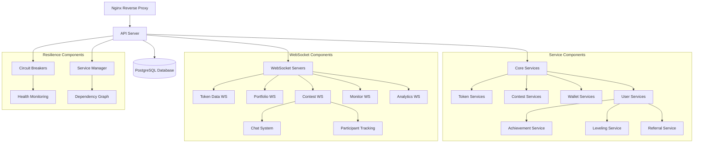

<div align="center">

# ⚔️ DEGENDUEL ⚔️

### *Battle for degenerate supremacy*


<br />

**Sharpen your trading skills while competing for rewards. Ape and jeet with zero risk.**

<p align="center"><i>Looking for the <a href="https://github.com/BranchManager69/degenduel-fe">Frontend</a> repo?</i></p>

<p align="center">


</p>

</div>

---

## 📚 Table of Contents

- [📌 Overview](#-overview)
- [🚀 Features](#-features)
- [🏗️ Architecture](#️-architecture)
- [💻 Tech Stack](#-tech-stack)
- [🔧 Project Structure](#-project-structure)
- [🛠️ System Components](#️-system-components)
- [🛡️ Security](#️-security)
- [⚙️ Getting Started](#️-getting-started)
- [📊 Monitoring](#-monitoring)
- [🧩 API Endpoints](#-api-endpoints)
- [📈 System Diagram](#-system-diagram)
- [📝 License](#-license)

---

## 📌 Overview

**DegenDuel** is a high-octane trading simulation platform that brings the thrill of crypto trading to a competitive arena. Hunt for god candles, discover giga-alpha, and outperform other traders in pursuit of ultimate **degen supremacy**.

This backend repository powers the DegenDuel platform with a microservice-inspired architecture, real-time data feeds, and a robust trading simulation engine.

<div align="center">
  
  
  
</div>

---

## 🚀 Features

### 🌐 Web3 Integration
- **Solana Wallet Authentication** - Secure login using Web3 wallet signatures
- **Crypto-Native Experience** - Designed for the degenerates of crypto
- **On-Chain Verification** - Transparent contest results and rewards
- **Wallet Balance Syncing** - Automatic balance tracking for contests and admins

### 📊 Real-Time Trading Simulation
- **Live Token Prices** - Real-time market data via specialized WebSockets
- **Portfolio Tracking** - Instant P&L updates and performance metrics
- **Trading Competitions** - Regular contests with leaderboards and prizes
- **Contest Chat** - Real-time communication between contest participants

### 📱 User Experience
- **Achievement System** - Earn XP and level up your trader profile
- **Referral System** - Refer friends for rewards with multi-tier tracking
- **Real-time Updates** - Instant notifications for trades, contests, and events
- **Leaderboards** - Compete against other traders for supremacy

### 🔧 System Design
- **Resilient Architecture** - Services with minimal dependencies for maximum uptime
- **Circuit Breakers** - Automatic failure detection and recovery
- **Service Monitoring** - Real-time health checks and performance metrics
- **Scalable Infrastructure** - Designed for growth with service-based architecture

---

## 🏗️ Architecture

DegenDuel follows a modern, service-based architecture with specialized components for different business domains.

### Core Components

- **Backend**: Node.js/Express with PostgreSQL and Prisma ORM
- **Authentication**: Web3 wallet verification using Solana/Phantom
- **Real-time**: Multiple WebSocket servers for dedicated data streams
- **Infrastructure**: PM2 process management with service monitoring

<div align="center">
  
  
  
</div>

---

## 💻 Tech Stack

<table align="center">
  <tr>
    <td align="center"><b>Core</b></td>
    <td align="center"><b>Database</b></td>
    <td align="center"><b>Infrastructure</b></td>
    <td align="center"><b>Web3</b></td>
  </tr>
  <tr>
    <td>
      <br/>
      <br/>
      
    </td>
    <td>
      <br/>
      <br/>
      
    </td>
    <td>
      <br/>
      <br/>
      
    </td>
    <td>
      <br/>
      <br/>
      
    </td>
  </tr>
</table>

---

## 🔧 Project Structure

The codebase follows a domain-driven design with clear separation of concerns:

```
degenduel/
├── config/                # Application configuration
├── controllers/           # Request handlers & business logic
├── middleware/            # Express middlewares
├── routes/                # API route definitions
├── services/              # Core business logic services
├── websocket/             # WebSocket servers
├── utils/                 # Utility functions
├── types/                 # TypeScript type definitions
├── prisma/                # Database schema and migrations
├── scripts/               # Utility scripts
└── docs_important/        # Architecture documentation
```

### Key Directories

| Directory | Purpose |
|-----------|---------|
| `/services` | Core domain business logic encapsulated as services |
| `/websocket` | Specialized WebSocket servers for real-time data |
| `/routes` | API endpoint definitions organized by domain |
| `/middleware` | Authentication, validation, and request processing |
| `/controllers` | Request handling and orchestration logic |
| `/config` | Application configuration by environment |

---

## 🛠️ System Components

### 🔄 Service Architecture

The backend is organized into specialized service domains with resilient dependencies:

| Domain | Services |
|--------|----------|
| **Data Services** | Token synchronization, market data, liquidity |
| **User Services** | Authentication, achievements, leveling, referrals |
| **Contest Services** | Evaluation, wallets, portfolio management |
| **Infrastructure** | Monitoring, health checks, circuit breakers |

Each service follows a standardized pattern with consistent interfaces, error handling, and lifecycle management. Services are designed with resilience in mind, minimizing hard dependencies to ensure the system remains operational even when individual components experience issues.

### ⚡ WebSocket Infrastructure

Multiple specialized WebSocket servers deliver real-time data streams:

| WebSocket | Purpose |
|-----------|---------|
| **Token Data WS** | Real-time token price and metadata updates |
| **Portfolio WS** | Live portfolio valuation and performance |
| **Contest WS** | Contest updates, leaderboards, and real-time chat |
| **Market WS** | Market data streaming from exchanges |
| **Monitor WS** | System health monitoring and metrics |
| **Analytics WS** | Real-time user analytics and activity tracking |

### 🔐 Authentication System

Secure Web3 wallet-based authentication:

1. **Challenge Request**
   ```
   GET /api/auth/challenge?wallet=<wallet_address>
   ```
   - Generates unique nonce for wallet
   - Stores nonce with expiration

2. **Wallet Verification**
   ```
   POST /api/auth/verify-wallet
   {
     "wallet": "address",
     "signature": [64-byte array],
     "message": "DegenDuel Authentication\nNonce: <nonce>"
   }
   ```
   - Verifies signature using Solana Web3.js
   - Creates/updates user and issues JWT

3. **Session Management**
   - HTTP-only cookies for security
   - Environment-specific configurations
   - Role-based access control

---

## 🛡️ Security

### API Security
- Rate limiting
- Input validation
- CORS policies
- Error sanitization

### Wallet Security
- Nonce-based challenge-response
- One-time use nonces
- Signature verification
- Wallet address validation

### Session Security
- JWT with expiration
- HTTP-only cookies
- Secure flag in production
- Domain-specific cookies

---

## ⚙️ Getting Started

### Prerequisites
```bash
node -v  # Must be 20.x or higher
npm -v   # Must be 8.x or higher
```

### Development Setup
1. Clone the repository
2. Install dependencies:
   ```bash
   npm install
   ```
3. Set up environment variables (copy from `.env.example`)
4. Initialize the database:
   ```bash
   npm run init-db
   ```
5. Start the development server:
   ```bash
   npm run dev
   ```

### Environment Configuration
Configuration adapts based on detected environment:

```javascript
// Environment detection
const environment = origin.includes('localhost') || origin.includes('127.0.0.1') 
  ? 'development' 
  : 'production';
```

Required environment variables:
```bash
PORT=3003                   # API server port
DD_API_DEBUG_MODE=false     # Enable/disable debug logging
```

---

## 📊 Monitoring

Monitor and manage the application using PM2:

```bash
# View process status
npm run status

# Check logs
npm run logs

# Restart services
npm run restart
```

### 🚨 Health Checks

The system includes robust health monitoring:

- **Service Health Checks** - Automatic status reporting
- **WebSocket Monitoring** - Real-time service metrics
- **Circuit Breakers** - Automatic failure detection and recovery

---

## 🧩 API Endpoints

### Authentication
- `GET /api/auth/challenge` - Request authentication challenge
- `POST /api/auth/verify-wallet` - Verify wallet and establish session
- `POST /api/auth/logout` - End session
- `GET /api/auth/session` - Check session status

### User Management
- `GET /api/users/profile` - Get user profile
- `POST /api/users/nickname` - Set/update nickname
- `GET /api/users/achievements` - List user achievements
- `GET /api/stats/user/:id` - Get user statistics and levels

### Contests
- `GET /api/contests` - List active contests
- `GET /api/contests/:id` - Get contest details
- `GET /api/contests/:id/leaderboard` - View contest leaderboard
- `POST /api/contests/:id/join` - Join a contest

### Trading
- `GET /api/tokens` - List available tokens
- `GET /api/v2/tokens/marketData/latest` - Get latest token market data
- `POST /api/portfolio-trades` - Execute trade
- `GET /api/portfolio-analytics` - Get portfolio analytics

### WebSockets
- `/api/v2/ws/contest` - Contest WebSocket (updates, chat, participants)
- `/api/v2/ws/tokenData` - Token data WebSocket
- `/api/v2/ws/portfolio` - Portfolio WebSocket

### Referrals
- `GET /api/referrals` - Get user's referral information
- `POST /api/referrals/create` - Create a referral code
- `GET /api/referrals/stats` - Get referral program statistics

---

## 📈 System Diagram



---

## 📝 License

This project is licensed under the MIT License - see the LICENSE file for details.

---

<div align="center">
  <h3>⚔️ DEGENDUEL ⚔️</h3>
  <p>Sharpen your trading skills while competing for real prizes. <br/>Ape and jeet with zero risk.</p>
  <p><b>© Branch Manager Productions.</b> All rights reserved.</p>
  
</div>