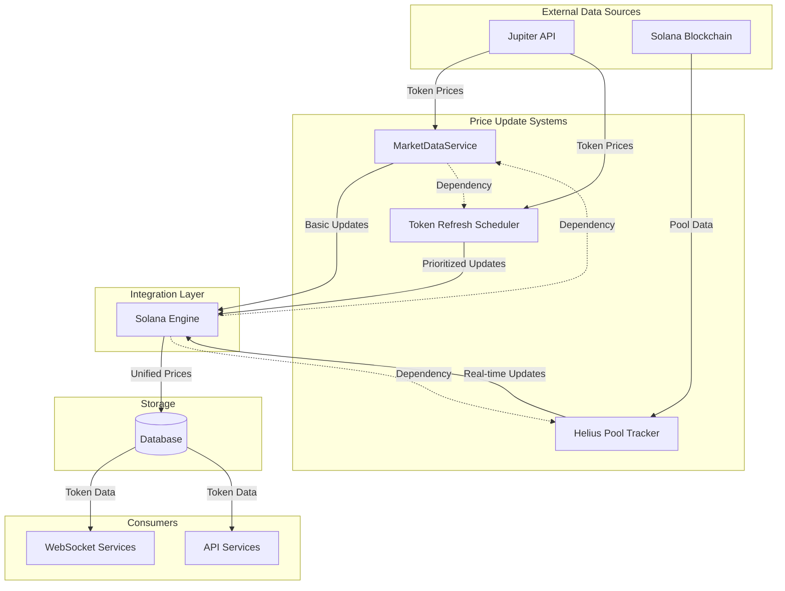
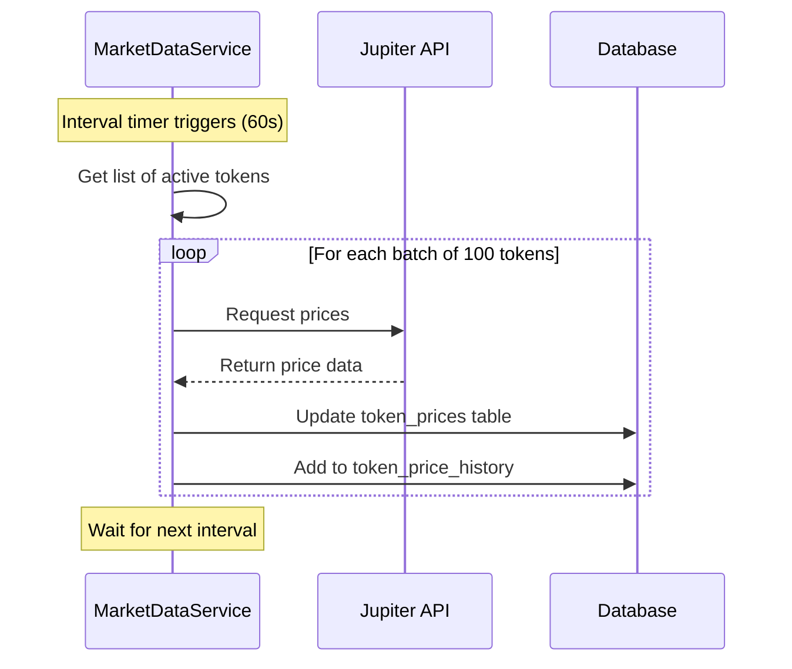
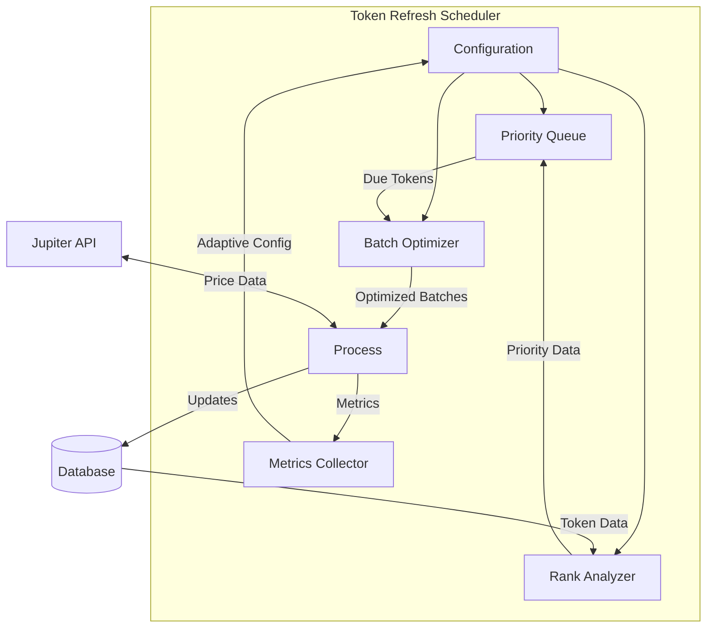
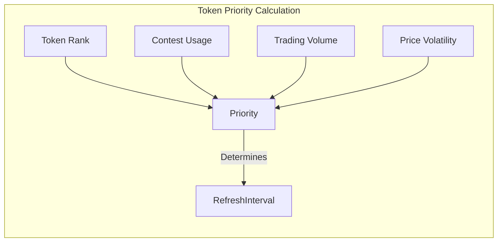
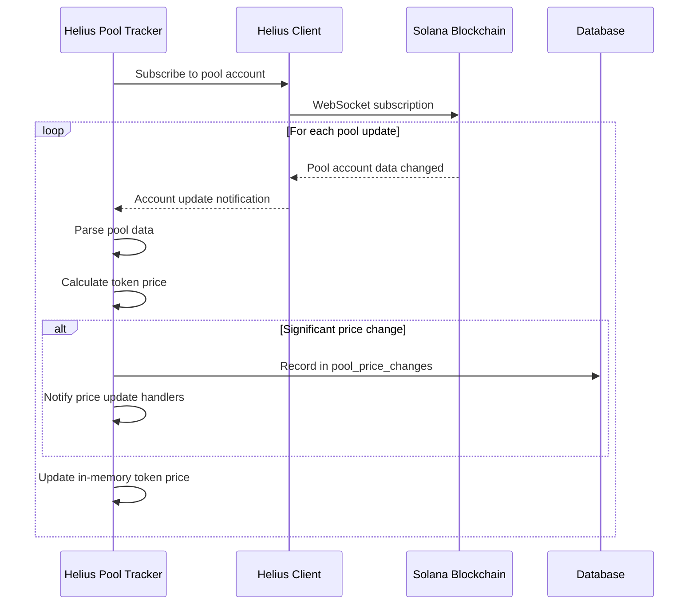
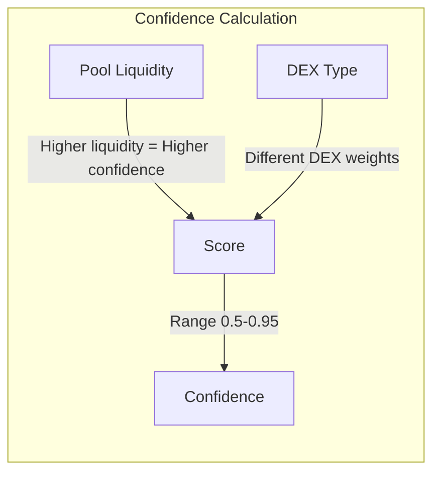
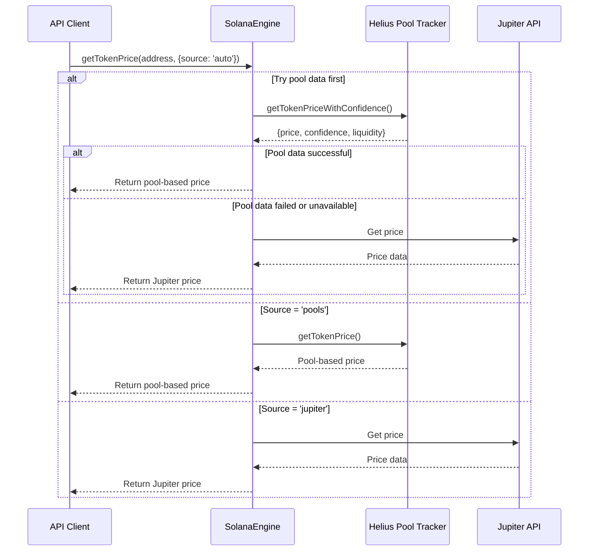
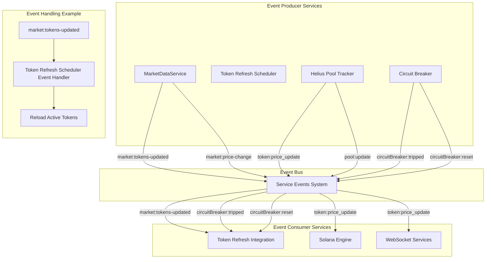
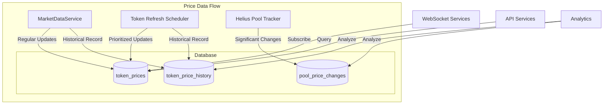
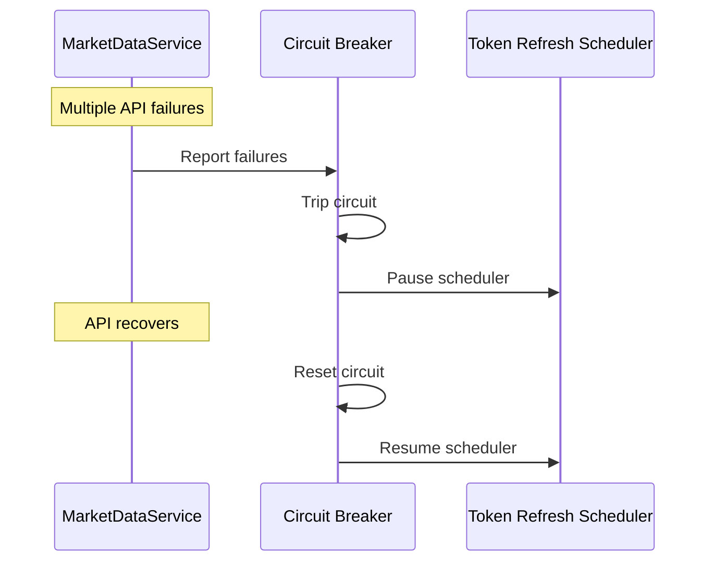

# DegenDuel Token Price System Architecture

## System Overview

DegenDuel employs three complementary token price update systems that work together to provide accurate, timely, and resource-efficient price data. This document explains how these systems function individually and how they interact.



## 1. Basic Token Price Updates (MarketDataService)

This foundational system directly polls the Jupiter API for token prices at regular intervals.

**Key Characteristics:**
- Updates all active tokens every 60 seconds
- Processes tokens in batches of up to 100 (Jupiter's API limit)
- Operates independently with minimal complexity



## 2. Advanced Token Refresh Scheduler

This system optimizes when and how often different tokens are updated based on their importance, trading activity, and volatility.

**Key Characteristics:**
- Assigns dynamic priority scores and refresh intervals to tokens
- Uses a priority queue to schedule tokens for refresh
- Implements adaptive rate limiting and batch optimization



**Priority Calculation Factors:**



## 3. Pool-Based Real-Time Price Tracking (Helius Pool Tracker)

This innovative system monitors liquidity pools directly via WebSockets, calculating token prices in real-time from on-chain data.

**Key Characteristics:**
- Monitors liquidity pools via Helius WebSockets
- Calculates prices directly from pool reserves
- Assigns confidence scores based on pool liquidity
- Records significant price changes



**Price Confidence Scoring:**



## Integration Between the Three Systems

The SolanaEngine acts as the central coordinator for token price data, intelligently selecting between different price sources.



## Event-Based Communication

The services communicate with each other using an event-driven architecture via the `serviceEvents` system, allowing for loose coupling and reactive behavior.



Key Event Types:
- `market:tokens-updated`: Emitted when token list is updated in MarketDataService
- `token:price_update`: Emitted by HeliusPoolTracker when significant price changes occur
- `circuitBreaker:tripped`: Emitted when an API fails repeatedly
- `circuitBreaker:reset`: Emitted when a service recovers from failure

Example Event Handler (from token-refresh-integration.js):
```javascript
// Listen for token sync events from MarketDataService
serviceEvents.on('market:tokens-updated', async (data) => {
  try {
    if (data && Array.isArray(data.updatedTokens) && data.updatedTokens.length > 0) {
      logApi.info(`${fancyColors.GOLD}[TokenRefreshIntegration]${fancyColors.RESET} Received token update event for ${data.updatedTokens.length} tokens`);
      
      // Reload active tokens
      await tokenRefreshScheduler.loadActiveTokens();
    }
  } catch (error) {
    logApi.error(`${fancyColors.GOLD}[TokenRefreshIntegration]${fancyColors.RESET} Error handling token update event:`, error);
  }
});
```

Benefits of the Event-Based Approach:
1. **Loose Coupling**: Services don't need direct references to each other
2. **Scalability**: New listeners can be added without modifying event producers
3. **Fault Isolation**: Service failures don't cascade across the entire system
4. **Reactive Architecture**: System components react to changes rather than constantly polling

## Data Flow and Storage



## Circuit Breaker Integration



## Advantages of the Multi-System Approach

1. **Resilience through Diversity**: Multiple independent price sources provide redundancy
2. **Optimized Resource Usage**: Prioritized scheduling ensures efficient API usage
3. **Real-time Price Data**: Direct pool monitoring provides immediate updates
4. **Confidence-Based Selection**: The system selects the most reliable price source
5. **Customizable Strategy**: Different tokens can use different price sources based on need

## System Comparison

| Feature | MarketDataService | Token Refresh Scheduler | Helius Pool Tracker |
|---------|-------------------|-------------------------|---------------------|
| **Update Frequency** | Fixed (60s) | Dynamic (15s-10min) | Real-time |
| **Price Source** | Jupiter API | Jupiter API | On-chain pools |
| **Batch Size** | Up to 100 | Optimized batches | Individual pools |
| **Prioritization** | None | Sophisticated scoring | Liquidity-based |
| **Confidence Scoring** | None | None | 0.5-0.95 based on liquidity |
| **Rate Limiting** | Basic | Adaptive | N/A (WebSocket) |
| **Fault Tolerance** | Low | Medium | High |
| **Resource Efficiency** | Low | High | Medium |
| **Real-time Capability** | None | None | High |
| **Implementation Complexity** | Low | High | Medium |

## Implementation Details

### MarketDataService Update Interval:

```javascript
this.updateInterval = setInterval(async () => {
  try {
    await this.updateTokenData();
  } catch (error) {
    logApi.error(`${fancyColors.GOLD}[MktDataSvc]${fancyColors.RESET} ${fancyColors.RED}Error in update interval:${fancyColors.RESET}`, error);
  }
}, this.config.update.intervalMs);
```

### Token Refresh Scheduler Priority Tiers:

```javascript
const PRIORITY_TIERS = {
  CRITICAL: { 
    score: 1000,
    interval: 15,    // 15 seconds
    volatility_factor: 2.0
  },
  HIGH: { 
    score: 500,
    interval: 30,    // 30 seconds 
    volatility_factor: 1.5
  },
  // ... more tiers ...
};
```

### Helius Pool Tracker WebSocket Subscription:

```javascript
const subscriptionId = await heliusClient.websocket.sendWebSocketRequest('accountSubscribe', [
  poolAddress,
  {
    commitment: 'confirmed',
    encoding: 'jsonParsed'
  }
]);
```

### SolanaEngine Price Source Selection:

```javascript
// In getTokenPrice method
if (source === 'auto') {
  // Try pool data first
  const poolPrice = await heliusPoolTracker.getTokenPriceWithConfidence(tokenAddress);
  
  if (poolPrice && poolPrice.price) {
    return {
      price: poolPrice.price,
      confidence: poolPrice.confidence || 0.5,
      source: `pool:${poolPrice.source || 'unknown'}`
    };
  } else if (fallback) {
    // Fall back to Jupiter
    const jupiterPrice = await jupiterClient.getPrice(tokenAddress);
    return {
      price: jupiterPrice,
      confidence: 0.8, // Standard confidence for Jupiter
      source: 'jupiter'
    };
  }
}
```

## Future Enhancements

1. **Unified Storage Model**: Create a unified view of prices from all three systems
2. **Enhanced DEX Support**: Add support for more DEX-specific pool parsing
3. **Machine Learning Price Validation**: Use ML to detect anomalies in price data
4. **Cross-chain Price Aggregation**: Extend to multiple blockchains
5. **Confidence-Based WebSocket Updates**: Only push updates to clients when confidence exceeds threshold

This architecture showcases a mature understanding of both the technical challenges in crypto price tracking and the business needs of a trading platform. It balances cutting-edge technology with pragmatic reliability in a way that few systems manage to achieve.