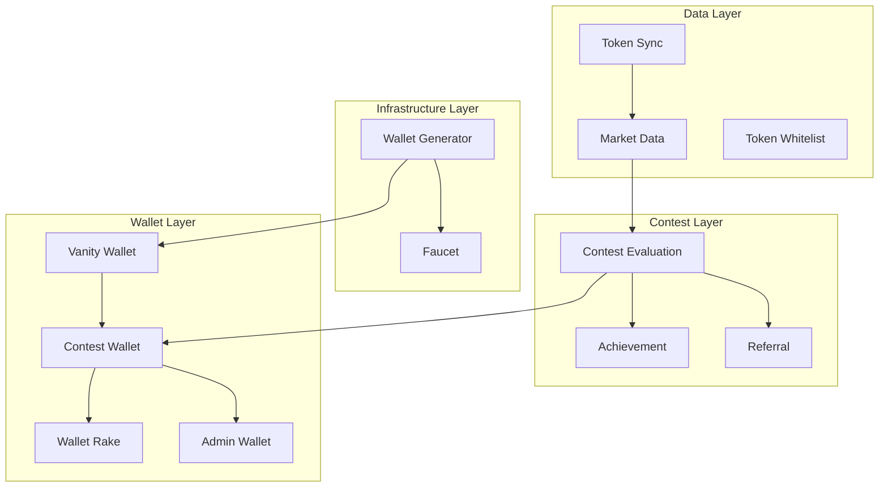

# DegenDuel Base Service Architecture

## Overview

This document outlines the foundational architecture patterns and implementation standards for all DegenDuel services. It serves as the primary reference for service development, modernization, and maintenance.

## Service Layer Structure

### Layer Organization


## Base Service Implementation

### Service Metadata
```typescript
interface ServiceMetadata {
    layer: ServiceLayer;
    description: string;
    updateFrequency: string;
    criticalLevel: 'low' | 'medium' | 'high' | 'critical';
    dependencies: string[];
}
```

### BaseService Class
```javascript
class BaseService {
    constructor(name, config) {
        this.name = name;
        this.config = {
            ...BASE_CONFIG,
            ...config,
            circuitBreaker: getCircuitBreakerConfig(name)
        };
        
        this.stats = {
            operations: {
                total: 0,
                successful: 0,
                failed: 0
            },
            performance: {
                averageOperationTimeMs: 0,
                lastOperationTimeMs: 0
            },
            circuitBreaker: {
                failures: 0,
                lastFailure: null,
                lastSuccess: null,
                lastReset: null,
                isOpen: false,
                recoveryAttempts: 0,
                lastRecoveryAttempt: null
            },
            history: {
                lastStarted: null,
                lastStopped: null,
                lastError: null,
                lastErrorTime: null,
                consecutiveFailures: 0
            }
        };
    }

    async initialize() {}
    async start() {}
    async stop() {}
    async performOperation() {}
}
```

### Standard Configuration
```javascript
const BASE_SERVICE_CONFIG = {
    checkIntervalMs: 5000,
    maxRetries: 3,
    retryDelayMs: 5000,
    backoff: {
        initialDelayMs: 1000,
        maxDelayMs: 30000,
        factor: 2
    }
}
```

## Service Registry

### Implementation
```javascript
class ServiceManager {
    static services = new Map();
    static dependencies = new Map();
    static state = new Map();

    static register(service, dependencies = []) {
        const metadata = getServiceMetadata(service.name);
        const allDependencies = new Set([
            ...dependencies,
            ...getServiceDependencies(service.name)
        ]);
        
        if (!validateDependencyChain(service.name)) {
            throw new Error(`Circular dependency detected`);
        }

        this.services.set(service.name, service);
        this.dependencies.set(service.name, Array.from(allDependencies));
    }

    static async initializeAll() {
        const initOrder = this.calculateInitializationOrder();
        // Initialize in layer order
    }
}
```

### Layer-Aware Initialization
```javascript
static calculateInitializationOrder() {
    // 1. Infrastructure Layer
    // 2. Data Layer
    // 3. Contest Layer
    // 4. Wallet Layer
}
```

## Service State Management

### State Structure
```typescript
interface ServiceState {
    running: boolean;
    status: ServiceStatus;
    criticalLevel: CriticalLevel;
    config: ServiceConfig;
    stats: ServiceStats;
    history: ServiceHistory;
}
```

### State Persistence
```javascript
async updateServiceState(serviceName, state, config, stats) {
    // Update database
    await prisma.system_settings.upsert({...});
    
    // Update local state
    this.state.set(serviceName, serviceState);
    
    // Broadcast update
    this.notifyStateChange(serviceName, serviceState);
}
```

## Error Handling

### Service Errors
```javascript
class ServiceError extends Error {
    constructor(type, message, details = {}) {
        super(message);
        this.type = type;
        this.details = details;
        this.timestamp = new Date();
    }
}
```

### Error Types
```javascript
const ServiceErrorTypes = {
    INITIALIZATION: 'INITIALIZATION_ERROR',
    OPERATION: 'OPERATION_ERROR',
    VALIDATION: 'VALIDATION_ERROR',
    NETWORK: 'NETWORK_ERROR',
    DATABASE: 'DATABASE_ERROR',
    BLOCKCHAIN: 'BLOCKCHAIN_ERROR',
    CONFIGURATION: 'CONFIGURATION_ERROR',
    AUTHENTICATION: 'AUTHENTICATION_ERROR',
    RATE_LIMIT: 'RATE_LIMIT_ERROR',
    CIRCUIT_BREAKER: 'CIRCUIT_BREAKER_ERROR',
    SERVICE_DISABLED: 'SERVICE_DISABLED'
};
```

## Service Dependencies

### Dependency Management
```javascript
function validateDependencyChain(serviceName) {
    const visited = new Set();
    const recursionStack = new Set();

    function hasCycle(service) {
        visited.add(service);
        recursionStack.add(service);

        const dependencies = getServiceDependencies(service);
        for (const dep of dependencies) {
            if (!visited.has(dep)) {
                if (hasCycle(dep)) return true;
            } else if (recursionStack.has(dep)) {
                return true;
            }
        }

        recursionStack.delete(service);
        return false;
    }

    return !hasCycle(serviceName);
}
```

### Layer Dependencies
```javascript
const SERVICE_LAYERS = {
    DATA: 'data_layer',
    CONTEST: 'contest_layer',
    WALLET: 'wallet_layer',
    INFRASTRUCTURE: 'infrastructure_layer'
};
```

## Implementation Standards

### 1. Service Organization
- Clear layer separation
- Explicit dependencies
- Standardized configuration
- Proper error handling

### 2. State Management
- Persistent state storage
- Real-time state updates
- Circuit breaker integration
- Performance tracking

### 3. Error Handling
- Type-specific errors
- Proper error propagation
- Circuit breaker integration
- Dependency awareness

### 4. Monitoring
- Operation statistics
- Performance metrics
- State transitions
- Dependency health

## Best Practices

### 1. Service Implementation
- Follow layer guidelines
- Implement all base methods
- Handle errors properly
- Track performance metrics

### 2. Dependency Management
- Validate dependencies
- Respect layer order
- Handle circular dependencies
- Track dependency health

### 3. State Management
- Persist service state
- Update state atomically
- Broadcast state changes
- Monitor state transitions

### 4. Error Handling
- Use proper error types
- Include error context
- Handle retries properly
- Respect circuit breaker