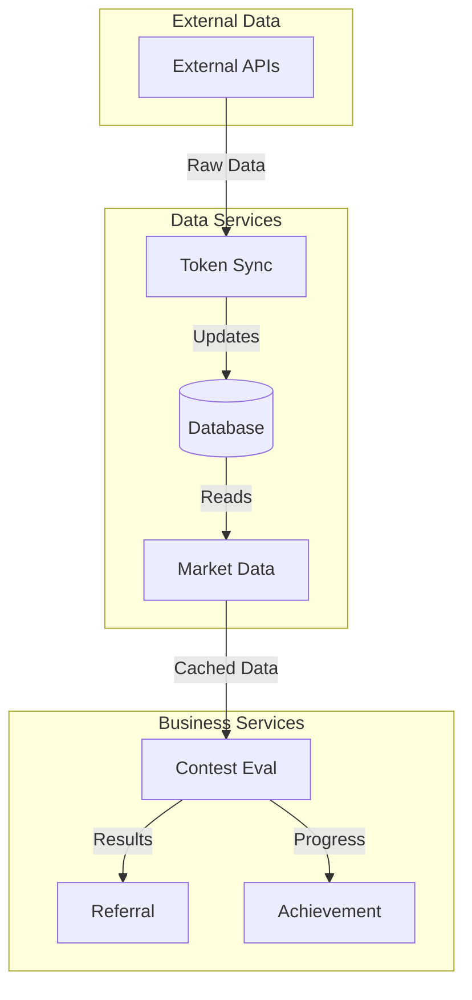

# DegenDuel Base Service Architecture

## Overview

This document outlines the foundational architecture patterns and implementation standards for all DegenDuel services. It serves as the primary reference for service development, modernization, and maintenance.

## Base Service Implementation

### BaseService Class
```javascript
class BaseService {
    constructor(name, config) {
        this.name = name;
        this.config = {
            ...DEFAULT_FAUCET_CONFIG,
            ...config
        };
        
        this.stats = {
            operations: {
                total: 0,
                successful: 0,
                failed: 0
            },
            performance: {
                averageOperationTimeMs: 0,
                lastOperationTimeMs: 0
            },
            circuitBreaker: {
                failures: 0,
                lastFailure: null,
                lastSuccess: null,
                lastReset: null,
                isOpen: false
            }
        };
    }

    async initialize() {}
    async start() {}
    async stop() {}
    async performOperation() {}
}
```

### Standard Configuration
```javascript
const DEFAULT_FAUCET_CONFIG = {
    checkIntervalMs: 5000,
    maxRetries: 3,
    retryDelayMs: 5000,
    circuitBreaker: {
        failureThreshold: 5,
        resetTimeoutMs: 30000,
        minHealthyPeriodMs: 60000
    },
    backoff: {
        initialDelayMs: 1000,
        maxDelayMs: 30000,
        factor: 2
    }
}
```

## Service Registry

### Implementation
```javascript
class ServiceRegistry {
    constructor() {
        this.services = new Map();
        this.dependencies = new Map();
    }

    register(service, dependencies = []) {
        this.services.set(service.name, service);
        this.dependencies.set(service.name, dependencies);
    }

    async initializeAll() {
        const order = this.resolveDependencies();
        for (const serviceName of order) {
            await this.services.get(serviceName).initialize();
        }
    }
}
```

### Usage
```javascript
const registry = new ServiceRegistry();

registry.register(tokenSyncService, []);
registry.register(contestService, ['token_sync_service']);
registry.register(walletService, ['contest_service']);
```

## Circuit Breaker Pattern

### Implementation
```typescript
// Central Circuit Breaker Configuration
interface CircuitBreakerConfig {
    enabled: boolean;
    failureThreshold: number;      // Default: 5
    resetTimeoutMs: number;        // Default: 60000 (1 minute)
    minHealthyPeriodMs: number;    // Default: 120000 (2 minutes)
    monitoringWindowMs: number;    // Default: 300000 (5 minutes)
    healthCheckIntervalMs: number; // Default: 30000 (30 seconds)
}

// Service-specific configurations
const SERVICE_SPECIFIC_CONFIGS = {
    market_data_service: {
        failureThreshold: 3,
        resetTimeoutMs: 30000
    },
    contest_evaluation_service: {
        failureThreshold: 10,
        resetTimeoutMs: 120000
    }
};

// Centralized Management through ServiceManager
class ServiceManager {
    static async checkServiceHealth(serviceName) {
        const service = this.services.get(serviceName);
        const state = await this.getServiceState(serviceName);
        
        if (state?.stats?.circuitBreaker?.isOpen) {
            if (this.shouldAttemptReset(state)) {
                return await this.attemptRecovery(service);
            }
            return false;
        }
        return true;
    }

    static determineServiceStatus(stats) {
        if (!stats) return 'unknown';
        if (stats.circuitBreaker?.isOpen) return 'circuit_open';
        if (stats.history?.consecutiveFailures > 0) return 'degraded';
        return 'healthy';
    }
}

// Base Service Integration
class BaseService {
    constructor(name, config) {
        this.name = name;
        this.config = {
            ...DEFAULT_CONFIG,
            ...config,
            circuitBreaker: getCircuitBreakerConfig(name)
        };
        
        this.stats = {
            operations: {
                total: 0,
                successful: 0,
                failed: 0
            },
            performance: {
                averageOperationTimeMs: 0,
                lastOperationTimeMs: 0
            },
            circuitBreaker: {
                failures: 0,
                lastFailure: null,
                lastSuccess: null,
                lastReset: null,
                isOpen: false,
                recoveryAttempts: 0
            }
        };
    }

    async start() {
        this.interval = setInterval(async () => {
            const [isEnabled, isHealthy] = await Promise.all([
                this.checkEnabled(),
                ServiceManager.checkServiceHealth(this.name)
            ]);

            if (!isEnabled || !isHealthy) return;
            
            try {
                await this.performOperation();
                await this.recordSuccess();
            } catch (error) {
                await this.handleError(error);
            }
        }, this.config.checkIntervalMs);
    }
}
```

### Real-time Monitoring
```typescript
interface WebSocketMessage {
    type: string;
    timestamp: string;
    service?: string;
    status?: string;
    circuit_breaker?: {
        is_open: boolean;
        failures: number;
        last_failure: string | null;
        last_success: string | null;
        recovery_attempts: number;
    };
    operations?: {
        total: number;
        successful: number;
        failed: number;
    };
    performance?: {
        averageOperationTimeMs: number;
        lastOperationTimeMs: number;
    };
}
```

### States
1. **Healthy**
   - Normal operation
   - No recent failures
   - Full functionality

2. **Degraded**
   - Some failures detected
   - Still operational
   - Monitoring increased

3. **Circuit Open**
   - Failure threshold exceeded
   - Operations suspended
   - Automatic recovery attempts

4. **Recovering**
   - Reset period elapsed
   - Test operations allowed
   - Success restores service

## Admin Logging System

### Implementation
```javascript
class AdminLogger {
    static async logAction(adminAddress, action, details, context) {
        await prisma.admin_logs.create({
            data: {
                admin_address: adminAddress,
                action: action,
                details: details,
                context: context,
                timestamp: new Date()
            }
        });
    }

    static Actions = {
        CONTEST: {
            START: 'CONTEST_START',
            END: 'CONTEST_END',
            CANCEL: 'CONTEST_CANCEL'
        },
        SERVICE: {
            START: 'SERVICE_START',
            STOP: 'SERVICE_STOP',
            CONFIGURE: 'SERVICE_CONFIGURE'
        }
    }
}
```

### Usage
```javascript
await AdminLogger.logAction(
    adminAddress,
    AdminLogger.Actions.SERVICE.START,
    {
        service_name: 'contest_evaluation',
        config: serviceConfig
    },
    context
);
```

## Service Modernization Status

### Completed ✅
- Token Sync Service (Independent data fetcher)
- Market Data Service (Independent data provider)
- Contest Evaluation Service (Uses Market Data)
- Wallet Rake Service
- Admin Wallet Service
- Referral Service (Uses Contest Eval)
- Contest Wallet Service
- Achievement Service (Uses Contest Eval)

### In Progress 🔄
- Vanity Wallet Service (Needs modern architecture update)

### Pending ⏳
- DD-Serv Service (Future modernization planned)

## Service Dependencies

### Data Flow Pattern


### Dependency Rules
1. **Data Services**
   - Token Sync: No dependencies (external data fetcher)
   - Market Data: No dependencies (internal data provider)
   - Both services operate independently on the database

2. **Business Services**
   - Should depend on Market Data for token information
   - Should NOT depend directly on Token Sync
   - Can have dependencies on other business services

3. **Wallet Services**
   - Should form their own dependency chain
   - Can depend on business services for triggers
   - Should NOT depend on data services directly

## Implementation Standards

### 1. Error Handling
```