# DegenDuel Service Architecture

## Table of Contents
1. [Platform Overview](#platform-overview)
2. [Service Layers](#service-layers)
3. [Core Services](#core-services)
4. [Service Interactions](#service-interactions)
5. [Data Flow & State Management](#data-flow--state-management)
6. [Platform Operations](#platform-operations)
7. [Security & Compliance](#security--compliance)
8. [Performance & Scaling](#performance--scaling)
9. [Monitoring & Maintenance](#monitoring--maintenance)
10. [Disaster Recovery](#disaster-recovery)

## Platform Overview

DegenDuel's architecture consists of four primary service layers that work together to provide a secure, real-time trading platform:

1. **Infrastructure Layer**
   - Wallet generation and encryption
   - Test environment faucet
   - Core system utilities

2. **Data Layer**
   - Token synchronization
   - Market data management
   - Token whitelist control

3. **Contest Layer**
   - Contest evaluation and prizes
   - Achievement tracking
   - Referral management

4. **Wallet Layer**
   - Contest wallet management
   - Vanity wallet pooling
   - Fund collection and rake
   - Administrative operations

### Complete Service Architecture
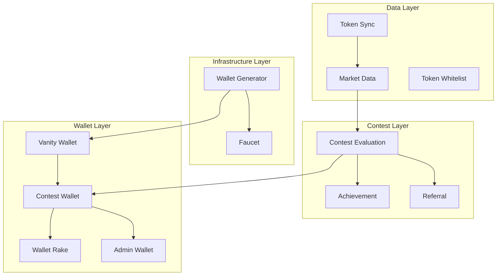

## Service Layers

### Wallet Management Layer
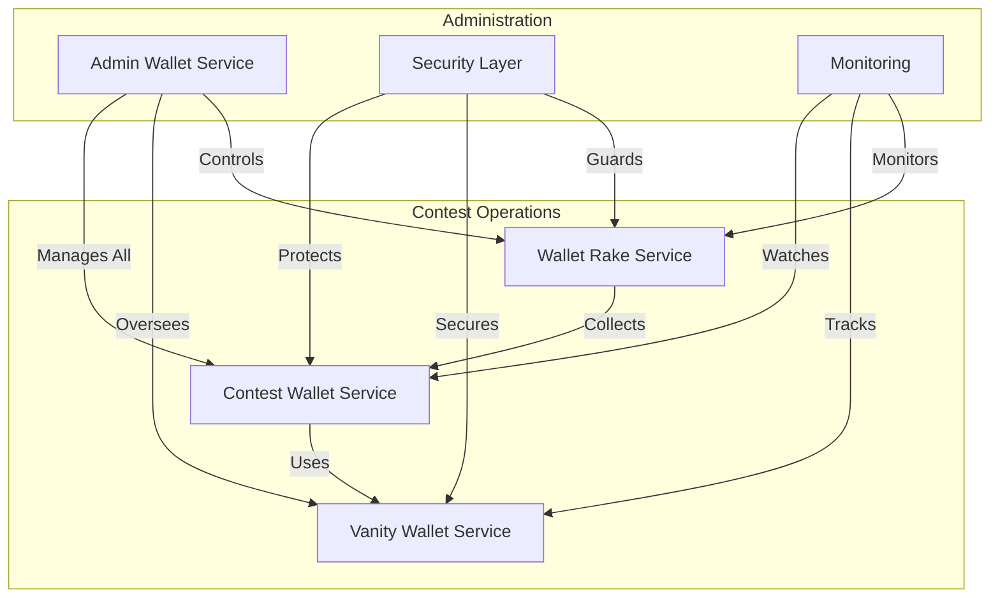

### Operations Management Layer
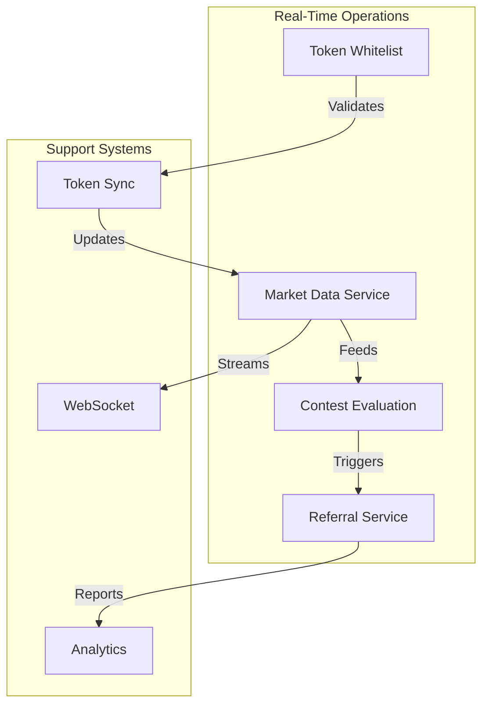

## Core Services

### Service Matrix
| Service | Layer | Update Frequency | Critical Level | Dependencies |
|---------|-------|-----------------|----------------|--------------|
| Wallet Generator | Infrastructure | 5m | High | None |
| Faucet | Infrastructure | 1h | Medium | Wallet Generator |
| Token Sync | Data | 30s | High | None |
| Market Data | Data | 100ms | Critical | Token Sync |
| Token Whitelist | Data | On demand | Medium | None |
| Contest Evaluation | Contest | On demand | Critical | Market Data |
| Achievement | Contest | On demand | Low | Contest Evaluation |
| Referral | Contest | 5m | Medium | Contest Evaluation |
| Contest Wallet | Wallet | On demand | Critical | Vanity Wallet, Contest Evaluation |
| Vanity Wallet | Wallet | Continuous | High | Wallet Generator |
| Wallet Rake | Wallet | 10m | High | Contest Wallet |
| Admin Wallet | Wallet | On demand | Critical | Contest Wallet |

### Service Responsibilities
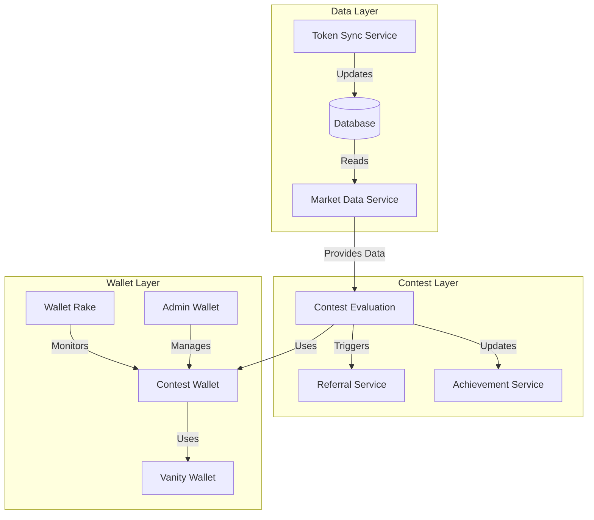

### Data Flow
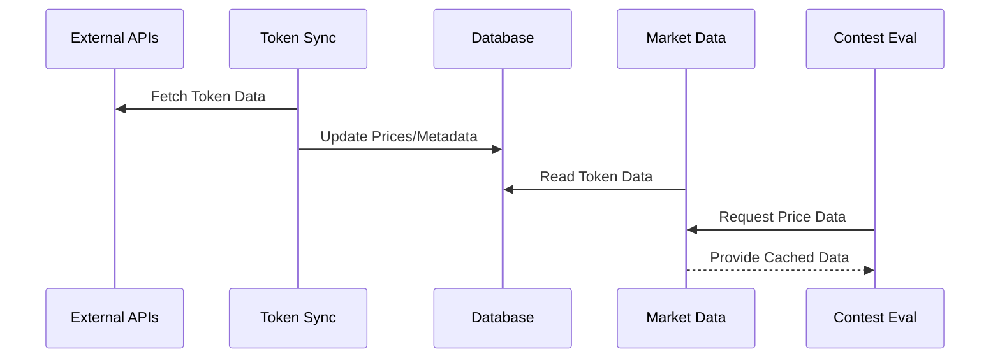

### Service States
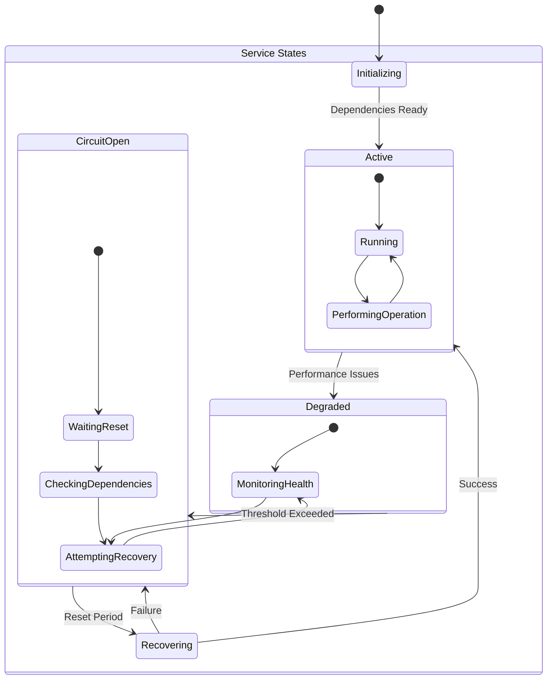

## Service Interactions

### Primary Workflows

1. **Contest Creation & Management**
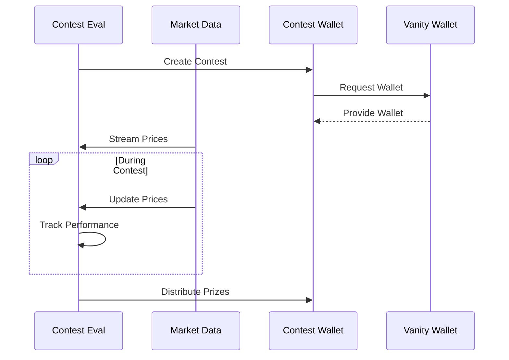

2. **Financial Operations**
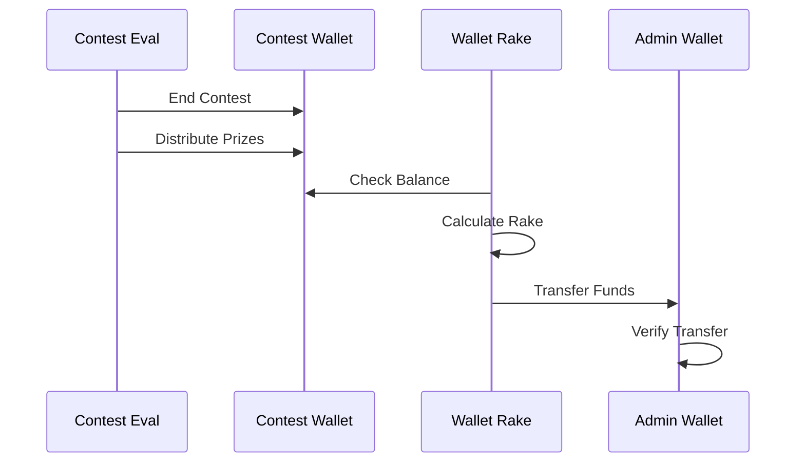

3. **Referral Processing**
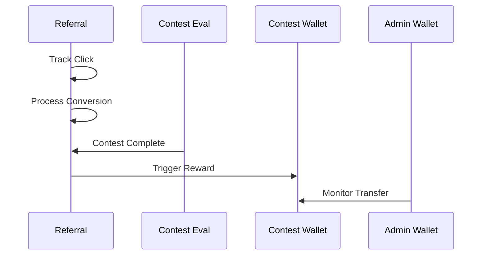

## Data Flow & State Management

### Data Ownership
```javascript
{
    wallet_layer: {
        contest_wallets: {
            owner: "Contest Wallet Service",
            readers: ["Admin", "Rake", "Evaluation"],
            writers: ["Contest Wallet", "Admin"]
        },
        vanity_pool: {
            owner: "Vanity Wallet Service",
            readers: ["Contest Wallet", "Admin"],
            writers: ["Vanity Wallet"]
        }
    },
    operations_layer: {
        market_data: {
            owner: "Market Data Service",
            readers: ["All"],
            writers: ["Market Data"]
        },
        contest_results: {
            owner: "Contest Evaluation",
            readers: ["All"],
            writers: ["Contest Evaluation"]
        },
        token_whitelist: {
            owner: "Token Whitelist Service",
            readers: ["All"],
            writers: ["Token Whitelist"]
        }
    }
}
```

### State Transitions
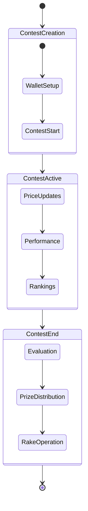

### Circuit Breaker Configuration
```javascript
{
    global_defaults: {
        enabled: true,
        failureThreshold: 5,
        resetTimeoutMs: 60000,
        minHealthyPeriodMs: 120000,
        monitoringWindowMs: 300000,
        healthCheckIntervalMs: 30000
    },
    service_specific: {
        market_data_service: {
            failureThreshold: 3,
            resetTimeoutMs: 30000
        },
        contest_evaluation_service: {
            failureThreshold: 10,
            resetTimeoutMs: 120000
        }
    }
}
```

## Platform Operations

### Critical Paths
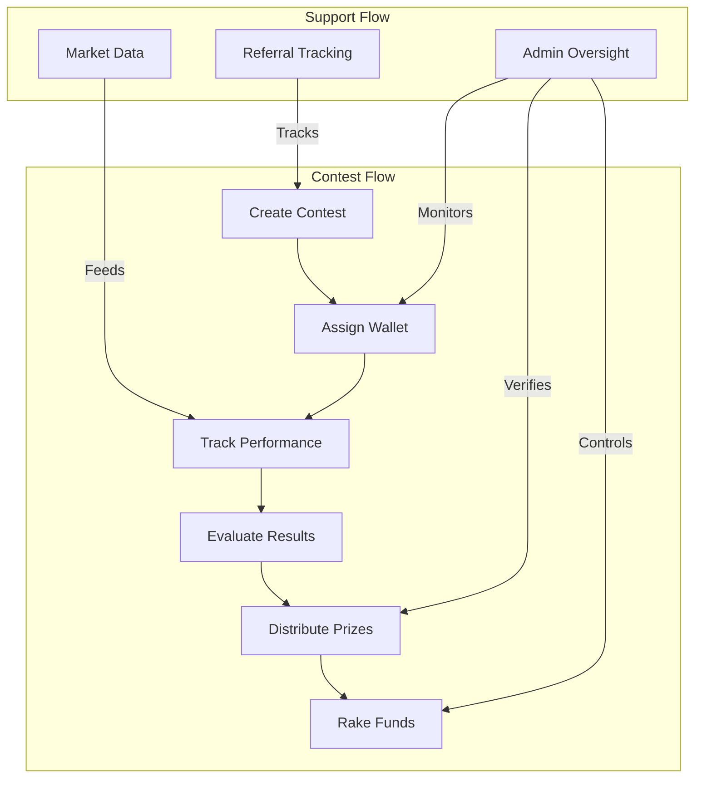

### Service Communication
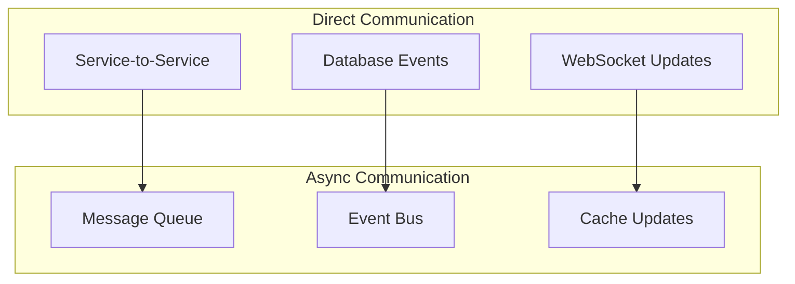

## Security & Compliance

### Security Architecture
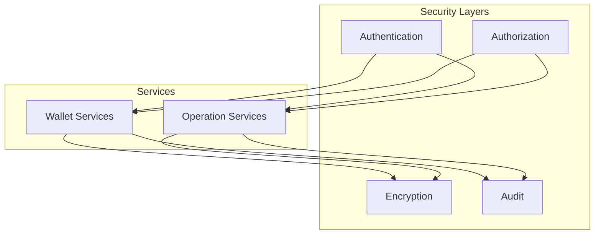

### Compliance Requirements
1. **Financial Security**
   - Wallet encryption
   - Transaction signing
   - Balance verification
   - Audit logging

2. **Operational Security**
   - Rate limiting
   - Access control
   - Data validation
   - Error handling

## Performance & Scaling

### Resource Requirements
```javascript
{
    wallet_layer: {
        total_cores: 8,
        memory: "16GB",
        network: "1Gbps",
        storage: "100GB SSD"
    },
    operations_layer: {
        total_cores: 8,
        memory: "24GB",
        network: "10Gbps",
        storage: "200GB SSD"
    }
}
```

### Scaling Strategy
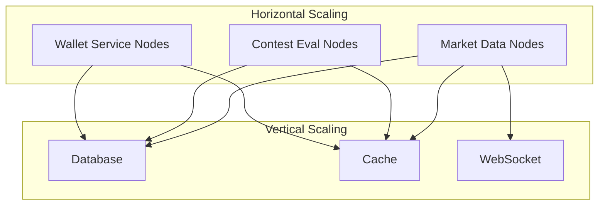

## Monitoring & Maintenance

### Health Monitoring
```javascript
{
    critical_metrics: {
        circuit_breaker: {
            status_check_interval: "5s",
            health_broadcast_interval: "5s",
            recovery_check_interval: "30s"
        },
        wallet_services: {
            wallet_creation_time: "< 1s",
            transaction_success: "99.99%",
            fund_security: "100%"
        },
        operations_services: {
            price_latency: "< 100ms",
            evaluation_accuracy: "100%",
            referral_tracking: "99.9%",
            whitelist_validation: "100%"
        }
    },
    health_states: {
        healthy: {
            description: "Normal operation",
            criteria: "No recent failures",
            monitoring: "Standard"
        },
        degraded: {
            description: "Performance issues detected",
            criteria: "Some failures, below threshold",
            monitoring: "Enhanced"
        },
        circuit_open: {
            description: "Service protection active",
            criteria: "Failure threshold exceeded",
            monitoring: "Critical"
        },
        recovering: {
            description: "Testing service restoration",
            criteria: "Reset period elapsed",
            monitoring: "Intensive"
        }
    }
}
```

### Real-time Monitoring
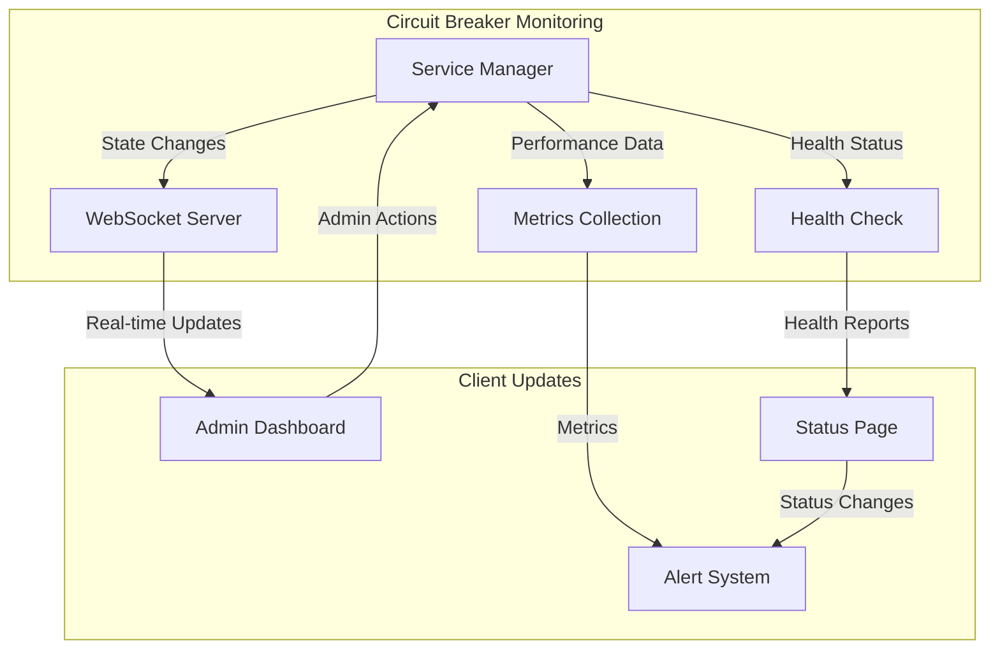

## Disaster Recovery

### Recovery Procedures
1. **Wallet Layer Recovery**
   - Private key backup
   - Transaction rollback
   - Balance reconciliation
   - State restoration

2. **Operations Layer Recovery**
   - Data replication
   - Service failover
   - Cache rebuilding
   - State synchronization

### Recovery Flow
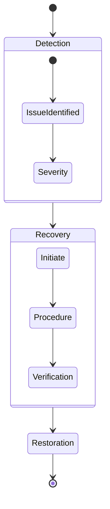

## Best Practices

1. **Service Management**
   - Maintain service independence
   - Coordinate updates
   - Monitor interactions
   - Document changes

2. **Data Handling**
   - Ensure consistency
   - Validate transactions
   - Maintain security
   - Backup regularly

3. **Performance**
   - Optimize critical paths
   - Cache effectively
   - Monitor resources
   - Scale proactively

4. **Security**
   - Encrypt sensitive data
   - Audit operations
   - Control access
   - Monitor threats

5. **Maintenance**
   - Schedule updates
   - Coordinate downtime
   - Test thoroughly
   - Document procedures

---

*Last Updated: February 2024*
*Contact: DegenDuel Platform Team* 