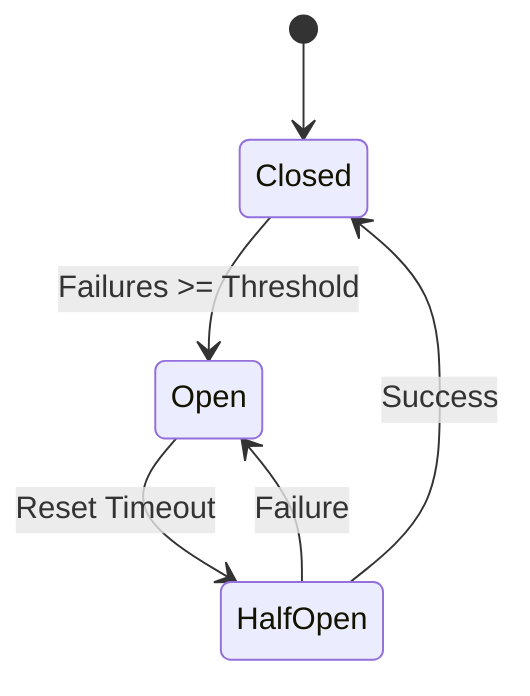
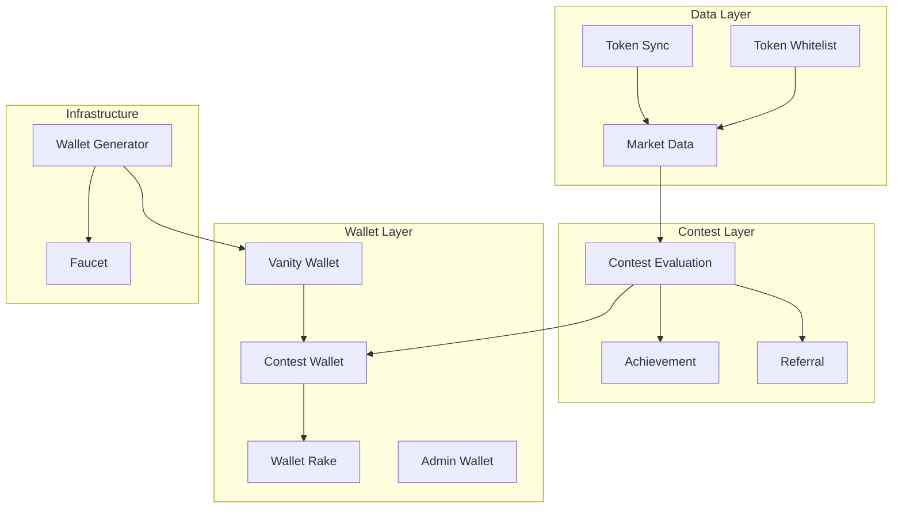

# DegenDuel Circuit Breaker System

## Overview

The DegenDuel Circuit Breaker System provides a robust fault tolerance mechanism across all services. It automatically detects and responds to service failures, protecting the system from cascading failures while enabling intelligent recovery.

## Core Components

### 1. Circuit Breaker States



- **Closed**: Normal operation
- **Open**: Service suspended
- **Half-Open**: Testing recovery

### 2. Service-Specific Configurations

#### Data Layer Services

| Service | Threshold | Reset (ms) | Reason |
|---------|-----------|------------|---------|
| Market Data | 3 | 30000 | Critical for real-time trading |
| Token Sync | 4 | 45000 | External API dependency |
| Token Whitelist | 5 | 60000 | Standard operations |

#### Contest Layer Services

| Service | Threshold | Reset (ms) | Reason |
|---------|-----------|------------|---------|
| Contest Evaluation | 10 | 120000 | Critical financial operations |
| Achievement | 6 | 70000 | Non-critical tracking |
| Referral | 5 | 60000 | Standard operations |

#### Wallet Layer Services

| Service | Threshold | Reset (ms) | Reason |
|---------|-----------|------------|---------|
| Contest Wallet | 8 | 90000 | Financial operations |
| Vanity Wallet | 4 | 45000 | Quick recovery needed |
| Wallet Rake | 8 | 90000 | Fund collection |
| Admin Wallet | 7 | 80000 | Critical admin operations |

#### Infrastructure Layer Services

| Service | Threshold | Reset (ms) | Reason |
|---------|-----------|------------|---------|
| Faucet | 6 | 75000 | Test environment |
| Wallet Generator | 5 | 60000 | Core infrastructure |

### 3. Recovery Mechanism

```typescript
interface RecoveryConfig {
    maxRecoveryAttempts: number;    // Default: 3
    backoffMultiplier: number;      // Default: 2
    minHealthyPeriodMs: number;     // Default: 120000
    monitoringWindowMs: number;     // Default: 300000
}
```

#### Recovery Process
1. **Initial Failure Detection**
   - Track failures until threshold reached
   - Open circuit when threshold exceeded

2. **Recovery Attempt**
   - Wait for resetTimeoutMs
   - Attempt test operation
   - Apply exponential backoff on failure

3. **Success Criteria**
   - Operation succeeds
   - Below failure threshold
   - Minimum healthy period maintained

### 4. Real-time Monitoring

```typescript
interface CircuitBreakerStatus {
    status: 'open' | 'closed' | 'half-open';
    details: string;
    failures: number;
    lastFailure: string | null;
    recoveryAttempts: number;
    lastRecoveryAttempt: string | null;
}
```

#### WebSocket Updates
- Path: `/api/v2/ws/circuit-breaker`
- Real-time state broadcasts
- Health check capabilities
- Manual reset functionality

## Implementation Details

### 1. Base Service Integration

```javascript
class BaseService {
    constructor(name, config) {
        this.config = {
            ...BASE_CONFIG,
            circuitBreaker: getCircuitBreakerConfig(name)
        };
        this.stats = {
            circuitBreaker: {
                isOpen: false,
                failures: 0,
                lastFailure: null,
                recoveryAttempts: 0
            }
        };
    }
}
```

### 2. Error Handling

```javascript
async handleError(error) {
    this.stats.circuitBreaker.failures++;
    if (this.stats.circuitBreaker.failures >= this.config.circuitBreaker.failureThreshold) {
        this.stats.circuitBreaker.isOpen = true;
        await this.attemptCircuitRecovery();
    }
}
```

### 3. Recovery Logic

```javascript
async attemptCircuitRecovery() {
    if (!shouldReset(this.stats, this.config.circuitBreaker)) {
        const nextAttemptDelay = calculateBackoffDelay(
            this.stats.circuitBreaker.recoveryAttempts,
            this.config.circuitBreaker
        );
        scheduleNextRecovery(nextAttemptDelay);
        return;
    }
    // Perform recovery attempt...
}
```

## Service Dependencies



## Best Practices

### 1. Configuration Guidelines

- Set lower thresholds for critical services
- Use longer reset times for financial operations
- Configure faster recovery for real-time services
- Apply exponential backoff for persistent failures

### 2. Monitoring Guidelines

- Watch for repeated circuit openings
- Monitor recovery attempt patterns
- Track service dependencies
- Log all state transitions

### 3. Recovery Guidelines

- Implement graceful degradation
- Handle cascading failures
- Maintain service dependencies
- Use exponential backoff

## Troubleshooting

### Common Issues

1. **Repeated Circuit Opens**
   - Check external dependencies
   - Verify resource availability
   - Review error patterns

2. **Failed Recovery**
   - Check dependency health
   - Verify configuration
   - Review error logs

3. **Cascading Failures**
   - Check service dependencies
   - Review circuit breaker thresholds
   - Monitor system resources

### Recovery Steps

1. **Manual Reset**
   ```javascript
   await service.attemptCircuitRecovery();
   ```

2. **Configuration Update**
   ```javascript
   await ServiceManager.updateServiceConfig(name, newConfig);
   ```

3. **Health Check**
   ```javascript
   const status = await ServiceManager.checkServiceHealth(name);
   ```

## Maintenance

### 1. Regular Tasks
- Review circuit breaker logs
- Analyze failure patterns
- Update thresholds as needed
- Monitor recovery effectiveness

### 2. Performance Tuning
- Adjust timeouts based on metrics
- Fine-tune recovery parameters
- Optimize health checks
- Update dependency chains

### 3. Configuration Updates
- Document all changes
- Test new configurations
- Monitor impact
- Update documentation

## Metrics and Alerts

### Key Metrics
- Circuit open frequency
- Recovery success rate
- Average recovery time
- Failure patterns

### Alert Conditions
- Circuit opens
- Failed recoveries
- Dependency failures
- Resource exhaustion

## Security Considerations

1. **Access Control**
   - Restrict circuit breaker resets
   - Log all manual interventions
   - Audit configuration changes

2. **Data Protection**
   - Secure state persistence
   - Protect configuration data
   - Encrypt sensitive logs

3. **Monitoring Security**
   - Authenticate WebSocket connections
   - Validate client permissions
   - Rate limit operations 