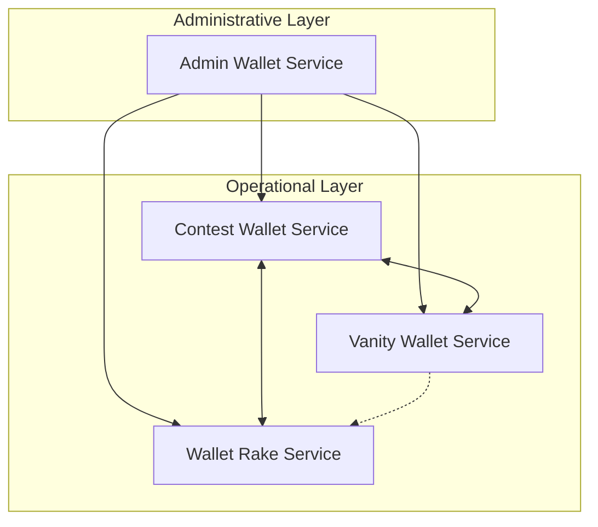
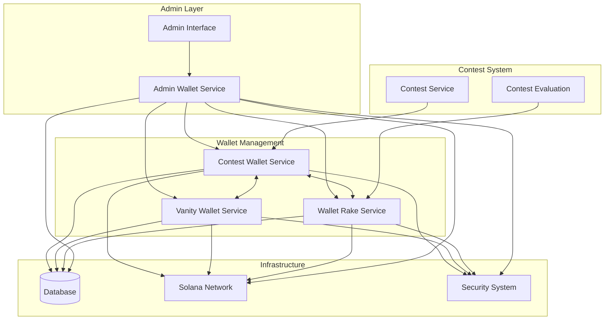
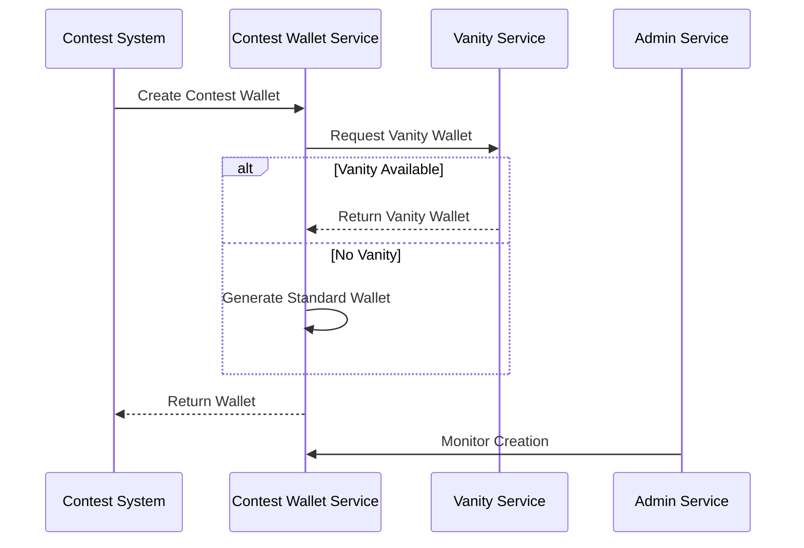
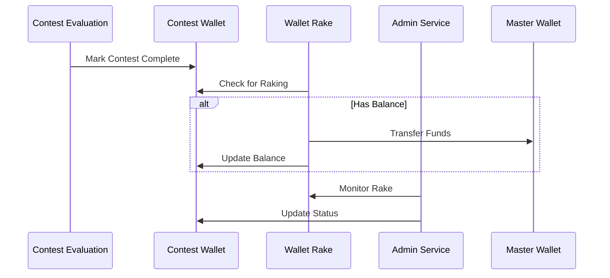
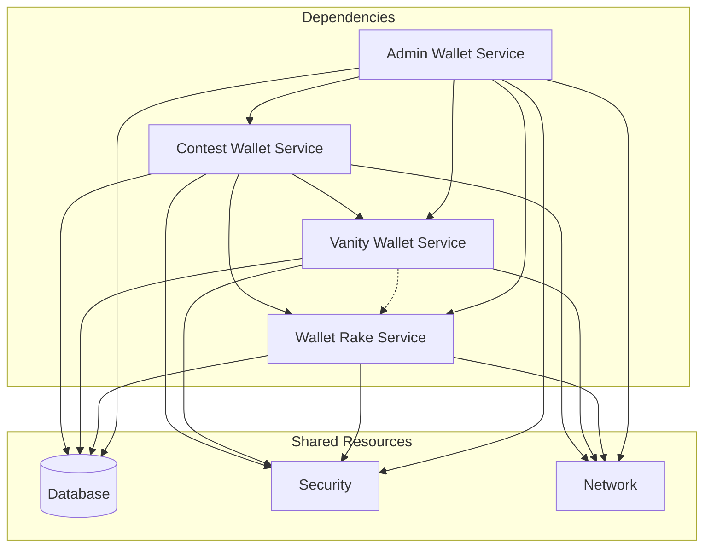
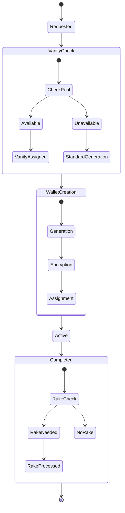
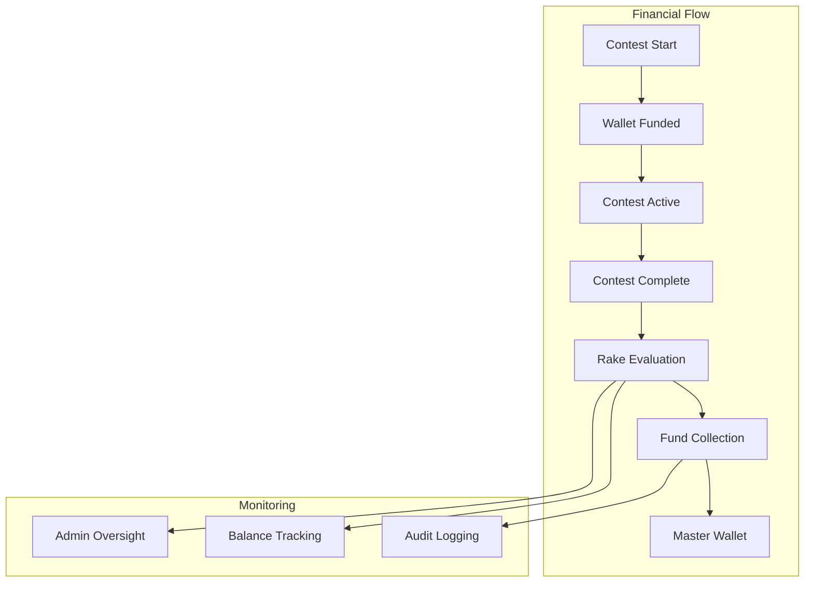
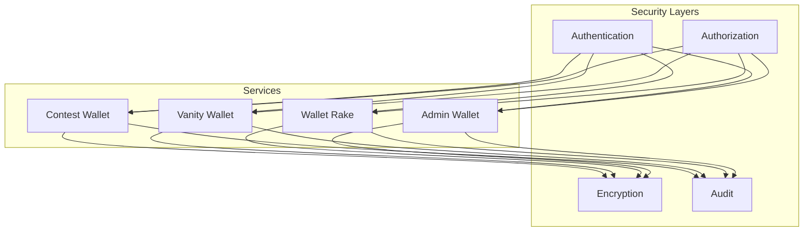
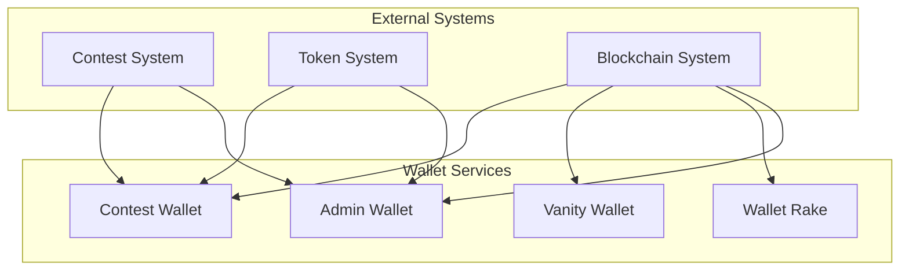

# Contest Wallet Management System Overview

## Table of Contents
1. [System Overview](#system-overview)
2. [Service Architecture](#service-architecture)
3. [Service Relationships](#service-relationships)
4. [Wallet Lifecycle](#wallet-lifecycle)
5. [Key Processes](#key-processes)
6. [Security & Compliance](#security--compliance)
7. [System Integration](#system-integration)
8. [Operational Considerations](#operational-considerations)

## System Overview

The Contest Wallet Management System consists of four interconnected services that together manage the complete lifecycle of contest wallets in the DegenDuel platform:

1. **Contest Wallet Service**
   - Primary wallet creation and management
   - Contest wallet lifecycle handling
   - Integration with vanity system

2. **Vanity Wallet Service**
   - Pre-generated wallet pool management
   - Custom address pattern generation
   - Resource-optimized wallet creation

3. **Wallet Rake Service**
   - Post-contest fund collection
   - Balance management
   - Financial cleanup operations

4. **Admin Wallet Service**
   - Administrative oversight
   - Manual intervention capabilities
   - System-wide wallet management

### Service Hierarchy

## Service Architecture

### Complete System Architecture

## Service Relationships

### Primary Interactions

1. **Contest Creation Flow**

2. **Contest Completion Flow**

### Service Dependencies

## Wallet Lifecycle

### Complete Lifecycle Flow

## Key Processes

### 1. Wallet Creation Process
- Contest Wallet Service initiates creation
- Checks Vanity Wallet Service for available wallets
- Falls back to standard generation if needed
- Admin Service monitors and can intervene
- Encryption and security measures applied

### 2. Wallet Management Process
- Active wallet monitoring
- Balance tracking
- Status updates
- Health checks
- Administrative oversight

### 3. Financial Operations

## Security & Compliance

### Security Architecture

### Key Security Features
1. **Encryption**
   - AES-256-GCM for key storage
   - Secure key transmission
   - Protected memory handling

2. **Access Control**
   - Role-based permissions
   - Admin context management
   - Operation authorization

3. **Audit System**
   - Comprehensive logging
   - Transaction tracking
   - Administrative actions

## System Integration

### Integration Points

## Operational Considerations

### Service Configuration Matrix
| Service | Check Interval | Min Balance | Retry Policy | Circuit Breaker |
|---------|---------------|-------------|--------------|-----------------|
| Contest | 5 minutes | 0.01 SOL | 3 retries | 5 failures |
| Vanity | 60 minutes | N/A | 3 retries | 5 failures |
| Rake | 10 minutes | 0.01 SOL | 3 retries | 5 failures |
| Admin | 1 minute | 0.05 SOL | 3 retries | 5 failures |

### Performance Optimization
1. **Resource Sharing**
   - Database connection pooling
   - Network request batching
   - Shared encryption services

2. **Load Management**
   - Dynamic worker scaling
   - Request queuing
   - Rate limiting

3. **Error Handling**
   - Coordinated circuit breakers
   - Shared retry policies
   - Cascading failure prevention

### Best Practices
1. Regular health monitoring across all services
2. Coordinated maintenance windows
3. Synchronized configuration updates
4. Regular security audits
5. Performance optimization reviews
6. Disaster recovery testing
7. Documentation maintenance

---

*Last Updated: February 2024*
*Contact: DegenDuel Platform Team* 