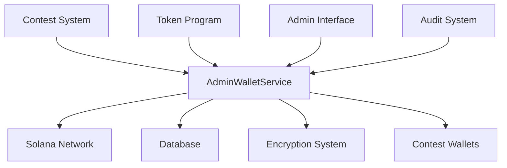

# Admin Wallet Service Reference

## Table of Contents
1. [System Overview](#system-overview)
2. [Architecture](#architecture)
3. [Core Components](#core-components)
4. [Configuration](#configuration)
5. [Features](#features)
6. [Performance](#performance)
7. [Security](#security)
8. [Administrative Functions](#administrative-functions)
9. [Monitoring & Maintenance](#monitoring--maintenance)
10. [Error Handling](#error-handling)
11. [Integration Guide](#integration-guide)
12. [Token Management](#token-management)
13. [Troubleshooting](#troubleshooting)

## System Overview

The Admin Wallet Service is a privileged component of the DegenDuel platform that provides administrative control over wallet operations, including contest wallet management, token transfers, and system-wide wallet monitoring. This service enables platform administrators to manage and oversee all wallet-related operations with enhanced security and comprehensive audit logging.

### Purpose
- Manage and monitor platform wallets
- Execute privileged wallet operations
- Provide administrative oversight
- Handle token and SOL transfers
- Maintain comprehensive audit trails

### Key Benefits
- Centralized wallet administration
- Secure fund management
- Token operation support
- Comprehensive monitoring
- Detailed audit logging

## Architecture

### High-Level Design


### Core Services
1. **AdminWalletService**
   - Extends BaseService
   - Manages administrative operations
   - Handles token operations
   - Maintains security context

2. **Integration Points**
   - Solana Token Program
   - Contest wallet system
   - Database operations
   - Audit logging system

## Core Components

### AdminWalletService
```javascript
class AdminWalletService extends BaseService {
    // Core functionality
    - Wallet management
    - Token operations
    - Administrative controls
    - Security context
}
```

### Key Methods
```javascript
- decryptWallet(encryptedData)
- getWalletDetails(walletAddress, tokenMints)
- transferSOL(fromWallet, toAddress, amount)
- transferToken(fromWallet, toAddress, mint, amount)
- massTransferSOL(fromWallet, transfers)
- massTransferTokens(fromWallet, mint, transfers)
- getAllContestWallets()
- getContestWalletsOverview()
```

## Configuration

### Service Configuration
```javascript
{
    name: 'admin_wallet_service',
    checkIntervalMs: 60 * 1000,  // Check every minute
    maxRetries: 3,
    retryDelayMs: 5000,
    circuitBreaker: {
        failureThreshold: 5,
        resetTimeoutMs: 60000,
        minHealthyPeriodMs: 120000
    },
    backoff: {
        initialDelayMs: 1000,
        maxDelayMs: 30000,
        factor: 2
    },
    wallet: {
        min_balance_sol: 0.05,
        transaction_timeout_ms: 30000
    }
}
```

## Features

### Administrative Operations
- Wallet overview and monitoring
- Mass transfer capabilities
- Token account management
- Balance monitoring
- Export capabilities

### Token Management
- SPL Token transfers
- Associated account creation
- Token balance monitoring
- Multi-token support

### Security Features
- Admin context management
- Action logging
- Key encryption
- Operation verification

## Performance

### Resource Management
- Efficient batch operations
- Transaction optimization
- Network congestion handling
- Resource monitoring

### Statistics Tracking
```javascript
{
    operations: {
        total: Number,
        successful: Number,
        failed: Number
    },
    transfers: {
        sol: {
            count: Number,
            total_amount: Number
        },
        tokens: {
            count: Number,
            by_mint: Object
        }
    },
    performance: {
        average_operation_time_ms: Number
    }
}
```

## Security

### Administrative Context
```javascript
async setAdminContext(adminId) {
    await prisma.$executeRaw`SELECT set_admin_context(${adminId})`;
}
```

### Action Logging
```javascript
{
    admin_id: String,
    action_type: String,
    details: Object,
    ip_address: String,
    wallet_address: String,
    transaction_id: String,
    contest_id: String,
    status: "success" | "failed",
    error_details: String
}
```

### Key Management
```javascript
{
    // Decryption process
    const { encrypted, iv, tag, aad } = JSON.parse(encryptedData);
    const decipher = crypto.createDecipheriv(
        'aes-256-gcm',
        Buffer.from(process.env.WALLET_ENCRYPTION_KEY, 'hex'),
        Buffer.from(iv, 'hex')
    );
}
```

## Administrative Functions

### Wallet Overview
```javascript
async getContestWalletsOverview() {
    // Returns
    {
        wallets: Array<{
            wallet_address: String,
            current_balance: Number,
            balance_difference: Number,
            last_sync_age: Number
        }>,
        stats: {
            total_wallets: Number,
            active_contests: Number,
            total_balance: Number,
            needs_sync: Number,
            status_breakdown: {
                active: Number,
                pending: Number,
                completed: Number,
                cancelled: Number
            }
        }
    }
}
```

### Mass Operations
```javascript
// Mass SOL transfer
async massTransferSOL(fromWallet, transfers: Array<{
    address: String,
    amount: Number,
    description: String
}>)

// Mass token transfer
async massTransferTokens(fromWallet, mint, transfers: Array<{
    address: String,
    amount: Number,
    description: String
}>)
```

## Token Management

### Token Operations
- Associated account creation
- Token balance checking
- Transfer operations
- Account verification

### Token Account Structure
```javascript
{
    mint: String,
    balance: String,
    address: String,
    error?: String
}
```

## Monitoring & Maintenance

### Health Checks
- Minute interval checks
- Balance verification
- Token account monitoring
- Wallet status tracking

### System Overview
```javascript
{
    totalSOL: Number,
    totalLamports: Number,
    walletCount: Number,
    status_breakdown: {
        active: Number,
        pending: Number,
        completed: Number,
        cancelled: Number
    }
}
```

## Error Handling

### Error Types
1. **Administrative Errors**
   - Context setting failures
   - Permission issues
   - Validation errors
   - Configuration problems

2. **Transaction Errors**
   - Transfer failures
   - Token operation errors
   - Network issues
   - Balance problems

### Recovery Mechanisms
- Automatic retries
- Circuit breaker protection
- Error logging
- Admin notification

## Integration Guide

### Basic Operations
```javascript
// Get wallet details
async function getWalletInfo(address, tokens) {
    const details = await AdminWalletService.getWalletDetails(
        address,
        tokens
    );
    return details;
}

// Transfer SOL
async function adminTransfer(from, to, amount, adminId) {
    const result = await AdminWalletService.transferSOL(
        from,
        to,
        amount,
        "Admin transfer",
        adminId
    );
    return result;
}
```

### Token Operations
```javascript
// Transfer tokens
async function adminTokenTransfer(from, to, mint, amount, adminId) {
    const result = await AdminWalletService.transferToken(
        from,
        to,
        mint,
        amount,
        "Admin token transfer",
        adminId
    );
    return result;
}
```

## Troubleshooting

### Common Issues

#### Administrative Access
**Symptoms:**
- Context setting failures
- Permission denied
- Operation rejection

**Resolution:**
- Verify admin credentials
- Check context setting
- Review permissions
- Audit recent actions

#### Token Operations
**Symptoms:**
- Account creation failures
- Transfer rejections
- Balance discrepancies

**Resolution:**
- Check token program status
- Verify account existence
- Review token balances
- Monitor network status

#### System Overview Issues
**Symptoms:**
- Incomplete data
- Sync failures
- Balance mismatches

**Resolution:**
- Refresh wallet data
- Check network connection
- Verify database state
- Review recent operations

### Best Practices
1. Regular system monitoring
2. Comprehensive logging
3. Operation verification
4. Security protocol adherence
5. Token account management
6. Balance reconciliation
7. Audit trail maintenance

---

*Last Updated: February 2024*
*Contact: DegenDuel Platform Team* 