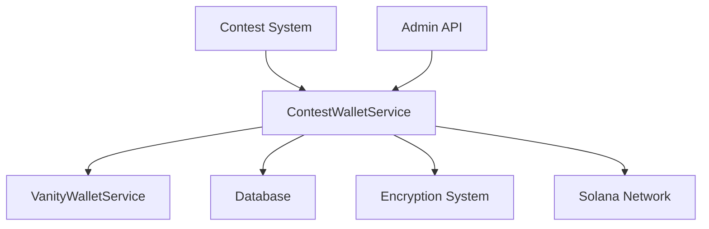

# Contest Wallet Service Reference

## Table of Contents
1. [System Overview](#system-overview)
2. [Architecture](#architecture)
3. [Core Components](#core-components)
4. [Configuration](#configuration)
5. [Features](#features)
6. [Performance](#performance)
7. [Security](#security)
8. [API Reference](#api-reference)
9. [Monitoring & Maintenance](#monitoring--maintenance)
10. [Error Handling](#error-handling)
11. [Integration Guide](#integration-guide)
12. [Troubleshooting](#troubleshooting)

## System Overview

The Contest Wallet System is a critical component of the DegenDuel platform, responsible for managing and allocating Solana wallets for contests. This system integrates closely with the Vanity Wallet Service to provide both vanity and standard wallet options for contests while ensuring secure key management and robust monitoring.

### Purpose
- Create and manage contest-specific Solana wallets
- Integrate with vanity wallet pool for premium addresses
- Ensure secure private key management
- Monitor wallet health and status
- Track contest wallet lifecycle

### Key Benefits
- Seamless vanity wallet integration
- Secure key encryption
- Automatic fallback generation
- Comprehensive monitoring
- Detailed audit logging

## Architecture

### High-Level Design


### Core Services
1. **ContestWalletService**
   - Extends BaseService
   - Manages wallet lifecycle
   - Handles key encryption
   - Maintains statistics

2. **Integration Services**
   - VanityWalletService connection
   - Solana network interface
   - Database operations
   - Admin logging system

## Core Components

### ContestWalletService
```javascript
class ContestWalletService extends BaseService {
    // Core functionality
    - Wallet creation and management
    - Key encryption
    - Health monitoring
    - Statistics tracking
}
```

### Key Methods
- `createContestWallet(contestId, preferredPattern, adminContext)`
- `encryptPrivateKey(privateKey)`
- `performOperation()` (health checks)

## Configuration

### Service Configuration
```javascript
{
    name: 'contest_wallet_service',
    checkIntervalMs: 5 * 60 * 1000,  // 5-minute checks
    maxRetries: 3,
    retryDelayMs: 5000,
    circuitBreaker: {
        failureThreshold: 5,
        resetTimeoutMs: 60000,
        minHealthyPeriodMs: 120000
    },
    backoff: {
        initialDelayMs: 1000,
        maxDelayMs: 30000,
        factor: 2
    },
    wallet: {
        encryption_algorithm: 'aes-256-gcm',
        min_balance_sol: 0.01
    }
}
```

### Wallet Configuration
- Encryption algorithm: AES-256-GCM
- Minimum balance: 0.01 SOL
- Health check interval: 5 minutes
- Retry attempts: 3

## Features

### Wallet Management
- Automatic vanity wallet allocation
- Fallback standard wallet generation
- Private key encryption
- Balance monitoring
- Health status tracking

### Integration with Vanity System
- Preferred pattern requests
- Automatic assignment tracking
- Pattern-based allocation
- Fallback mechanisms

### Security Features
- AES-256-GCM encryption
- Secure key storage
- Admin action logging
- Circuit breaker protection

## Performance

### Resource Management
- Efficient key generation
- Optimized database queries
- Batched operations support
- Health check optimization

### Statistics Tracking
```javascript
{
    operations: {
        total: Number,
        successful: Number,
        failed: Number
    },
    wallets: {
        created: Number,
        vanity_used: Number,
        generated: Number
    },
    errors: {
        creation_failures: Number,
        encryption_failures: Number,
        last_error: String
    },
    performance: {
        average_creation_time_ms: Number,
        last_operation_time_ms: Number
    }
}
```

## Security

### Encryption System
- Algorithm: AES-256-GCM
- Initialization Vector (IV) generation
- Auth Tag verification
- Secure key storage

### Key Management
```javascript
{
    encrypted: String,  // Hex-encoded encrypted private key
    iv: String,        // Hex-encoded initialization vector
    tag: String        // Hex-encoded authentication tag
}
```

### Audit Logging
- Wallet creation events
- Vanity wallet assignments
- Encryption operations
- Error events

## Monitoring & Maintenance

### Health Checks
- 5-minute interval checks
- Wallet status verification
- Balance monitoring
- Contest status tracking

### Health Check Results
```javascript
{
    total: Number,      // Total wallets
    active: Number,     // Active contest wallets
    completed: Number,  // Completed contest wallets
    issues: Array       // Detected issues
}
```

### Performance Metrics
- Creation time tracking
- Operation success rates
- Error frequency
- Resource utilization

## Error Handling

### Error Types
1. **Creation Errors**
   - Vanity wallet unavailable
   - Generation failures
   - Database errors
   - Network issues

2. **Encryption Errors**
   - Key generation failures
   - Encryption process errors
   - IV generation issues
   - Tag verification failures

### Recovery Mechanisms
- Circuit breaker implementation
- Automatic retries
- Exponential backoff
- Fallback generation

## Integration Guide

### Creating Contest Wallets
```javascript
// Example: Creating a contest wallet with vanity preference
async function createContestWallet(contestId, preferredPattern = null) {
    const wallet = await ContestWalletService.createContestWallet(
        contestId,
        preferredPattern
    );
    return wallet;
}
```

### Handling Encryption
```javascript
// Example: Working with encrypted keys
const encryptedData = JSON.parse(wallet.private_key);
{
    encrypted: "hex_encoded_encrypted_key",
    iv: "hex_encoded_iv",
    tag: "hex_encoded_auth_tag"
}
```

## Troubleshooting

### Common Issues

#### Wallet Creation Failures
**Symptoms:**
- Creation operation failures
- Increased error rates
- Timeout issues

**Resolution:**
- Check vanity pool availability
- Verify network connectivity
- Review encryption system
- Check database connections

#### Encryption Issues
**Symptoms:**
- Encryption failures
- Key verification errors
- Auth tag mismatches

**Resolution:**
- Verify encryption key availability
- Check IV generation
- Validate tag creation
- Review encryption process

#### Health Check Failures
**Symptoms:**
- Increased failed checks
- Balance verification issues
- Status inconsistencies

**Resolution:**
- Review wallet statuses
- Check balance requirements
- Verify contest states
- Audit wallet assignments

### Best Practices
1. Regular health check monitoring
2. Proper error handling implementation
3. Secure key management
4. Regular backup procedures
5. Performance optimization
6. Audit log review
7. Resource utilization monitoring

### Interplay with Vanity Wallet Service

The Contest Wallet Service works in close coordination with the Vanity Wallet Service through several key touchpoints:

1. **Wallet Creation Flow**
   ```mermaid
   sequenceDiagram
       participant C as Contest System
       participant CW as Contest Wallet Service
       participant V as Vanity Wallet Service
       participant S as Solana Network
       
       C->>CW: Request New Wallet
       CW->>V: Check Vanity Available
       alt Vanity Available
           V->>CW: Return Vanity Wallet
           CW->>CW: Assign to Contest
       else No Vanity
           CW->>S: Generate New Wallet
       end
       CW->>C: Return Wallet
   ```

2. **Resource Optimization**
   - Shared database connections
   - Coordinated health checks
   - Unified error handling
   - Combined statistics

3. **Fallback Mechanisms**
   - Automatic standard wallet generation
   - Pattern matching flexibility
   - Shared circuit breaker states
   - Coordinated recovery

---

*Last Updated: February 2024*
*Contact: DegenDuel Platform Team* 