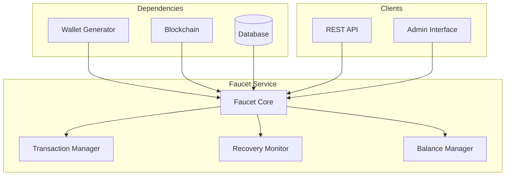
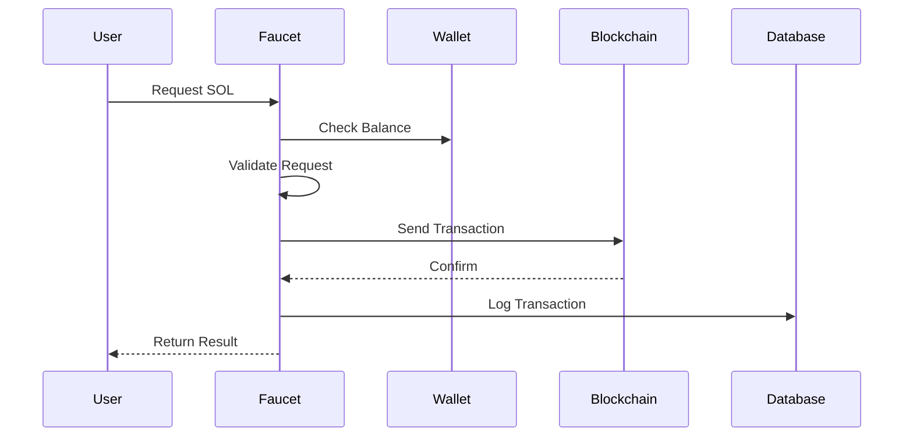
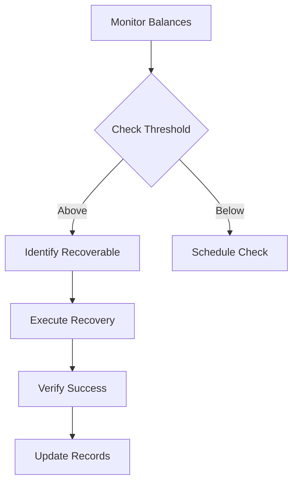

# Faucet Service Reference

## Table of Contents
1. [System Overview](#system-overview)
2. [Architecture](#architecture)
3. [Core Components](#core-components)
4. [Configuration](#configuration)
5. [Transaction Management](#transaction-management)
6. [Recovery System](#recovery-system)
7. [Security & Validation](#security--validation)
8. [Performance & Scaling](#performance--scaling)
9. [Error Handling](#error-handling)
10. [Monitoring & Maintenance](#monitoring--maintenance)
11. [Integration Guide](#integration-guide)
12. [Troubleshooting](#troubleshooting)

## System Overview

The Faucet Service is a critical infrastructure component that manages SOL distribution for test users and handles automated fund recovery. It ensures controlled and secure distribution of test funds while maintaining system balance.

### Purpose
- Distribute test SOL to users
- Manage faucet wallet balances
- Recover unused test funds
- Track distribution metrics
- Ensure system stability

### Key Responsibilities
- SOL distribution management
- Balance monitoring
- Fund recovery automation
- Transaction tracking
- Rate limiting enforcement

## Architecture

### High-Level Design


### Transaction Flow


## Core Components

### Faucet Service
```javascript
class FaucetService extends BaseService {
    // Core functionality
    - SOL distribution
    - Balance monitoring
    - Recovery automation
    - Transaction tracking
    - Rate limiting
}
```

### Configuration
```javascript
const FAUCET_CONFIG = {
    name: 'faucet_service',
    checkIntervalMs: 60 * 60 * 1000,  // 1-hour checks
    maxRetries: 3,
    retryDelayMs: 5 * 60 * 1000,      // 5-minute retry delay
    circuitBreaker: {
        failureThreshold: 5,
        resetTimeoutMs: 60000,
        minHealthyPeriodMs: 120000
    },
    wallet: {
        min_balance_sol: 0.05,
        transaction_timeout_ms: 30000
    }
}
```

## Transaction Management

### Distribution Rules
```javascript
interface DistributionRules {
    maxAmountPerUser: number;     // Maximum SOL per user
    dailyLimit: number;           // Daily distribution limit
    minInterval: number;          // Time between requests
    recoveryThreshold: number;    // Recovery trigger amount
}
```

### Transaction Processing
```javascript
async function processTransaction(request) {
    // Transaction flow
    {
        validateRequest();
        checkUserLimits();
        verifyFaucetBalance();
        executeTransfer();
        logTransaction();
        updateMetrics();
    }
}
```

## Recovery System

### Recovery Process


### Recovery Configuration
```javascript
{
    recoveryRules: {
        minBalance: 0.01,          // Minimum to keep
        maxRecovery: 1.0,          // Maximum to recover
        checkInterval: 3600000,    // 1-hour interval
        batchSize: 50              // Transactions per batch
    }
}
```

## Security & Validation

### Request Validation
```javascript
interface RequestValidation {
    validateAddress(address: string): boolean;
    checkRateLimit(user: string): boolean;
    verifyAmount(amount: number): boolean;
    checkUserHistory(user: string): boolean;
}
```

### Security Measures
1. Rate limiting per IP/user
2. Amount restrictions
3. Address validation
4. Transaction signing
5. Balance verification

## Performance & Scaling

### Resource Management
- Transaction batching
- Connection pooling
- Memory optimization
- Rate limiting

### Performance Metrics
```javascript
{
    operations: {
        total: number;
        successful: number;
        failed: number;
    },
    transactions: {
        processed: number;
        pending: number;
        failed: number;
    },
    recovery: {
        attempted: number;
        successful: number;
        amount: number;
    }
}
```

## Error Handling

### Error Types
1. **Transaction Errors**
   - Insufficient balance
   - Network issues
   - Timeout errors
   - Validation failures

2. **Recovery Errors**
   - Failed recovery
   - Balance issues
   - Network problems
   - Timeout errors

### Recovery Mechanisms
```javascript
async function handleTransactionError(error) {
    // Error handling flow
    {
        logError();
        retryTransaction();
        notifyAdmin();
        updateMetrics();
    }
}
```

## Monitoring & Maintenance

### Health Metrics
```javascript
{
    faucetStatus: {
        balance: number;
        activeUsers: number;
        pendingTransactions: number;
        recoveryStatus: string;
    },
    performance: {
        transactionLatency: number;
        successRate: number;
        errorRate: number;
        recoveryRate: number;
    }
}
```

### Alert Conditions
1. **Critical Alerts**
   - Low balance
   - High failure rate
   - Recovery failures
   - System errors

2. **Warning Alerts**
   - High usage
   - Slow transactions
   - Recovery needed
   - Rate limiting

## Integration Guide

### REST API
```javascript
// Request SOL
POST /api/faucet/request
{
    address: string;
    amount: number;
}

// Check status
GET /api/faucet/status
{
    balance: number;
    available: boolean;
    dailyLimit: number;
    remainingLimit: number;
}
```

### Admin Interface
```javascript
// Force recovery
POST /api/admin/faucet/recover
{
    threshold: number;
    maxAmount: number;
}

// Update configuration
PUT /api/admin/faucet/config
{
    dailyLimit: number;
    maxAmount: number;
    recoveryRules: object;
}
```

## Troubleshooting

### Common Issues

#### Distribution Issues
**Symptoms:**
- Failed transactions
- Slow processing
- Balance errors

**Resolution:**
- Check balance
- Verify network
- Review limits
- Check logs

#### Recovery Issues
**Symptoms:**
- Failed recovery
- Missing funds
- Incomplete batches

**Resolution:**
- Verify balances
- Check transactions
- Review thresholds
- Monitor network

### Best Practices
1. Regular balance monitoring
2. Transaction verification
3. Log analysis
4. Performance tracking
5. Security auditing
6. Configuration review
7. Recovery testing
8. User limit management

---

*Last Updated: February 2024*
*Contact: DegenDuel Platform Team* 