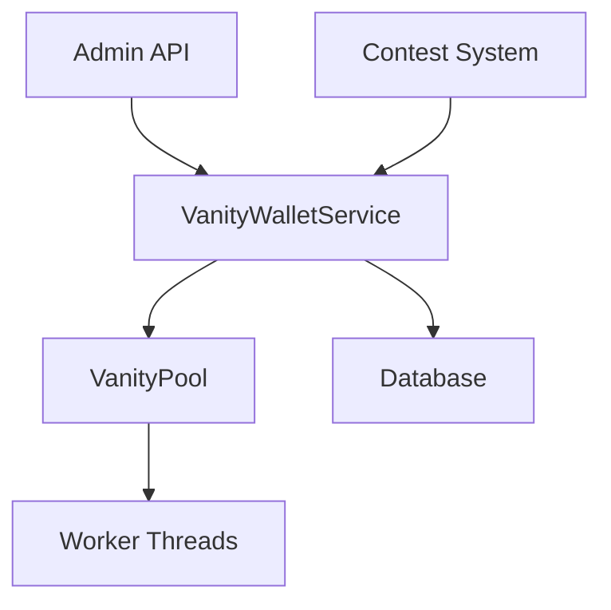

# Vanity Wallet Service Reference

## Table of Contents
1. [System Overview](#system-overview)
2. [Architecture](#architecture)
3. [Core Components](#core-components)
4. [Configuration](#configuration)
5. [Features](#features)
6. [Performance](#performance)
7. [Security](#security)
8. [API Reference](#api-reference)
9. [Monitoring & Maintenance](#monitoring--maintenance)
10. [Error Handling](#error-handling)
11. [Integration Guide](#integration-guide)
12. [Troubleshooting](#troubleshooting)

## System Overview

The Vanity Wallet System is a critical component of the DegenDuel platform, responsible for generating, managing, and distributing Solana wallets with customized address patterns. This system ensures efficient allocation of vanity wallets to contests while maintaining a healthy pool of pre-generated addresses.

### Purpose
- Pre-generate and maintain a pool of vanity Solana wallets
- Provide instant wallet allocation for contests
- Ensure efficient resource utilization during generation
- Track and manage wallet distribution patterns

### Key Benefits
- Instant wallet availability for contests
- Customizable address patterns
- Resource-efficient generation process
- Robust error handling and recovery
- Comprehensive monitoring and statistics

## Architecture

### High-Level Design


### Core Services
1. **VanityWalletService**
   - Extends BaseService
   - Manages wallet pool
   - Handles wallet assignments
   - Maintains statistics

2. **VanityPool**
   - Manages generation workers
   - Handles CPU utilization
   - Implements pattern matching
   - Processes batch requests

3. **Admin Interface**
   - REST API endpoints
   - Authentication & authorization
   - Monitoring capabilities
   - Management functions

## Core Components

### VanityWalletService
```javascript
class VanityWalletService extends BaseService {
    // Core functionality
    - Pool management
    - Wallet assignment
    - Statistics tracking
    - Health monitoring
}
```

### Key Methods
- `getAvailableWallet(preferredPattern, adminContext)`
- `assignWalletToContest(walletId, contestId, adminContext)`
- `addToPool(wallets, adminContext)`
- `performOperation()` (health checks)

## Configuration

### Service Configuration
```javascript
{
    name: 'vanity_wallet_service',
    checkIntervalMs: 60 * 60 * 1000,  // Hourly checks
    maxRetries: 3,
    retryDelayMs: 5000,
    circuitBreaker: {
        failureThreshold: 5,
        resetTimeoutMs: 60000,
        minHealthyPeriodMs: 120000
    },
    backoff: {
        initialDelayMs: 1000,
        maxDelayMs: 30000,
        factor: 2
    },
    pool: {
        min_size: 10,
        max_size: 1000,
        low_threshold: 20,
        generation_batch_size: 5
    }
}
```

### Pool Configuration
- Minimum pool size: 10 wallets
- Maximum pool size: 1000 wallets
- Low threshold: 20 wallets
- Batch generation size: 5 wallets

## Features

### Pool Management
- Automatic pool health monitoring
- Dynamic replenishment
- Pattern distribution tracking
- Usage statistics

### Generation Capabilities
- Multi-threaded generation
- Dynamic worker scaling
- Pattern matching options:
  - Case sensitivity
  - Position-based matching
  - Pattern complexity validation
- Configurable timeouts

### Performance Optimization
- CPU utilization monitoring
- Dynamic worker count adjustment
- Resource-aware scheduling
- Batch processing support

## Performance

### Resource Management
- Target CPU utilization: 80%
- Reserved core count: 1
- Dynamic worker scaling
- Batch operation support

### Statistics Tracking
```javascript
{
    operations: {
        total: Number,
        successful: Number,
        failed: Number
    },
    wallets: {
        total: Number,
        available: Number,
        used: Number,
        by_pattern: Object
    },
    assignments: {
        total: Number,
        successful: Number,
        failed: Number
    },
    pool_health: {
        last_check: Date,
        below_threshold_count: Number,
        generation_requests: Number
    },
    performance: {
        average_operation_time_ms: Number,
        last_operation_time_ms: Number
    }
}
```

## Security

### Authentication & Authorization
- Admin-only access to management endpoints
- Rate limiting on all endpoints
- Secure private key storage
- Audit logging

### Rate Limiting
```javascript
{
    windowMs: 60 * 1000,  // 1 minute window
    max: 50               // 50 requests per minute
}
```

### Audit Logging
- All administrative actions logged
- Wallet assignments tracked
- Pattern generation requests recorded
- Error events documented

## API Reference

### Admin Endpoints

#### GET /api/admin/vanity-wallets/pool/status
- Returns current pool status
- Includes statistics and health metrics
- Rate limited: 50 requests/minute

#### GET /api/admin/vanity-wallets/pool/patterns
- Returns pattern distribution
- Includes generation statistics
- Rate limited: 50 requests/minute

#### GET /api/admin/vanity-wallets/pool/alerts
- Returns current alerts
- Includes threshold warnings
- Rate limited: 50 requests/minute

#### POST /api/admin/vanity-wallets/pool/patterns
- Adds new generation patterns
- Accepts batch requests
- Rate limited: 50 requests/minute

## Monitoring & Maintenance

### Health Checks
- Hourly pool size verification
- Pattern distribution analysis
- Resource utilization monitoring
- Error rate tracking

### Alerts
- Pool size below threshold
- Generation failures
- Resource utilization issues
- Pattern distribution imbalances

### Statistics
- Operational metrics
- Performance statistics
- Resource utilization
- Error rates

## Error Handling

### Error Types
1. **Generation Errors**
   - Timeout errors
   - Pattern validation errors
   - Resource exhaustion
   - Worker failures

2. **Pool Errors**
   - Depletion events
   - Assignment conflicts
   - Database errors
   - Concurrency issues

### Recovery Mechanisms
- Circuit breaker pattern
- Exponential backoff
- Automatic retries
- Resource reallocation

### Circuit Breaker Configuration
```javascript
{
    failureThreshold: 5,
    resetTimeoutMs: 60000,
    minHealthyPeriodMs: 120000
}
```

## Integration Guide

### Contest System Integration
```javascript
// Example: Creating a contest wallet
async function createContestWallet(contestId, preferredPattern = null) {
    const vanityWallet = await VanityWalletService.getAvailableWallet(preferredPattern);
    if (vanityWallet) {
        await VanityWalletService.assignWalletToContest(vanityWallet.id, contestId);
        return vanityWallet;
    }
    // Fallback to regular wallet generation
}
```

### Pattern Requirements
- Must be valid Solana address characters
- Reasonable length (affects generation time)
- Case sensitivity considerations
- Position specifications

## Troubleshooting

### Common Issues

#### Pool Depletion
**Symptoms:**
- Low available wallet count
- Increased generation requests
- Assignment delays

**Resolution:**
- Increase pool size
- Adjust generation batch size
- Review pattern complexity

#### Generation Performance
**Symptoms:**
- High CPU utilization
- Increased generation times
- Worker failures

**Resolution:**
- Adjust worker count
- Review pattern complexity
- Optimize batch sizes

#### Pattern Distribution
**Symptoms:**
- Uneven pattern distribution
- Pattern-specific depletion
- Generation bottlenecks

**Resolution:**
- Review pattern priorities
- Adjust generation distribution
- Optimize pattern complexity

### Best Practices
1. Monitor pool health regularly
2. Maintain reasonable pattern complexity
3. Balance resource utilization
4. Regular pattern distribution review
5. Implement proper error handling
6. Maintain audit logs
7. Regular performance optimization

---

*Last Updated: February 2024*
*Contact: DegenDuel Platform Team* 