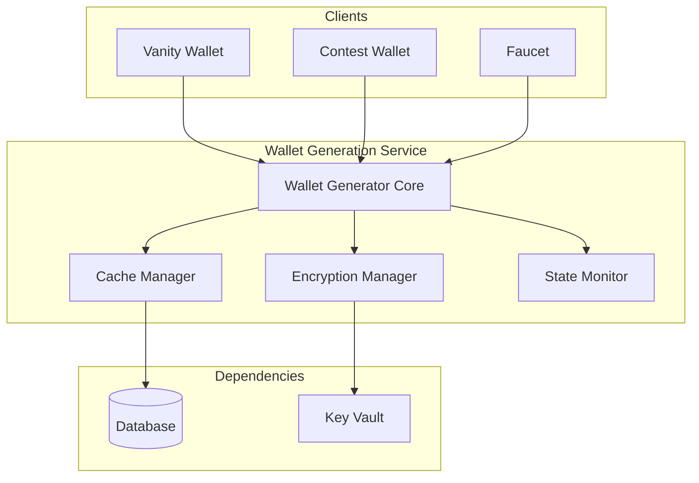
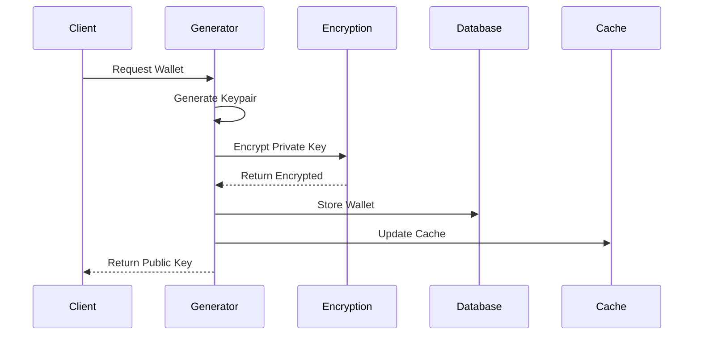
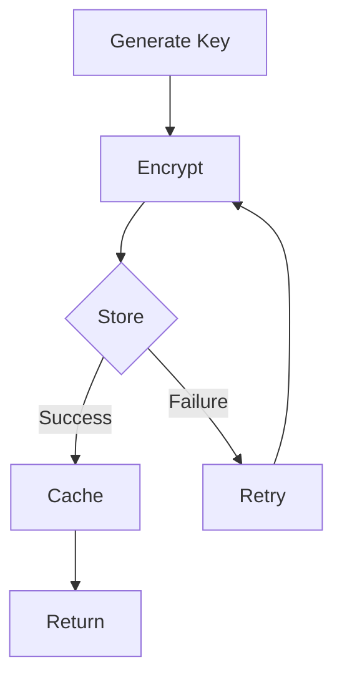

# Wallet Generation Service Reference

## Table of Contents
1. [System Overview](#system-overview)
2. [Architecture](#architecture)
3. [Core Components](#core-components)
4. [Encryption System](#encryption-system)
5. [Wallet Management](#wallet-management)
6. [Security & Validation](#security--validation)
7. [Performance & Scaling](#performance--scaling)
8. [Error Handling](#error-handling)
9. [Monitoring & Maintenance](#monitoring--maintenance)
10. [Integration Guide](#integration-guide)
11. [Troubleshooting](#troubleshooting)

## System Overview

The Wallet Generation Service is a foundational infrastructure component responsible for securely generating, encrypting, and managing Solana wallets across the DegenDuel platform. It serves as the primary wallet factory for contest wallets, vanity wallets, and administrative operations.

### Purpose
- Generate Solana wallets
- Manage encryption/decryption
- Store wallet metadata
- Track wallet lifecycle
- Ensure wallet security

### Key Responsibilities
- Keypair generation
- Secure encryption
- Wallet management
- Cache optimization
- State tracking

## Architecture

### High-Level Design


### Wallet Generation Flow


## Core Components

### Wallet Generator Service
```javascript
class WalletService extends BaseService {
    // Core functionality
    - Keypair generation
    - Encryption management
    - Cache handling
    - State tracking
    - Wallet lifecycle
}
```

### Configuration
```javascript
const WALLET_SERVICE_CONFIG = {
    name: 'wallet_generator_service',
    checkIntervalMs: 5 * 60 * 1000,  // 5-minute checks
    maxRetries: 3,
    retryDelayMs: 5000,
    circuitBreaker: {
        failureThreshold: 5,
        resetTimeoutMs: 60000,
        minHealthyPeriodMs: 120000
    },
    cache: {
        maxSize: 1000,
        ttl: 15 * 60 * 1000  // 15 minutes
    }
}
```

## Encryption System

### Encryption Process


### Encryption Configuration
```javascript
{
    encryption: {
        algorithm: 'aes-256-gcm',
        keyLength: 32,
        ivLength: 16,
        tagLength: 16,
        saltLength: 32
    }
}
```

## Wallet Management

### Wallet Structure
```javascript
interface WalletInfo {
    publicKey: string;
    secretKey: string;
    timestamp: number;
    metadata?: {
        purpose: string;
        type: string;
        created_at: string;
        last_used: string;
    }
}
```

### State Management
```javascript
interface WalletState {
    active: boolean;
    encrypted: boolean;
    cached: boolean;
    last_verified: string;
    verification_status: string;
}
```

## Security & Validation

### Key Validation
```javascript
interface KeyValidation {
    validatePublicKey(key: string): boolean;
    validatePrivateKey(key: string): boolean;
    verifyKeyPair(pub: string, priv: string): boolean;
}
```

### Security Measures
1. Secure key generation
2. Strong encryption
3. Key validation
4. Access control
5. Audit logging

## Performance & Scaling

### Resource Management
- LRU caching
- Batch processing
- Memory optimization
- Connection pooling

### Performance Metrics
```javascript
{
    operations: {
        total: number;
        successful: number;
        failed: number;
    },
    wallets: {
        generated: number;
        imported: number;
        deactivated: number;
        cached: number;
    },
    encryption: {
        successful: number;
        failed: number;
    }
}
```

## Error Handling

### Error Types
1. **Generation Errors**
   - Key generation failure
   - Encryption error
   - Validation failure
   - Storage error

2. **Management Errors**
   - Cache failure
   - Database error
   - Verification error
   - Access error

### Recovery Mechanisms
```javascript
async function handleGenerationError(error) {
    // Error handling flow
    {
        logError();
        cleanupPartial();
        retryOperation();
        updateMetrics();
    }
}
```

## Monitoring & Maintenance

### Health Metrics
```javascript
{
    generatorStatus: {
        active: boolean;
        cacheSize: number;
        pendingOperations: number;
        errorRate: number;
    },
    performance: {
        generationLatency: number;
        encryptionLatency: number;
        cacheHitRate: number;
        successRate: number;
    }
}
```

### Alert Conditions
1. **Critical Alerts**
   - Generation failures
   - Encryption errors
   - High error rate
   - Cache failures

2. **Warning Alerts**
   - Cache pressure
   - Slow operations
   - Verification delays
   - Resource usage

## Integration Guide

### Service Integration
```javascript
// Generate new wallet
async function generateWallet(identifier, options = {}) {
    const wallet = await walletService.generateWallet(
        identifier,
        {
            forceNew: boolean,
            metadata: object
        }
    );
    return wallet;
}

// Get existing wallet
async function getWallet(identifier) {
    const wallet = await walletService.getWallet(identifier);
    return wallet;
}
```

### Encryption Integration
```javascript
// Encrypt private key
async function encryptPrivateKey(privateKey) {
    const encrypted = await walletService.encryptPrivateKey(
        privateKey
    );
    return encrypted;
}

// Decrypt private key
async function decryptPrivateKey(encryptedData) {
    const decrypted = await walletService.decryptPrivateKey(
        encryptedData
    );
    return decrypted;
}
```

## Troubleshooting

### Common Issues

#### Generation Issues
**Symptoms:**
- Failed generation
- Encryption errors
- Validation failures

**Resolution:**
- Check entropy
- Verify encryption
- Validate keys
- Review logs

#### Management Issues
**Symptoms:**
- Cache misses
- Slow operations
- Access errors

**Resolution:**
- Check cache
- Monitor resources
- Verify access
- Review config

### Best Practices
1. Regular key validation
2. Cache management
3. Error monitoring
4. Performance tracking
5. Security auditing
6. Access control
7. Backup verification
8. Resource optimization

### Verification Process
```javascript
async function verifyWallet(identifier) {
    // Verification checks
    {
        exists: boolean;
        valid: boolean;
        error: string | null;
    }
}
```

---

*Last Updated: February 2024*
*Contact: DegenDuel Platform Team* 