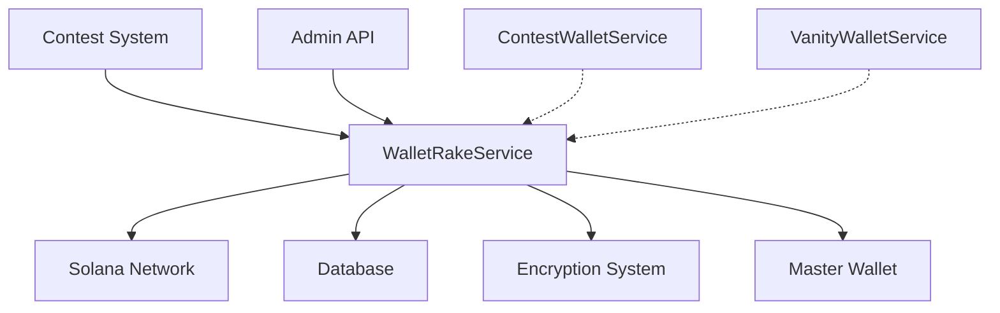

# Wallet Rake System Reference

## Table of Contents
1. [System Overview](#system-overview)
2. [Architecture](#architecture)
3. [Core Components](#core-components)
4. [Configuration](#configuration)
5. [Features](#features)
6. [Performance](#performance)
7. [Security](#security)
8. [API Reference](#api-reference)
9. [Monitoring & Maintenance](#monitoring--maintenance)
10. [Error Handling](#error-handling)
11. [Integration Guide](#integration-guide)
12. [Financial Considerations](#financial-considerations)
13. [Troubleshooting](#troubleshooting)

## System Overview

The Wallet Rake Service is a critical financial component of the DegenDuel platform, responsible for efficiently collecting residual SOL from completed contest wallets. This service ensures proper financial cleanup while maintaining minimum required balances for blockchain operations.

### Purpose
- Collect residual SOL from completed contest wallets
- Maintain minimum balance requirements
- Track and audit all rake operations
- Ensure secure fund transfers
- Optimize gas costs and timing

### Key Benefits
- Automated financial cleanup
- Secure fund collection
- Detailed transaction tracking
- Optimized gas usage
- Comprehensive audit trail

## Architecture

### High-Level Design


### Core Services
1. **WalletRakeService**
   - Extends BaseService
   - Manages fund collection
   - Handles transaction processing
   - Maintains rake statistics

2. **Integration Points**
   - Solana network interface
   - Database operations
   - Key decryption system
   - Transaction logging

## Core Components

### WalletRakeService
```javascript
class WalletRakeService extends BaseService {
    // Core functionality
    - Fund collection management
    - Transaction processing
    - Balance monitoring
    - Statistics tracking
}
```

### Key Methods
```javascript
- decryptPrivateKey(encryptedData)
- transferSOL(fromKeypair, amount, contestId)
- processWallet(wallet, adminContext)
- performOperation()
- forceRakeWallet(walletAddress, adminAddress, context)
```

## Configuration

### Service Configuration
```javascript
{
    name: 'wallet_rake_service',
    checkIntervalMs: 10 * 60 * 1000,  // 10-minute checks
    maxRetries: 3,
    retryDelayMs: 5 * 60 * 1000,      // 5 minutes between retries
    circuitBreaker: {
        failureThreshold: 5,
        resetTimeoutMs: 60000,
        minHealthyPeriodMs: 120000
    },
    backoff: {
        initialDelayMs: 1000,
        maxDelayMs: 30000,
        factor: 2
    },
    wallet: {
        min_balance_sol: 0.01,         // Minimum SOL to maintain
        master_wallet: "BPuRhkeCkor7DxMrcPVsB4AdW6Pmp5oACjVzpPb72Mhp",
        min_rake_amount: 0.001         // Minimum SOL to rake
    }
}
```

### Operational Parameters
- Check Interval: 10 minutes
- Minimum Balance: 0.01 SOL
- Minimum Rake Amount: 0.001 SOL
- Retry Delay: 5 minutes
- Maximum Retries: 3

## Features

### Rake Management
- Automated balance collection
- Minimum balance preservation
- Transaction batching
- Gas optimization
- Retry mechanisms

### Transaction Processing
- Secure fund transfers
- Balance verification
- Transaction confirmation
- Failure recovery
- Audit logging

### Performance Optimization
- Batched operations
- Gas cost optimization
- Network retry handling
- Resource-aware scheduling

## Performance

### Resource Management
- Optimized transaction timing
- Network congestion awareness
- Batch processing capabilities
- Resource utilization tracking

### Statistics Tracking
```javascript
{
    operations: {
        total: Number,
        successful: Number,
        failed: Number
    },
    amounts: {
        total_raked: Number,
        by_contest: Object
    },
    wallets: {
        processed: Number,
        skipped: Number,
        failed: Number,
        last_processed: Object
    },
    performance: {
        average_rake_time_ms: Number,
        last_rake_time_ms: Number
    }
}
```

## Security

### Transaction Security
- Pre-transfer balance verification
- Minimum balance preservation
- Transaction confirmation waiting
- Signature verification

### Key Management
```javascript
{
    // Decryption process
    const { encrypted, iv, tag, aad } = JSON.parse(encryptedData);
    const decipher = crypto.createDecipheriv(
        'aes-256-gcm',
        Buffer.from(process.env.WALLET_ENCRYPTION_KEY, 'hex'),
        Buffer.from(iv, 'hex')
    );
}
```

### Audit System
- Transaction logging
- Balance change tracking
- Error documentation
- Administrative actions

## Financial Considerations

### Balance Management
```javascript
const currentBalance = await connection.getBalance(fromKeypair.publicKey);
const minRequired = config.wallet.min_balance_sol * LAMPORTS_PER_SOL;
const rakeAmount = currentBalance - minRequired;

// Validation
if (rakeAmount < (config.wallet.min_rake_amount * LAMPORTS_PER_SOL)) {
    // Skip - amount too small
}
```

### Transaction Logging
```javascript
{
    wallet_address: String,
    type: "CONTEST_WALLET_RAKE",
    amount: Number,
    balance_before: Number,
    balance_after: Number,
    description: String,
    status: "completed" | "failed",
    blockchain_signature: String,
    completed_at: Date,
    created_at: Date,
    user_id: String,
    contest_id: String
}
```

### Gas Optimization
- Minimum rake amount threshold
- Transaction batching
- Network congestion awareness
- Retry timing optimization

## Monitoring & Maintenance

### Health Checks
- 10-minute interval checks
- Balance verification
- Transaction success rates
- Network status monitoring

### Performance Metrics
```javascript
{
    duration: Number,
    processed: Number,
    successful: Number,
    failed: Number,
    results: Array<{
        wallet: String,
        contest: String,
        status: "success" | "failed",
        signature?: String,
        error?: String
    }>
}
```

### Alerts
- Failed rake operations
- Network issues
- Balance anomalies
- Security concerns

## Error Handling

### Error Types
1. **Transaction Errors**
   - Insufficient balance
   - Network failures
   - Confirmation timeouts
   - Signature failures

2. **Security Errors**
   - Decryption failures
   - Key validation errors
   - Authorization issues
   - Balance verification failures

### Recovery Mechanisms
```javascript
// Retry mechanism
if (retryCount < config.maxRetries) {
    await new Promise(resolve => 
        setTimeout(resolve, config.retryDelayMs)
    );
    return transferSOL(fromKeypair, amount, contestId, retryCount + 1);
}
```

## Integration Guide

### Automated Rake Process
```javascript
// Example: Processing a wallet
async function processWallet(wallet) {
    const balance = await connection.getBalance(pubkey);
    const minBalance = config.wallet.min_balance_sol * LAMPORTS_PER_SOL;
    
    if (balance <= minBalance) {
        return null; // Skip - insufficient balance
    }
    
    const rakeAmount = balance - minBalance;
    // Process rake operation...
}
```

### Force Rake Operation
```javascript
// Example: Admin-initiated rake
async function forceRakeWallet(walletAddress, adminAddress) {
    const wallet = await findWallet(walletAddress);
    return processWallet(wallet, {
        admin_address: adminAddress
    });
}
```

## Troubleshooting

### Common Issues

#### Transaction Failures
**Symptoms:**
- Failed transfers
- Timeout errors
- Confirmation issues

**Resolution:**
- Check network status
- Verify balance requirements
- Review gas settings
- Monitor network congestion

#### Balance Discrepancies
**Symptoms:**
- Unexpected balances
- Failed verifications
- Rake amount issues

**Resolution:**
- Audit transaction history
- Verify minimum balances
- Check calculation logic
- Review recent operations

#### Network Issues
**Symptoms:**
- High latency
- Failed connections
- Timeout increases

**Resolution:**
- Check RPC endpoints
- Monitor network status
- Adjust retry parameters
- Review connection settings

### Best Practices
1. Regular balance monitoring
2. Transaction verification
3. Gas optimization
4. Network status awareness
5. Security protocol adherence
6. Audit log maintenance
7. Performance optimization

### Service Interplay

The Wallet Rake Service operates as the final stage in the wallet lifecycle:

1. **Wallet Lifecycle Flow**
   ```mermaid
   sequenceDiagram
       participant C as Contest System
       participant CW as Contest Wallet
       participant WR as Wallet Rake
       participant M as Master Wallet
       
       Note over C,M: Contest Completion
       C->>CW: Mark Contest Complete
       WR->>CW: Check Balance
       alt Sufficient Balance
           WR->>WR: Calculate Rake Amount
           WR->>M: Transfer Funds
           WR->>CW: Update Balance
       else Insufficient Balance
           WR->>WR: Skip Wallet
       end
   ```

2. **System Integration**
   - Post-contest cleanup
   - Financial reconciliation
   - Balance management
   - Audit trail maintenance

3. **Optimization Strategy**
   - Coordinated timing
   - Resource sharing
   - Error propagation
   - Status synchronization

---

*Last Updated: February 2024*
*Contact: DegenDuel Platform Team* 