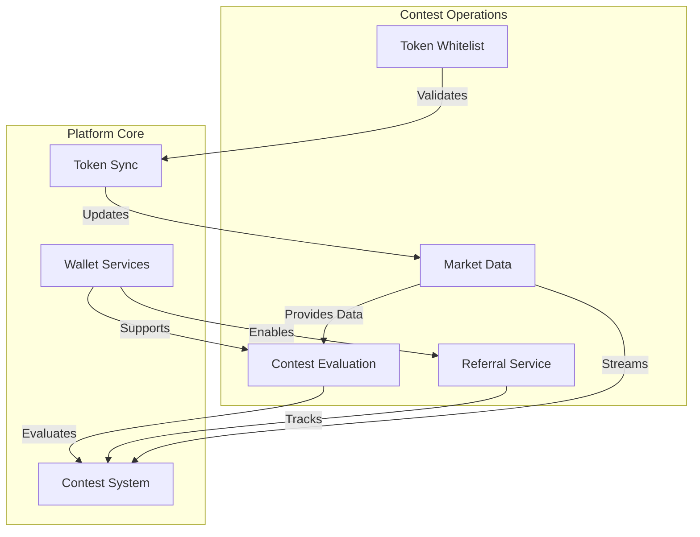
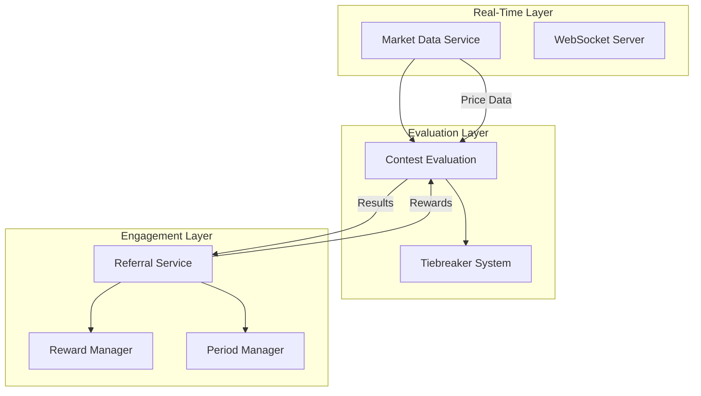
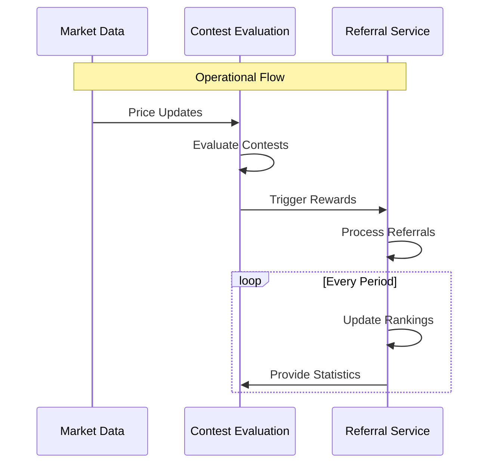
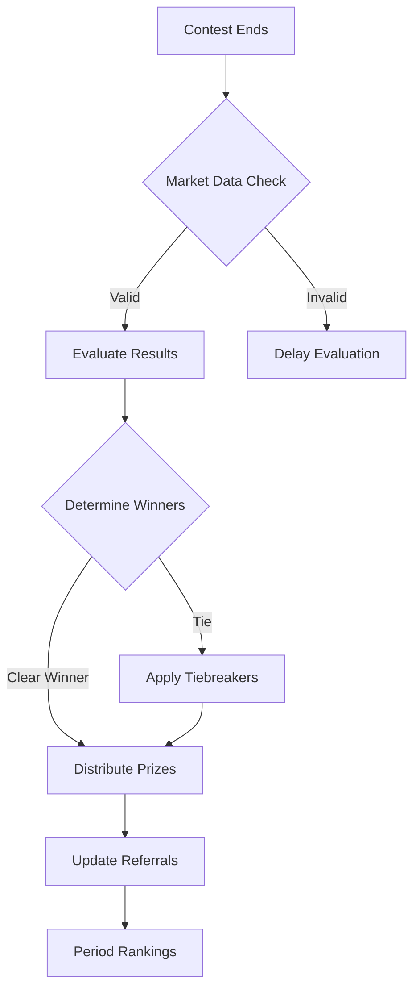
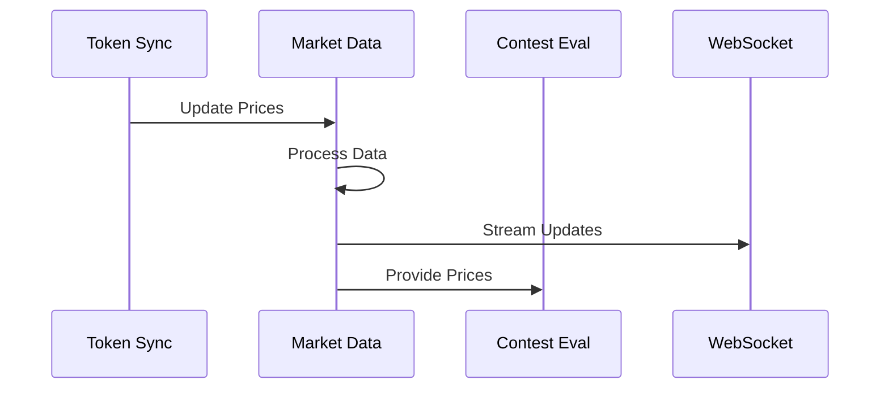
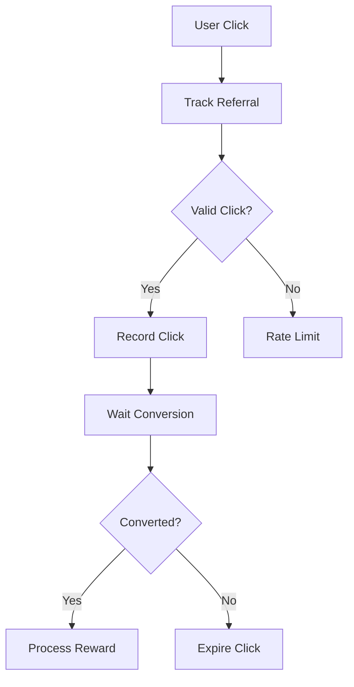
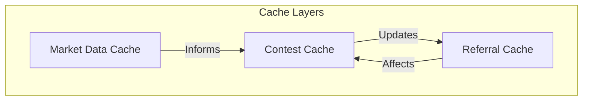
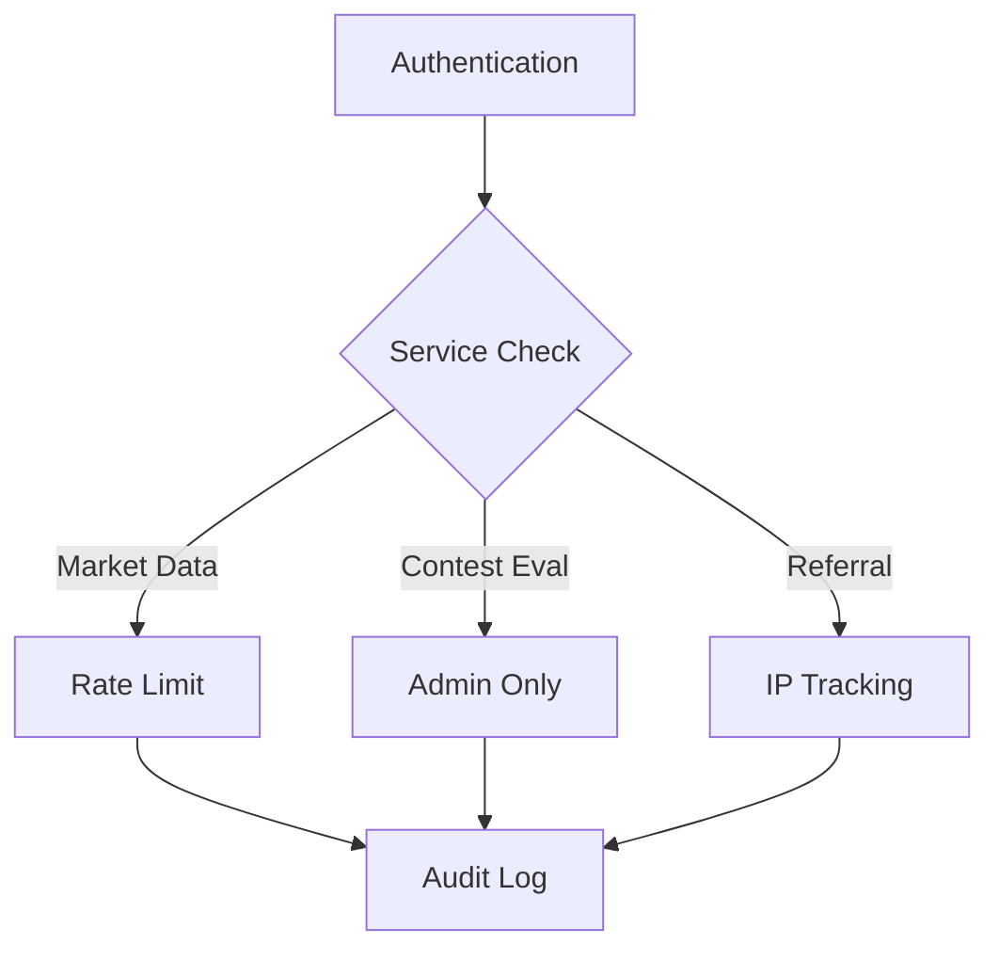
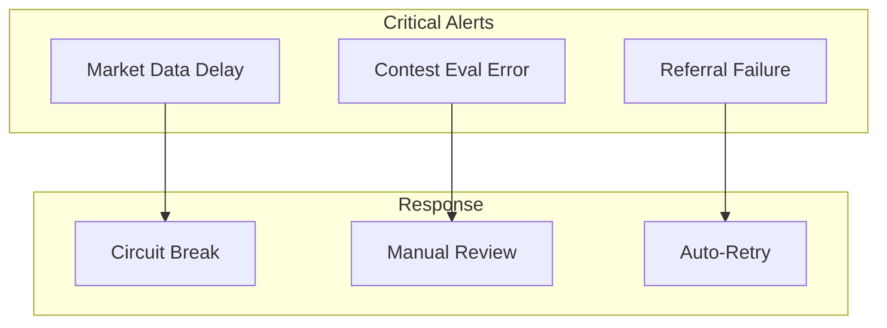
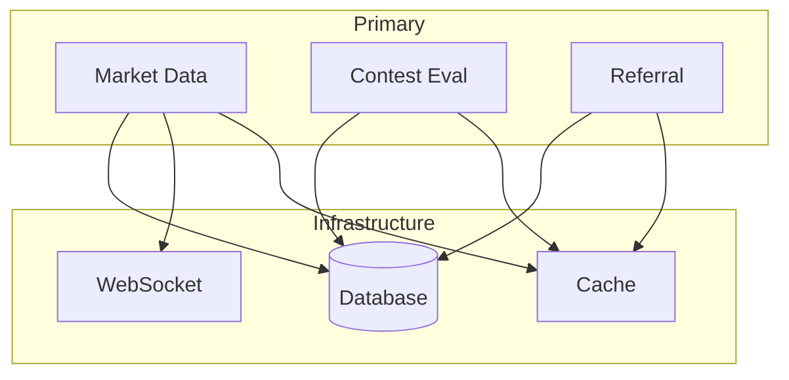

# Operations Management Services Overview

## Table of Contents
1. [System Overview](#system-overview)
2. [Service Architecture](#service-architecture)
3. [Service Interactions](#service-interactions)
4. [Operational Flows](#operational-flows)
5. [Data Management](#data-management)
6. [Performance & Scaling](#performance--scaling)
7. [Security & Compliance](#security--compliance)
8. [Monitoring & Maintenance](#monitoring--maintenance)

## System Overview

The Operations Management layer of DegenDuel consists of four interconnected services that manage critical platform operations:

1. **Contest Evaluation Service**
   - Contest lifecycle management
   - Winner determination
   - Prize distribution
   - Tiebreaker resolution

2. **Market Data Service**
   - Real-time price streaming
   - Market sentiment analysis
   - Volume tracking
   - WebSocket distribution

3. **Referral Service**
   - Referral program management
   - Reward distribution
   - Period-based competitions
   - Analytics tracking

4. **Token Whitelist Service**
   - Token validation
   - Submission management
   - Whitelist enforcement
   - Token status tracking

### Service Relationships


## Service Architecture

### High-Level Integration


## Service Interactions

### Primary Data Flows


### Shared Resources
```javascript
{
    database: {
        tables: {
            contests: "Contest data & status",
            market_data: "Price & volume info",
            referrals: "Referral tracking"
        },
        access: {
            contestEval: "READ/WRITE",
            marketData: "READ",
            referral: "READ/WRITE"
        }
    },
    cache: {
        marketData: "1s TTL",
        rankings: "60s TTL",
        contestStats: "300s TTL"
    }
}
```

## Operational Flows

### Contest Completion Flow


### Market Data Distribution


### Referral Processing


## Data Management

### Service Data Domains
```javascript
// Data ownership and access patterns
{
    marketData: {
        owner: "Market Data Service",
        consumers: ["Contest Evaluation", "UI"],
        updateFrequency: "100ms",
        cacheStrategy: "Short-term"
    },
    contestResults: {
        owner: "Contest Evaluation",
        consumers: ["Referral Service", "UI"],
        updateFrequency: "On completion",
        cacheStrategy: "Long-term"
    },
    referralStats: {
        owner: "Referral Service",
        consumers: ["Contest Evaluation", "UI"],
        updateFrequency: "5 minutes",
        cacheStrategy: "Medium-term"
    }
}
```

### Cache Coordination


## Performance & Scaling

### Service Requirements
| Service | Update Frequency | Cache TTL | Resource Priority |
|---------|-----------------|-----------|-------------------|
| Market Data | 100ms | 1s | High CPU/Memory |
| Contest Eval | On demand | 5m | High CPU |
| Referral | 5m | 5m | High I/O |
| Token Whitelist | On demand | 1h | Medium I/O |

### Resource Allocation
```javascript
{
    marketData: {
        cpu: "4 cores",
        memory: "8GB",
        network: "1Gbps"
    },
    contestEval: {
        cpu: "2 cores",
        memory: "4GB",
        network: "100Mbps"
    },
    referral: {
        cpu: "2 cores",
        memory: "4GB",
        network: "100Mbps"
    },
    tokenWhitelist: {
        cpu: "1 core",
        memory: "2GB",
        network: "100Mbps"
    }
}
```

## Security & Compliance

### Service Security Matrix
| Service | Auth Required | Rate Limits | Data Sensitivity |
|---------|--------------|-------------|------------------|
| Market Data | Yes | 600/min | Medium |
| Contest Eval | Yes | 10/min | High |
| Referral | Yes | 100/15min | High |
| Token Whitelist | Yes | 10/hour | High |

### Cross-Service Security


## Monitoring & Maintenance

### Health Checks
```javascript
{
    marketData: {
        latency: "< 100ms",
        uptime: "99.99%",
        errorRate: "< 0.1%"
    },
    contestEval: {
        accuracy: "100%",
        completion: "< 5min",
        errorRate: "0%"
    },
    referral: {
        tracking: "100%",
        distribution: "< 24h",
        errorRate: "< 1%"
    },
    tokenWhitelist: {
        validation: "100%",
        response: "< 30s",
        errorRate: "< 0.1%"
    }
}
```

### Alert Coordination


### Service Dependencies


## Best Practices

1. **Service Coordination**
   - Maintain service order dependencies
   - Coordinate maintenance windows
   - Synchronize cache invalidation
   - Share resource limits

2. **Data Consistency**
   - Market Data is source of truth for prices
   - Contest Evaluation for results
   - Referral Service for engagement metrics

3. **Performance Optimization**
   - Optimize high-frequency operations
   - Cache aggressively but appropriately
   - Monitor resource utilization
   - Balance load distribution

4. **Error Handling**
   - Implement circuit breakers
   - Coordinate recovery procedures
   - Maintain audit trails
   - Share error states

5. **Monitoring**
   - Track cross-service metrics
   - Monitor end-to-end flows
   - Alert on service dependencies
   - Maintain performance baselines

---

*Last Updated: February 2024*
*Contact: DegenDuel Platform Team* 