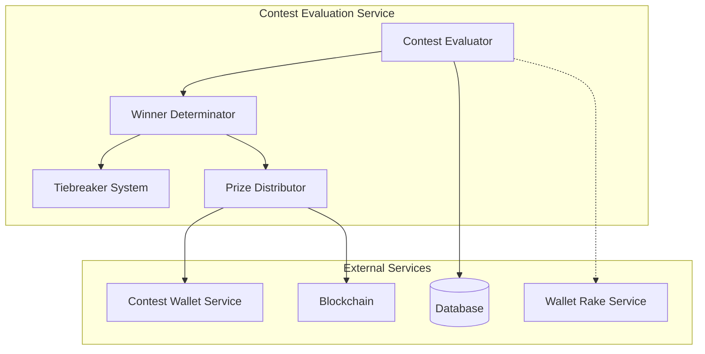
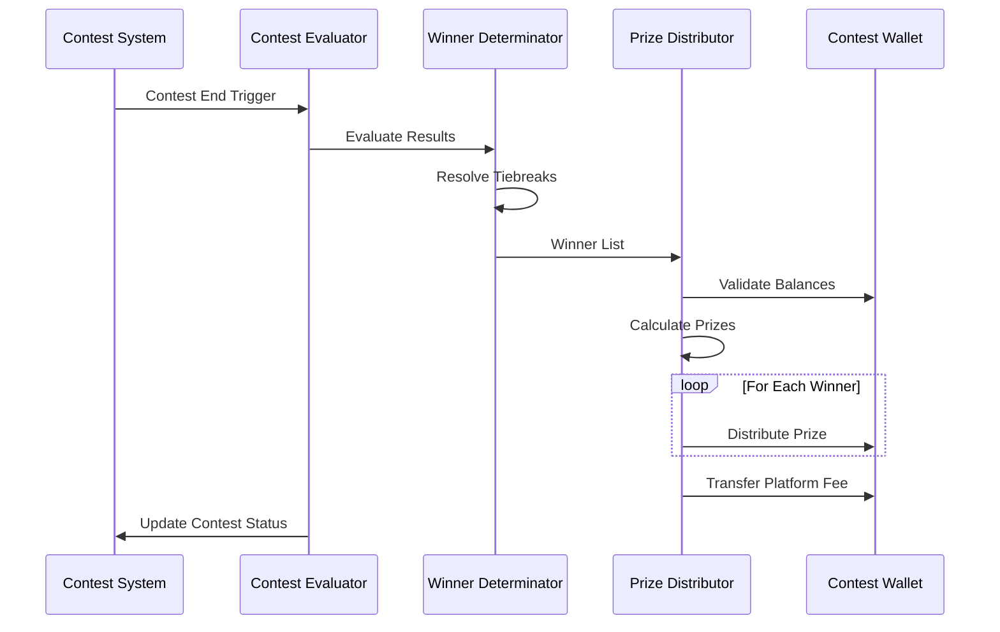
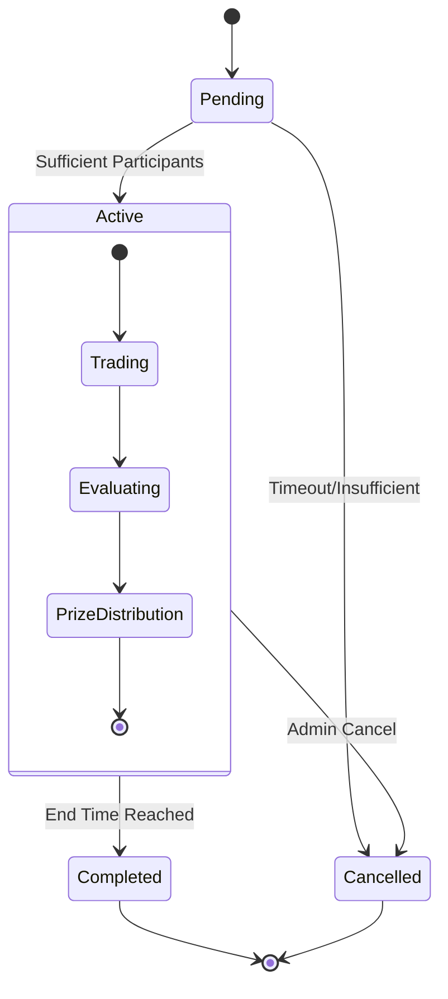
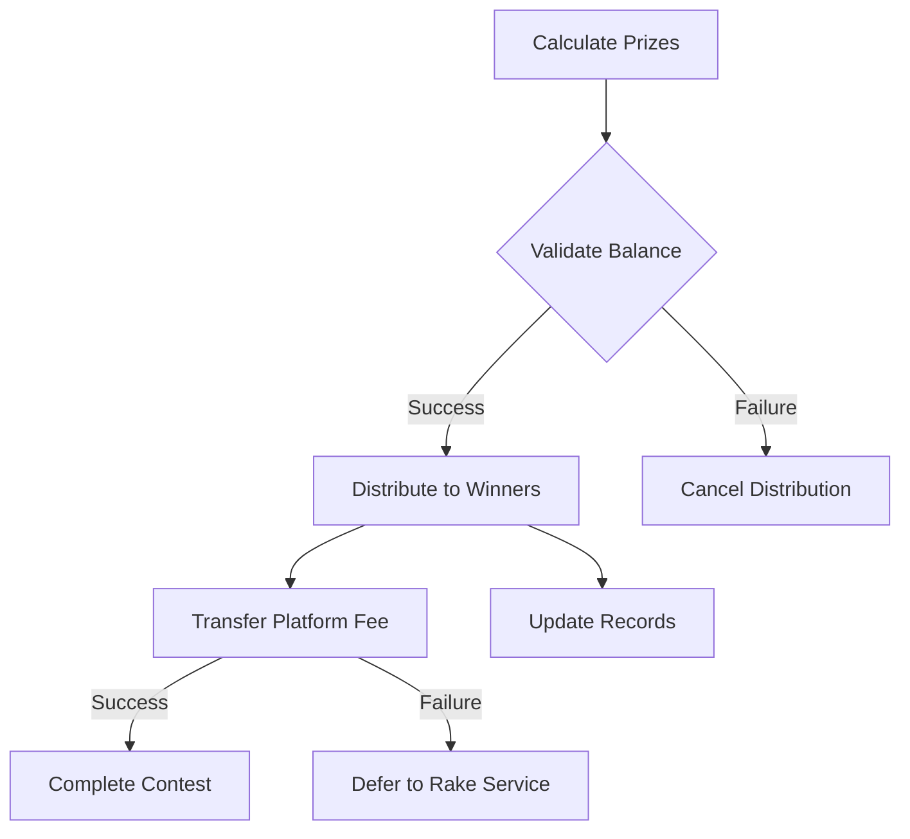

# Contest Evaluation Service Reference

## Table of Contents
1. [System Overview](#system-overview)
2. [Architecture](#architecture)
3. [Core Components](#core-components)
4. [Configuration](#configuration)
5. [Contest Lifecycle](#contest-lifecycle)
6. [Winner Determination](#winner-determination)
7. [Prize Distribution](#prize-distribution)
8. [Financial Management](#financial-management)
9. [Monitoring & Maintenance](#monitoring--maintenance)
10. [Error Handling](#error-handling)
11. [Integration Guide](#integration-guide)
12. [Troubleshooting](#troubleshooting)

## System Overview

The Contest Evaluation Service is a critical operational component of the DegenDuel platform, responsible for managing the entire contest lifecycle from initiation to completion, including winner determination and prize distribution.

### Purpose
- Manage contest lifecycle states
- Determine contest winners
- Handle prize distribution
- Process contest refunds
- Manage platform fees

### Key Responsibilities
- Automated contest start/end
- Complex tiebreaker resolution
- Prize pool calculation
- Secure prize distribution
- Platform fee collection

## Architecture

### High-Level Design


### Process Flow


## Core Components

### Contest Evaluator
```javascript
class ContestEvaluationService extends BaseService {
    // Core functionality
    - Contest lifecycle management
    - Winner determination
    - Prize distribution
    - Platform fee handling
}
```

### Configuration
```javascript
{
    name: 'contest_evaluation_service',
    checkIntervalMs: 60 * 1000,  // 1-minute checks
    prizeDistribution: {
        maxRetries: 3,
        retryDelayMs: 5000
    },
    refunds: {
        maxRetries: 3,
        retryDelayMs: 5000
    },
    autoCancelWindow: (0 * 24 * 60 * 60 * 1000) + (0 * 60 * 60 * 1000) + (1 * 60 * 1000) + (29 * 1000),  // 0 days, 0 hours, 1 minutes, and 29 seconds
    states: {
        PENDING: 'pending',
        ACTIVE: 'active',
        COMPLETED: 'completed',
        CANCELLED: 'cancelled'
    }
}
```

## Contest Lifecycle

### State Transitions


### Auto-Cancellation Mechanism

The service automatically manages contest state transitions, including cancellation when requirements aren't met:

1. **No Participants Cancellation**
   - When a contest reaches its start time with 0 participants
   - Cancellation happens immediately, no waiting period
   - Status changes to "cancelled" with appropriate reason

2. **Insufficient Participants Cancellation**
   - When a contest has participants but fewer than the minimum required
   - System waits for `autoCancelWindow` duration (default: 1 min 29 sec)
   - If minimum not reached after waiting, status changes to "cancelled"

3. **Waiting Period Logic**
   ```javascript
   if (contest.start_time < new Date(Date.now() - autoCancelWindow)) {
       // Cancel contest - insufficient participants after waiting period
   } else {
       // Still in waiting period, check again on next service run
   }
   ```

This mechanism allows for a brief period where late sign-ups can still occur before cancellation.

## Winner Determination

### Tiebreaker System
```javascript
// Tiebreaker Metrics (in order of priority)
1. Final Balance
2. Win Rate
3. Number of Profitable Trades
4. Average Profit per Trade
5. Biggest Single Win
6. Time in Profitable Positions
7. Earliest Profitable Trade
8. Wallet Address (deterministic fallback)
```

### Tiebreaker Statistics
```javascript
{
    wallet_address: String,
    final_balance: Decimal,
    profitable_trades: Number,
    total_trades: Number,
    win_rate: Number,
    biggest_win: Decimal,
    avg_profit_per_trade: Decimal,
    time_in_profitable_positions: Number,
    earliest_profit_time: Date,
    total_profit: Decimal
}
```

## Prize Distribution

### Prize Pool Calculation
```javascript
// Platform fee calculation
platformFeePercentage = 0.10  // 10%
actualPrizePool = totalPool * (1 - platformFeePercentage)

// Prize structure example
{
    place_1: 0.69,  // 69% to first place
    place_2: 0.20,  // 20% to second place
    place_3: 0.11   // 11% to third place
}
```

### Distribution Process


## Financial Management

### Balance Validation
```javascript
requiredBalance = totalPrizePool + platformFee + minimumBuffer
currentBalance = await getWalletBalance()

if (currentBalance < requiredBalance) {
    throw InsufficientBalanceError
}
```

### Transaction Types
1. **Prize Payouts**
   - Winner distributions
   - Includes place ranking
   - Full audit trail

2. **Platform Fees**
   - 10% of prize pool
   - Automatic collection
   - Rake service fallback

3. **Refunds**
   - Cancelled contests
   - Entry fee returns
   - Retry mechanism

## Monitoring & Maintenance

### Health Metrics
```javascript
{
    totalEvaluated: Number,
    successfulEvaluations: Number,
    failedEvaluations: Number,
    prizeDistribution: {
        total: Number,
        successful: Number,
        failed: Number,
        totalAmountDistributed: Decimal
    },
    tieBreaks: {
        total: Number,
        resolved: Number,
        failed: Number
    }
}
```

### Service Management Integration

The Contest Evaluation Service fully integrates with the platform's centralized service tracking system:

1. **Health Reporting**
   - Reports heartbeats at regular intervals using `serviceManager.updateServiceHeartbeat()`
   - Includes detailed `evaluationStats` with each heartbeat
   - Updates operation success/failure counts for circuit breaker monitoring
   - Fetches current database counts to maintain accurate contest status statistics

2. **Error Handling**
   - Errors are properly tracked and reported to the service manager
   - Each operation failure increments appropriate counters
   - Consecutive failures properly trigger circuit breaker protection

3. **Monitoring Dashboard Integration**
   - Service health is visible in the admin service dashboard
   - Key metrics include:
     - Active/completed/cancelled contest counts
     - Operation success rate
     - Average evaluation time
     - Prize distribution success rate

4. **Circuit Breaker Protection**
   - Automatically pauses operation after consecutive failures
   - Self-recovers after configured reset timeouts
   - Administrative override available via service management API

All service state changes, including contest cancellations, are reflected in real-time in the service management system's monitoring dashboard.

### Performance Monitoring
- Evaluation timing
- Distribution success rates
- Tiebreaker resolution metrics
- Balance validation checks

## Error Handling

### Error Types
1. **Evaluation Errors**
   - Insufficient participants
   - Invalid contest state
   - Data inconsistencies

2. **Distribution Errors**
   - Insufficient balance
   - Transaction failures
   - Network issues

3. **Tiebreaker Errors**
   - Data access issues
   - Calculation errors
   - Resolution failures

### Recovery Mechanisms
```javascript
// Prize distribution retry mechanism
for (let attempt = 1; attempt <= maxRetries; attempt++) {
    try {
        await distributePrize()
        break
    } catch (error) {
        if (attempt === maxRetries) throw error
        await delay(retryDelayMs)
    }
}
```

## Integration Guide

### Contest Evaluation
```javascript
// Trigger contest evaluation
async function evaluateContest(contestId) {
    const contest = await getContest(contestId)
    const winners = await determineWinners(contest)
    await distributePrizes(winners)
    await updateContestStatus(contest)
}
```

### Manual Operations
```javascript
// Admin-initiated evaluation
async function manuallyEvaluate(contestId, adminId) {
    await validateAdminContext(adminId)
    await evaluateContest(contestId)
    await logAdminAction(adminId, 'FORCE_EVALUATE')
}
```

## Troubleshooting

### Common Issues

#### Evaluation Failures
**Symptoms:**
- Stuck in evaluation state
- Missing winner data
- Tiebreaker errors

**Resolution:**
- Check participant data
- Verify balance calculations
- Review tiebreaker metrics
- Check database consistency

#### Distribution Issues
**Symptoms:**
- Failed prize payments
- Incomplete distributions
- Balance discrepancies

**Resolution:**
- Verify wallet balances
- Check transaction logs
- Review prize calculations
- Monitor network status

#### State Transition Problems
**Symptoms:**
- Contests stuck in states
- Missing state updates
- Inconsistent timestamps
- Contests not being automatically canceled

**Resolution:**
- Check state conditions
- Verify timestamps
- Review participant counts 
- Check automatic triggers
- Verify `autoCancelWindow` configuration is appropriate
- Check contest participant count against minimum requirements
- Review logs for "waiting for more participants" messages

### Best Practices
1. Regular state monitoring
2. Balance verification
3. Transaction confirmation
4. Audit log review
5. Performance optimization
6. Error rate monitoring
7. Network status checks

---

*Last Updated: March 2025*
*Contact: DegenDuel Platform Team* 