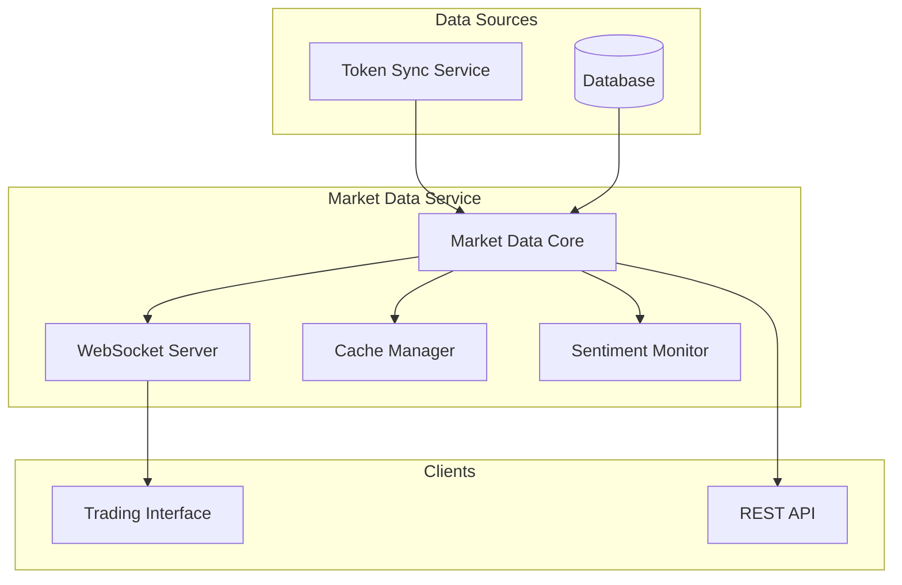
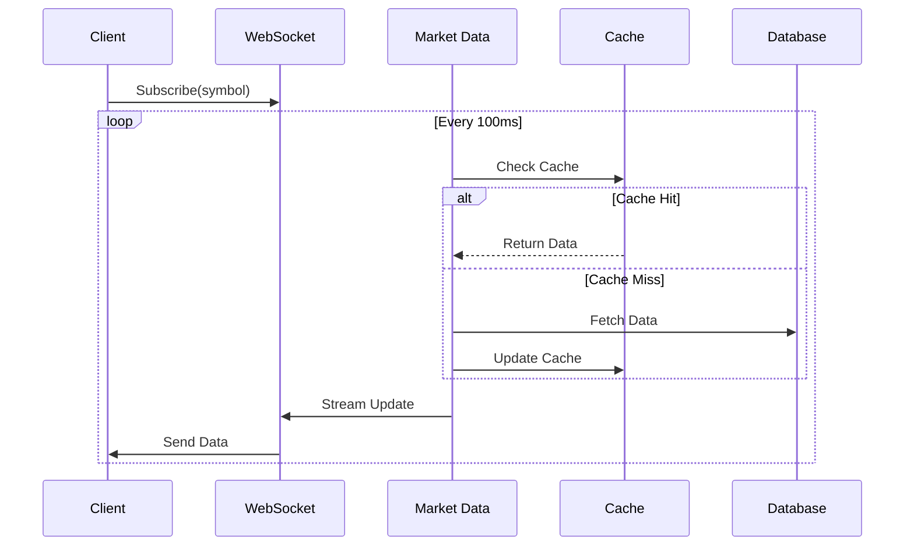
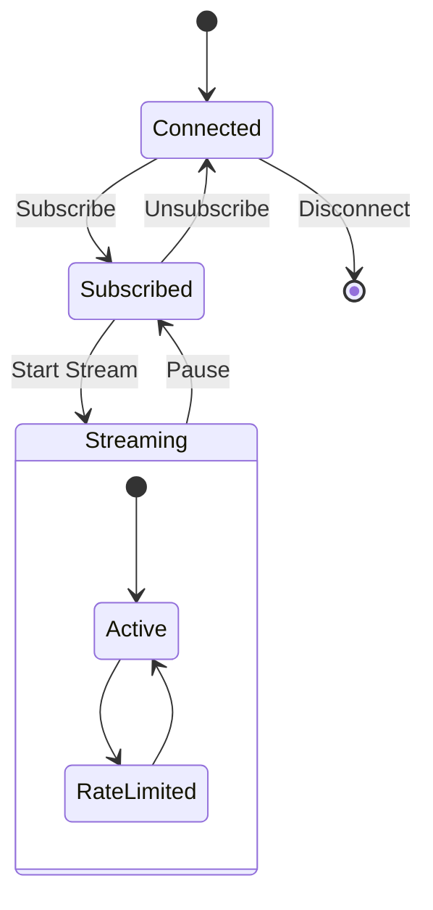

# Market Data System Reference

## Table of Contents
1. [System Overview](#system-overview)
2. [Architecture](#architecture)
3. [Core Components](#core-components)
4. [Real-Time Capabilities](#real-time-capabilities)
5. [Data Streams](#data-streams)
6. [WebSocket Interface](#websocket-interface)
7. [Performance & Scaling](#performance--scaling)
8. [Caching System](#caching-system)
9. [Error Handling](#error-handling)
10. [Monitoring & Maintenance](#monitoring--maintenance)
11. [Integration Guide](#integration-guide)
12. [Troubleshooting](#troubleshooting)

## System Overview

The Market Data Service is a high-performance, real-time data delivery system that provides instant access to token prices, volumes, and market sentiment. It serves as the primary source of market information for the DegenDuel platform's trading interface.

### Purpose
- Deliver real-time market data
- Provide WebSocket streaming
- Calculate market metrics
- Monitor trading sentiment
- Optimize data delivery

### Key Responsibilities
- 10 updates/second data streaming
- Price aggregation
- Volume tracking
- Sentiment analysis
- Cache management

## Architecture

### High-Level Design


### Data Flow


## Core Components

### Market Data Service
```javascript
class MarketDataService extends BaseService {
    // Core functionality
    - Real-time data streaming
    - Cache management
    - Health monitoring
    - Rate limiting
}
```

### Configuration
```javascript
{
    updateInterval: 100,           // 100ms for 10 updates/second
    maxConcurrentRequests: 100,
    cacheTimeout: 1000,           // 1 second cache
    circuitBreaker: {
        failureThreshold: 5,
        resetTimeoutMs: 60000,    // 1 minute
        minHealthyPeriodMs: 120000 // 2 minutes
    }
}
```

## Real-Time Capabilities

### Update Frequency
- 10 updates per second (100ms interval)
- Configurable rate limiting
- Optimized for low latency
- Resource-aware scaling

### WebSocket Streaming
```javascript
// WebSocket message types
{
    MARKET_PRICE: {
        symbol: String,
        price: Decimal,
        change_24h: Decimal,
        volume_24h: Decimal,
        high_24h: Decimal,
        low_24h: Decimal,
        timestamp: DateTime
    },
    MARKET_VOLUME: {
        symbol: String,
        volume: Decimal,
        trades_count: Number,
        buy_volume: Decimal,
        sell_volume: Decimal,
        interval: String,
        timestamp: DateTime
    },
    MARKET_SENTIMENT: {
        symbol: String,
        sentiment_score: Number,
        buy_pressure: Number,
        sell_pressure: Number,
        volume_trend: String,
        timestamp: DateTime
    }
}
```

## Data Streams

### Price Stream
```javascript
async getPrice(symbol) {
    // Real-time price data
    {
        current: Decimal,
        change_24h: Decimal,
        volume_24h: Decimal,
        high_24h: Decimal,
        low_24h: Decimal
    }
}
```

### Volume Stream
```javascript
async getVolume(symbol) {
    // 1-hour volume data
    {
        total: Decimal,
        trades_count: Number,
        buy_volume: Decimal,
        sell_volume: Decimal,
        interval: '1h'
    }
}
```

### Sentiment Stream
```javascript
async getSentiment(symbol) {
    // Market sentiment data
    {
        score: Number,
        buy_pressure: Number,
        sell_pressure: Number,
        volume_trend: 'increasing' | 'stable' | 'decreasing'
    }
}
```

## WebSocket Interface

### Connection Management


### Subscription Management
```javascript
{
    symbolSubscriptions: Map<clientId, Set<symbol>>,
    maxPayload: 16 * 1024,  // 16KB
    requireAuth: true,
    rateLimit: 600          // 10 updates/second
}
```

## Performance & Scaling

### Resource Management
- Concurrent request limiting
- Cache optimization
- Connection pooling
- Memory management

### Performance Metrics
```javascript
{
    requestCount: Number,
    cacheHits: Number,
    cacheMisses: Number,
    errors: Number,
    lastError: String,
    marketData: {
        circuitBreaker: {
            isOpen: Boolean,
            failures: Number,
            lastFailure: DateTime,
            recoveryAttempts: Number,
            lastCheck: DateTime
        }
    }
}
```

## Caching System

### Cache Structure
```javascript
{
    key: String,      // 'price:${symbol}'
    data: Object,     // Cached data
    timestamp: Number // Cache entry time
}
```

### Cache Management
```javascript
// Cache operations
getFromCache(key)
setCache(key, data)
cleanupCache()  // Runs periodically
```

## Error Handling

### Error Types
1. **Service Errors**
   - Circuit breaker open
   - Rate limiting
   - Resource exhaustion
   - Network issues

2. **Data Errors**
   - Missing data
   - Stale cache
   - Invalid updates
   - Format issues

3. **WebSocket Errors**
   - Connection drops
   - Subscription errors
   - Message failures

### Recovery Mechanisms
```javascript
// Health check mechanism
async checkServiceHealth() {
    - Check circuit breaker
    - Verify request count
    - Monitor resources
    - Validate connections
}
```

## Monitoring & Maintenance

### Health Metrics
```javascript
{
    serviceStatus: {
        isHealthy: Boolean,
        activeConnections: Number,
        activeSubscriptions: Number,
        cacheSize: Number
    },
    performance: {
        requestLatency: Number,
        updateFrequency: Number,
        messageSize: Number,
        errorRate: Number
    }
}
```

### Alert Conditions
1. **Critical Alerts**
   - Service unavailable
   - High error rate
   - Circuit breaker trips
   - Memory pressure

2. **Warning Alerts**
   - Cache performance
   - Update delays
   - Connection issues
   - Rate limiting

## Integration Guide

### REST API Access
```javascript
// Get latest market data
GET /api/marketData/latest
{
    success: true,
    data: [{
        address: String,
        symbol: String,
        name: String,
        price: Decimal,
        market_cap: Decimal,
        change_24h: Decimal,
        volume_24h: Decimal,
        last_updated: DateTime
    }],
    timestamp: DateTime
}
```

### WebSocket Integration
```javascript
// Connect to WebSocket
const ws = new WebSocket('/api/v2/ws/market');

// Subscribe to updates
ws.send({
    type: 'SUBSCRIBE',
    symbols: ['SOL', 'BONK']
});

// Handle updates
ws.onmessage = (event) => {
    const { type, data } = JSON.parse(event.data);
    switch(type) {
        case 'MARKET_PRICE':
            updatePrice(data);
            break;
        case 'MARKET_VOLUME':
            updateVolume(data);
            break;
        case 'MARKET_SENTIMENT':
            updateSentiment(data);
            break;
    }
};
```

## Troubleshooting

### Common Issues

#### Data Latency
**Symptoms:**
- Delayed updates
- Stale prices
- Slow responses

**Resolution:**
- Check network latency
- Verify cache health
- Monitor update frequency
- Review subscription load

#### WebSocket Issues
**Symptoms:**
- Connection drops
- Message delays
- Subscription failures

**Resolution:**
- Check connection status
- Verify authentication
- Review rate limits
- Monitor message queue

#### Resource Issues
**Symptoms:**
- High memory usage
- Increased latency
- Service instability

**Resolution:**
- Monitor resource usage
- Optimize cache size
- Adjust rate limits
- Scale if needed

### Best Practices
1. Monitor update frequency
2. Maintain connection health
3. Optimize subscriptions
4. Cache management
5. Resource monitoring
6. Error tracking
7. Performance tuning

---

*Last Updated: February 2024*
*Contact: DegenDuel Platform Team* 