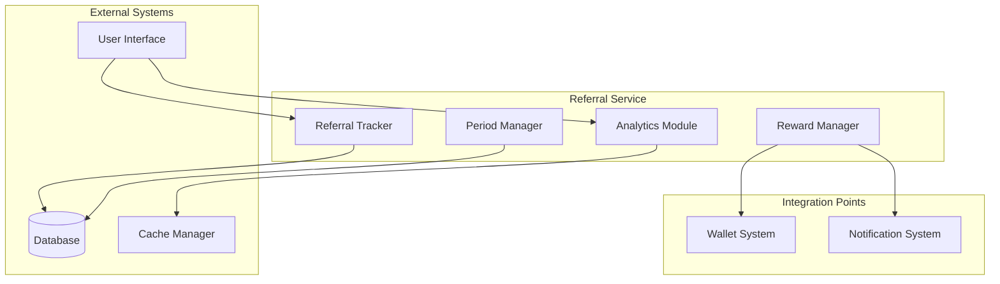
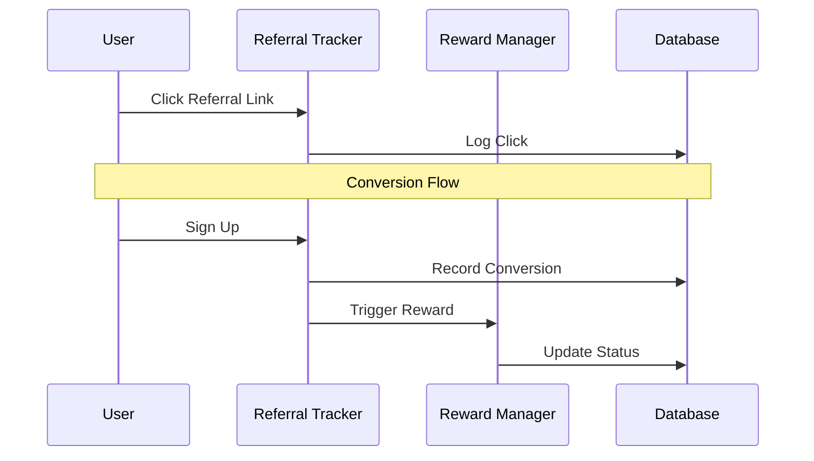
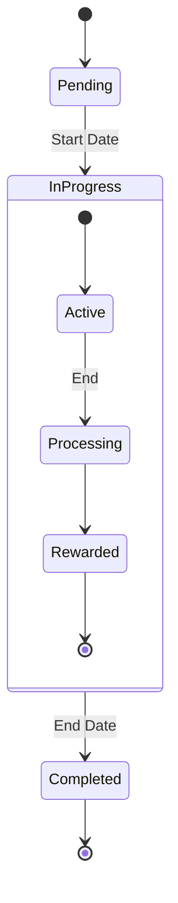
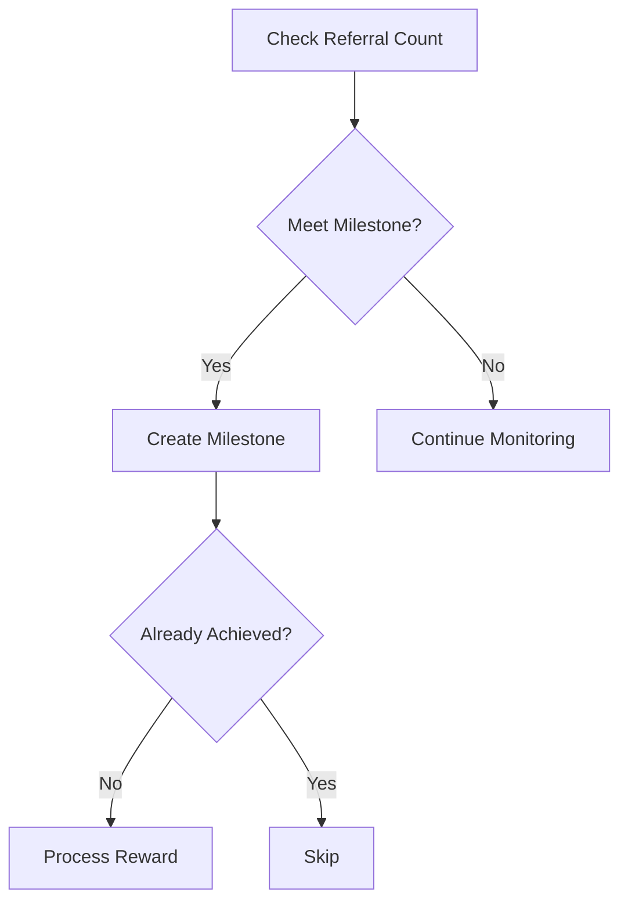

# Referral Service Reference

## Table of Contents
1. [System Overview](#system-overview)
2. [Architecture](#architecture)
3. [Core Components](#core-components)
4. [Period Management](#period-management)
5. [Tracking System](#tracking-system)
6. [Reward System](#reward-system)
7. [Analytics & Reporting](#analytics--reporting)
8. [Ranking System](#ranking-system)
9. [Caching Strategy](#caching-strategy)
10. [Security & Rate Limiting](#security--rate-limiting)
11. [Performance & Scaling](#performance--scaling)
12. [Error Handling](#error-handling)
13. [Integration Guide](#integration-guide)
14. [Troubleshooting](#troubleshooting)

## System Overview

The Referral Service manages DegenDuel's comprehensive referral program, handling everything from click tracking to reward distribution, with support for periodic competitions and milestone achievements.

### Purpose
- Track referral activities
- Manage reward distribution
- Handle periodic competitions
- Process milestone achievements
- Provide analytics insights

### Key Responsibilities
- Click & conversion tracking
- Reward calculation & distribution
- Period & ranking management
- Milestone tracking
- Analytics reporting

## Architecture

### High-Level Design


### Data Flow


## Core Components

### Referral Service
```javascript
class ReferralService extends BaseService {
    // Core functionality
    - Click tracking
    - Conversion processing
    - Reward distribution
    - Period management
    - Analytics reporting
}
```

### Configuration
```javascript
{
    name: 'referral_service',
    checkIntervalMs: 5 * 60 * 1000,  // 5-minute checks
    tracking: {
        maxClicksPerIP: 100,
        clickWindowMs: 15 * 60 * 1000,    // 15 minutes
        maxConversionsPerIP: 10,
        conversionWindowMs: 60 * 60 * 1000 // 1 hour
    },
    cache: {
        periodStatsTTL: 300,  // 5 minutes
        rankingsTTL: 60       // 1 minute
    }
}
```

## Period Management

### Period Structure
```javascript
{
    id: UUID,
    start_date: DateTime,
    end_date: DateTime,
    is_active: Boolean,
    status: 'pending' | 'in_progress' | 'completed',
    settings: {
        reward_tiers: {
            tier_1: { referrals: 5, reward: 10 },
            tier_2: { referrals: 15, reward: 30 },
            tier_3: { referrals: 30, reward: 60 }
        },
        leaderboard_rewards: {
            top_3: [100, 50, 25],
            top_10: 10
        }
    }
}
```

### Period Flow


## Tracking System

### Click Tracking
```javascript
// Click data structure
{
    referral_code: String,
    source: String,
    landing_page: String,
    utm_params: {
        source: String,
        medium: String,
        campaign: String
    },
    device: String,
    browser: String,
    ip_address: String,
    user_agent: String,
    session_id: UUID,
    timestamp: DateTime
}
```

### Conversion Tracking
```javascript
// Conversion data structure
{
    referrer_id: String,
    referred_id: String,
    status: 'PENDING' | 'COMPLETED',
    reward_amount: Decimal,
    qualified_at: DateTime,
    reward_paid_at: DateTime,
    metadata: {
        source: String,
        campaign: String,
        conversion_time: Number
    }
}
```

## Reward System

### Milestone Management


### Reward Distribution
```javascript
// Reward processing flow
async processRewards(referralId) {
    1. Validate referral
    2. Calculate reward
    3. Process payment
    4. Update status
    5. Trigger milestone check
    6. Update statistics
}
```

## Analytics & Reporting

### Click Analytics
```javascript
{
    total: Number,
    by_source: {
        [source: String]: Number
    },
    by_device: {
        [device: String]: Number
    },
    by_campaign: {
        [campaign: String]: Number
    },
    conversion_rate: Number
}
```

### Conversion Analytics
```javascript
{
    total: Number,
    by_source: {
        [source: String]: Number
    },
    by_status: {
        PENDING: Number,
        COMPLETED: Number
    },
    average_time: Number
}
```

### Performance Metrics
```javascript
{
    operations: {
        total: Number,
        successful: Number,
        failed: Number
    },
    rewards: {
        total_distributed: Decimal,
        by_type: Object,
        pending: Number
    },
    performance: {
        average_operation_time_ms: Number,
        last_operation_time_ms: Number
    }
}
```

## Ranking System

### Ranking Calculation
```javascript
// SQL-based ranking
SELECT 
    referrer_id,
    COUNT(*) as referral_count,
    ROW_NUMBER() OVER (
        ORDER BY COUNT(*) DESC
    ) as rank
FROM referrals
WHERE period_id = ?
GROUP BY referrer_id
```

### Trend Analysis
```javascript
// Trend calculation
calculateTrend(newRank, oldRank) {
    if (!oldRank) return 'stable';
    return newRank < oldRank ? 'up' :
           newRank > oldRank ? 'down' : 'stable';
}
```

## Caching Strategy

### Cache Structure
```javascript
{
    // Period stats cache
    'current_period_stats': {
        total_global_referrals: Number,
        current_period: {
            start_date: DateTime,
            end_date: DateTime,
            days_remaining: Number
        }
    },
    
    // Rankings cache
    'current_rankings': Array<{
        user_id: String,
        rank: Number,
        referral_count: Number,
        trend: 'up' | 'down' | 'stable'
    }>
}
```

### Cache Management
```javascript
// Cache operations
async getCachedPeriodStats()
async getCachedRankings()
cleanupCache()  // Periodic cleanup
```

## Security & Rate Limiting

### Rate Limits
```javascript
{
    clicks: {
        maxPerIP: 100,
        windowMs: 900000  // 15 minutes
    },
    conversions: {
        maxPerIP: 10,
        windowMs: 3600000 // 1 hour
    }
}
```

### IP Tracking
```javascript
// IP tracking structure
{
    ip_address: String,
    click_count: Number,
    conversion_count: Number,
    first_seen: DateTime,
    last_seen: DateTime
}
```

## Performance & Scaling

### Resource Management
- Batch processing
- Caching strategy
- Database optimization
- Rate limiting

### Performance Metrics
```javascript
{
    tracking: {
        clickLatency: Number,
        conversionLatency: Number,
        processingTime: Number
    },
    caching: {
        hitRate: Number,
        missRate: Number,
        evictionRate: Number
    },
    database: {
        queryTime: Number,
        connectionPool: Number
    }
}
```

## Error Handling

### Error Types
1. **Tracking Errors**
   - Rate limit exceeded
   - Invalid referral code
   - Duplicate conversion
   - IP blacklisted

2. **Reward Errors**
   - Processing failure
   - Invalid amount
   - Distribution failure
   - Milestone error

3. **System Errors**
   - Database issues
   - Cache failures
   - Network problems
   - Service timeouts

### Recovery Mechanisms
```javascript
// Error handling flow
async handleError(error) {
    1. Log error
    2. Update statistics
    3. Trigger circuit breaker
    4. Attempt recovery
    5. Notify if critical
}
```

## Integration Guide

### Tracking Integration
```javascript
// Track referral click
async trackClick(referralCode, clickData) {
    const click = await referralService.trackClick(
        referralCode,
        {
            source: 'website',
            device: 'mobile',
            ip_address: '1.2.3.4',
            ...clickData
        }
    );
    return click;
}
```

### Conversion Integration
```javascript
// Process conversion
async processConversion(sessionId, userData) {
    const conversion = await referralService.processConversion(
        sessionId,
        {
            wallet_address: '0x...',
            ...userData
        }
    );
    return conversion;
}
```

## Troubleshooting

### Common Issues

#### Tracking Issues
**Symptoms:**
- Missing clicks
- Duplicate conversions
- Rate limit errors

**Resolution:**
- Check IP limits
- Verify session tracking
- Review rate limits
- Monitor click flow

#### Reward Issues
**Symptoms:**
- Failed distributions
- Incorrect amounts
- Missing milestones

**Resolution:**
- Verify calculations
- Check reward rules
- Review transactions
- Audit milestone logic

#### Period Issues
**Symptoms:**
- Incorrect rankings
- Missing rewards
- Period transitions

**Resolution:**
- Check period dates
- Verify calculations
- Review rankings
- Audit transitions

### Best Practices
1. Regular analytics review
2. Cache management
3. Rate limit monitoring
4. Database optimization
5. Error tracking
6. Performance tuning
7. Security auditing

---

*Last Updated: February 2024*
*Contact: DegenDuel Platform Team* 