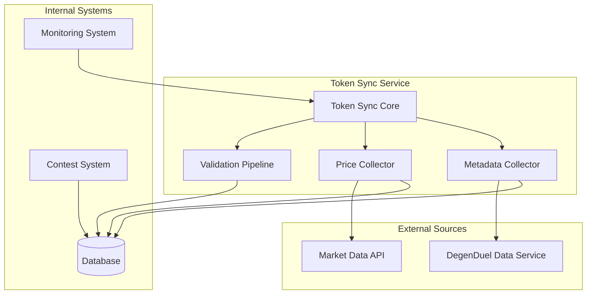
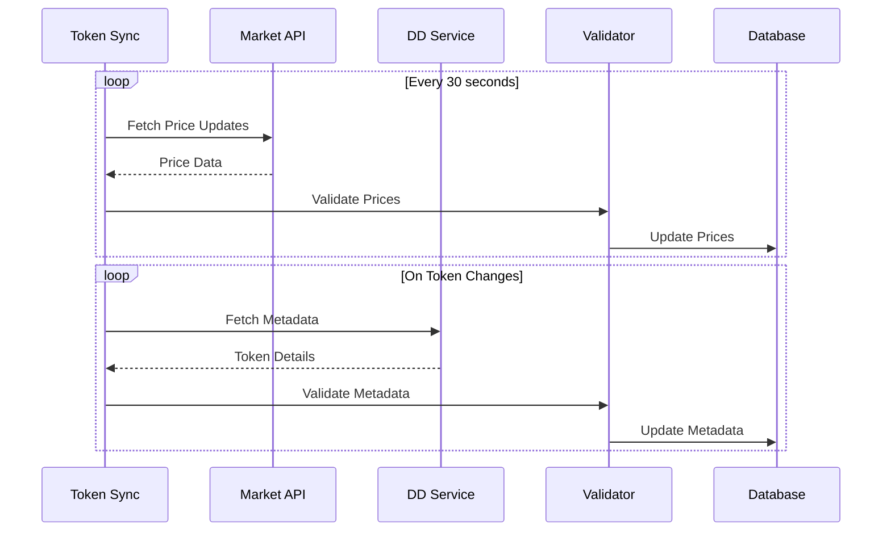
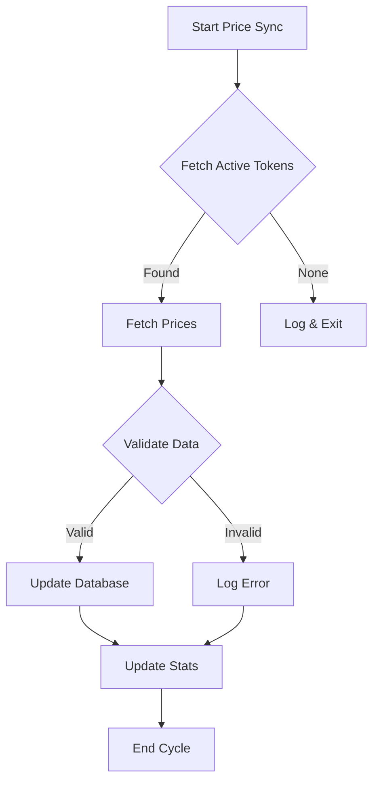
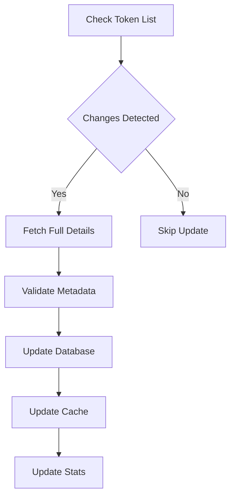

# Token Sync System Reference

## Table of Contents
1. [System Overview](#system-overview)
2. [Architecture](#architecture)
3. [Core Components](#core-components)
4. [Configuration](#configuration)
5. [Data Management](#data-management)
6. [Validation System](#validation-system)
7. [Synchronization Process](#synchronization-process)
8. [Performance & Scaling](#performance--scaling)
9. [Error Handling](#error-handling)
10. [Monitoring & Maintenance](#monitoring--maintenance)
11. [Integration Guide](#integration-guide)
12. [Troubleshooting](#troubleshooting)

## System Overview

The Token Sync Service is a mission-critical component of the DegenDuel platform that maintains accurate and up-to-date token information by synchronizing with external market data sources and managing token metadata.

### Purpose
- Maintain real-time token price data
- Synchronize token metadata
- Validate token information
- Ensure data consistency
- Track market metrics

### Key Responsibilities
- Price synchronization (30-second intervals)
- Metadata management
- Data validation
- Market statistics tracking
- Performance monitoring

## Architecture

### High-Level Design


### Data Flow


## Core Components

### Token Sync Service
```javascript
class TokenSyncService extends BaseService {
    // Core functionality
    - Price synchronization
    - Metadata management
    - Data validation
    - Cache management
    - Performance tracking
}
```

### Configuration
```javascript
{
    name: 'token_sync_service',
    checkIntervalMs: 30 * 1000,  // 30-second price checks
    maxRetries: 3,
    retryDelayMs: 5000,
    circuitBreaker: {
        failureThreshold: 5,
        resetTimeoutMs: 60000,
        minHealthyPeriodMs: 120000
    },
    api: {
        timeoutMs: 10000,
        endpoints: {
            prices: '/prices/bulk',
            simpleList: '/list?detail=simple',
            fullDetails: '/list?detail=full'
        }
    }
}
```

## Data Management

### Price Data Structure
```javascript
{
    token_id: String,
    price: Decimal,
    updated_at: DateTime,
    market_cap: Decimal,
    volume_24h: Decimal,
    change_24h: Decimal
}
```

### Metadata Structure
```javascript
{
    address: String,      // Validated Solana address
    symbol: String,       // Cleaned and normalized
    name: String,         // Validated token name
    decimals: Number,     // Default: 9
    is_active: Boolean,
    market_data: {
        market_cap: Decimal,
        change_24h: Decimal,
        volume_24h: Decimal
    },
    social_data: {
        image_url: String,
        description: String,
        twitter_url: String,
        telegram_url: String,
        discord_url: String,
        website_url: String
    }
}
```

## Validation System

### URL Validation
```javascript
validateUrl(url) {
    // Validation rules
    - Protocol whitelist (https, http)
    - Maximum length check
    - URL structure validation
    - Sanitization
}
```

### Token Data Validation
```javascript
// Symbol validation
symbol.trim()
    .toUpperCase()
    .replace(/[^A-Z0-9-_.]/g, '')
    .substring(0, MAX_LENGTH)

// Address validation
ADDRESS.SOLANA_PATTERN.test(address)

// Description validation
description.trim()
    .substring(0, MAX_LENGTH)
```

### Validation Statistics
```javascript
{
    validationFailures: {
        urls: Number,
        descriptions: Number,
        symbols: Number,
        names: Number,
        addresses: Number
    },
    metadataCompleteness: {
        hasImage: Number,
        hasDescription: Number,
        hasTwitter: Number,
        hasTelegram: Number,
        hasDiscord: Number,
        hasWebsite: Number
    }
}
```

## Synchronization Process

### Price Sync Flow


### Metadata Sync Flow


## Performance & Scaling

### Resource Management
- Optimized API calls
- Batch processing
- Connection pooling
- Cache utilization
- Rate limiting

### Performance Metrics
```javascript
{
    operations: {
        total: Number,
        successful: Number,
        failed: Number
    },
    timing: {
        lastOperationMs: Number,
        averageOperationMs: Number
    },
    data: {
        tokensProcessed: Number,
        pricesUpdated: Number,
        metadataUpdated: Number
    }
}
```

## Error Handling

### Error Types
1. **API Errors**
   - Timeout errors
   - Rate limiting
   - Data format issues
   - Network failures

2. **Validation Errors**
   - Invalid data format
   - Missing required fields
   - Malformed URLs
   - Invalid addresses

3. **Sync Errors**
   - Database conflicts
   - Cache inconsistencies
   - Transaction failures

### Recovery Mechanisms
```javascript
// API retry mechanism
async makeApiCall(endpoint, options) {
    for (let attempt = 1; attempt <= maxRetries; attempt++) {
        try {
            return await axios({ ... })
        } catch (error) {
            if (attempt === maxRetries) throw error
            await delay(retryDelayMs)
        }
    }
}
```

## Monitoring & Maintenance

### Health Metrics
```javascript
{
    syncStatus: {
        lastPriceSync: DateTime,
        lastMetadataSync: DateTime,
        activeTokens: Number,
        pendingUpdates: Number
    },
    performance: {
        apiLatency: Number,
        dbLatency: Number,
        memoryUsage: Number,
        errorRate: Number
    }
}
```

### Alert Conditions
1. **Critical Alerts**
   - Price sync failures
   - API unavailability
   - High error rates
   - Data inconsistencies

2. **Warning Alerts**
   - Increased latency
   - Validation failures
   - Cache misses
   - Resource pressure

## Integration Guide

### Price Data Access
```javascript
// Get latest token price
async function getTokenPrice(tokenAddress) {
    const price = await prisma.token_prices.findFirst({
        where: { token_address: tokenAddress },
        orderBy: { updated_at: 'desc' }
    })
    return price
}
```

### Metadata Updates
```javascript
// Subscribe to metadata changes
tokenSyncService.on('metadata.updated', async (updates) => {
    // Handle token metadata updates
    await processMetadataChanges(updates)
})
```

## Troubleshooting

### Common Issues

#### Price Sync Issues
**Symptoms:**
- Stale prices
- Missing updates
- Inconsistent data

**Resolution:**
- Check API status
- Verify network connectivity
- Review validation logs
- Check rate limits

#### Metadata Sync Issues
**Symptoms:**
- Incomplete metadata
- Validation failures
- Cache inconsistencies

**Resolution:**
- Verify data sources
- Check validation rules
- Clear cache if needed
- Review error logs

#### Performance Issues
**Symptoms:**
- Increased latency
- High resource usage
- Sync delays

**Resolution:**
- Monitor API calls
- Check database indexes
- Review batch sizes
- Optimize queries

### Best Practices
1. Regular sync monitoring
2. Validation rule maintenance
3. Cache management
4. Error log analysis
5. Performance optimization
6. Data consistency checks
7. Resource utilization tracking

---

*Last Updated: February 2024*
*Contact: DegenDuel Platform Team* 