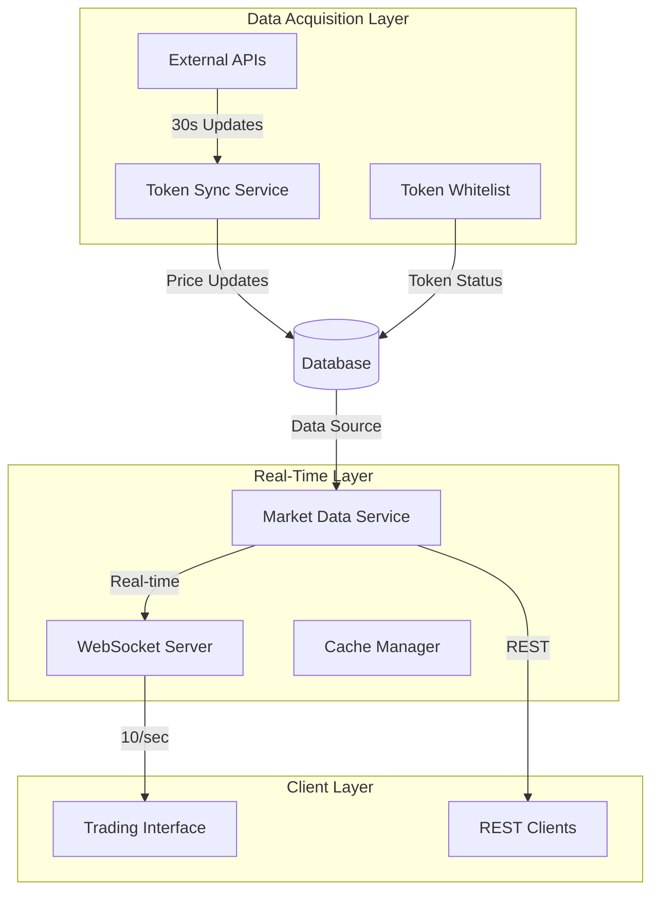
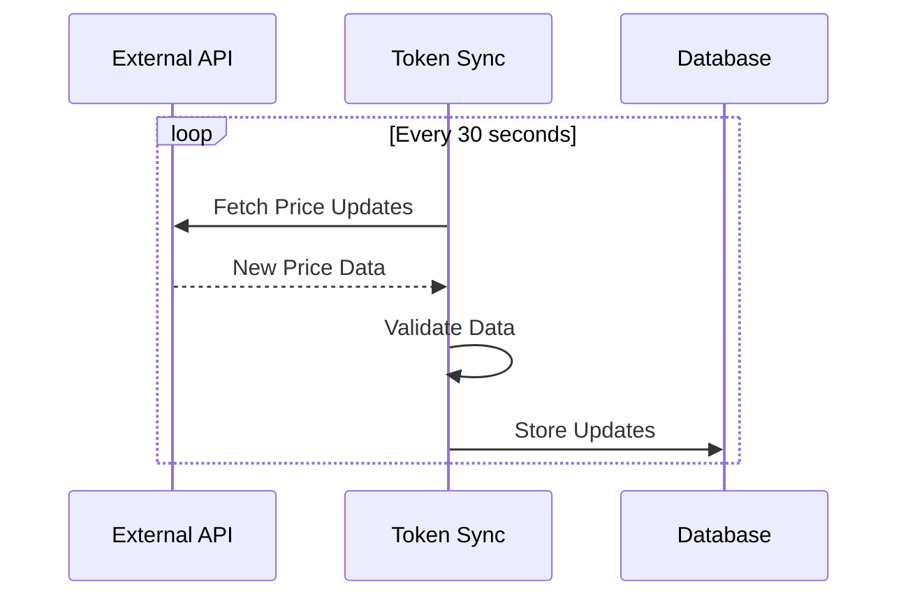
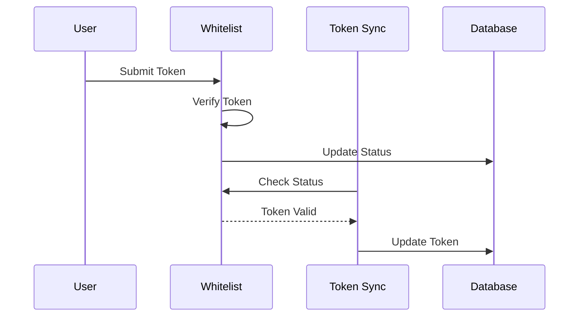
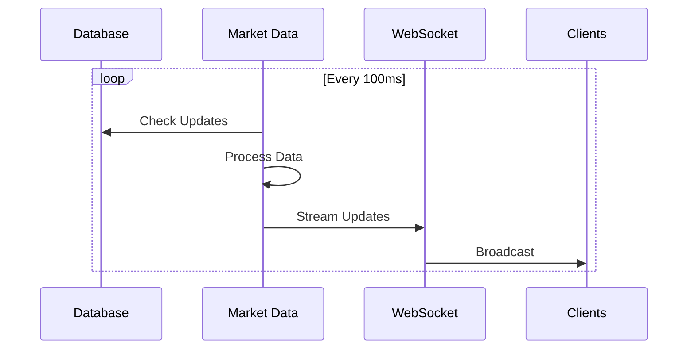
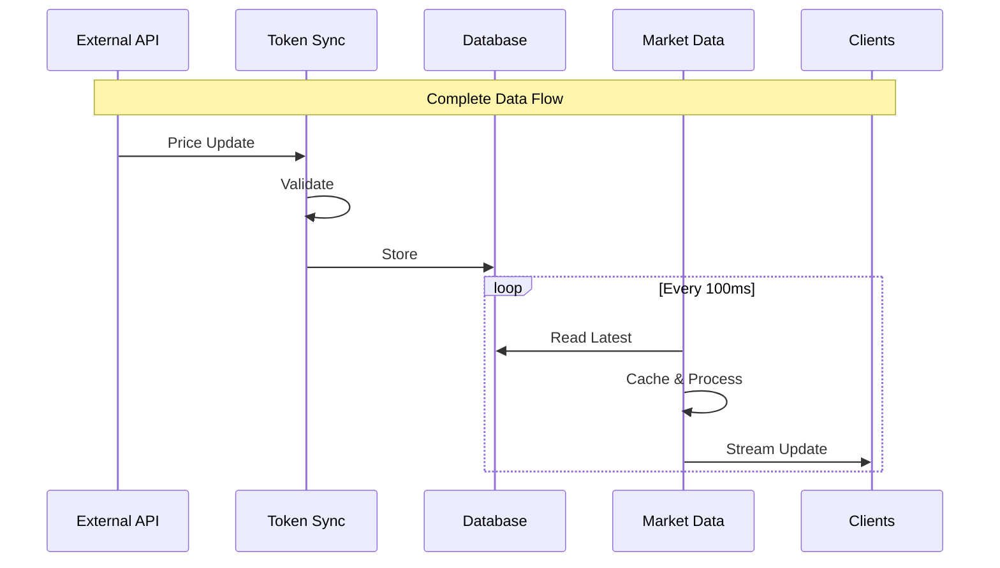
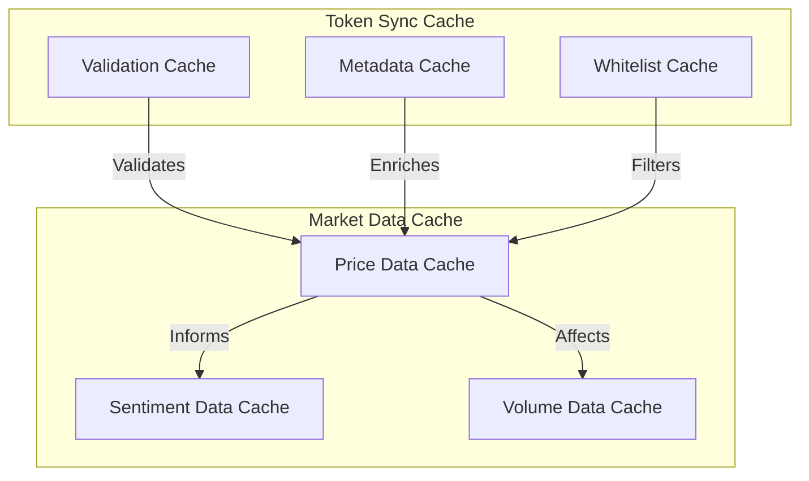
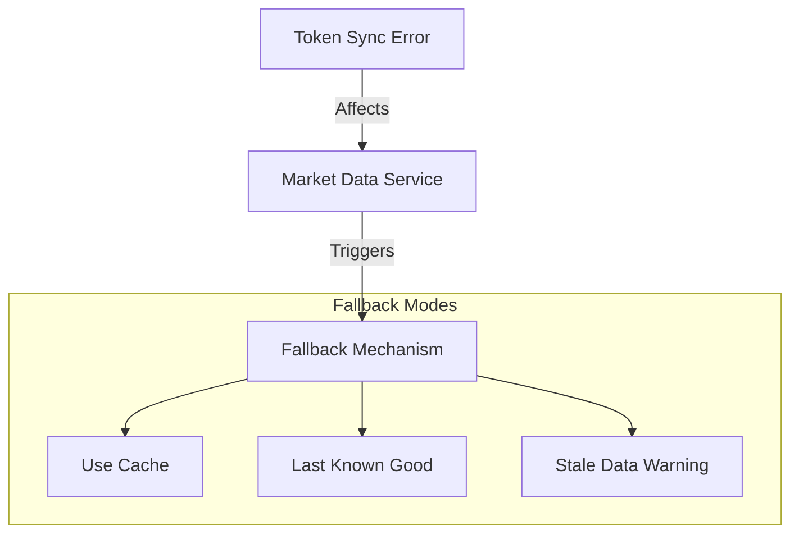
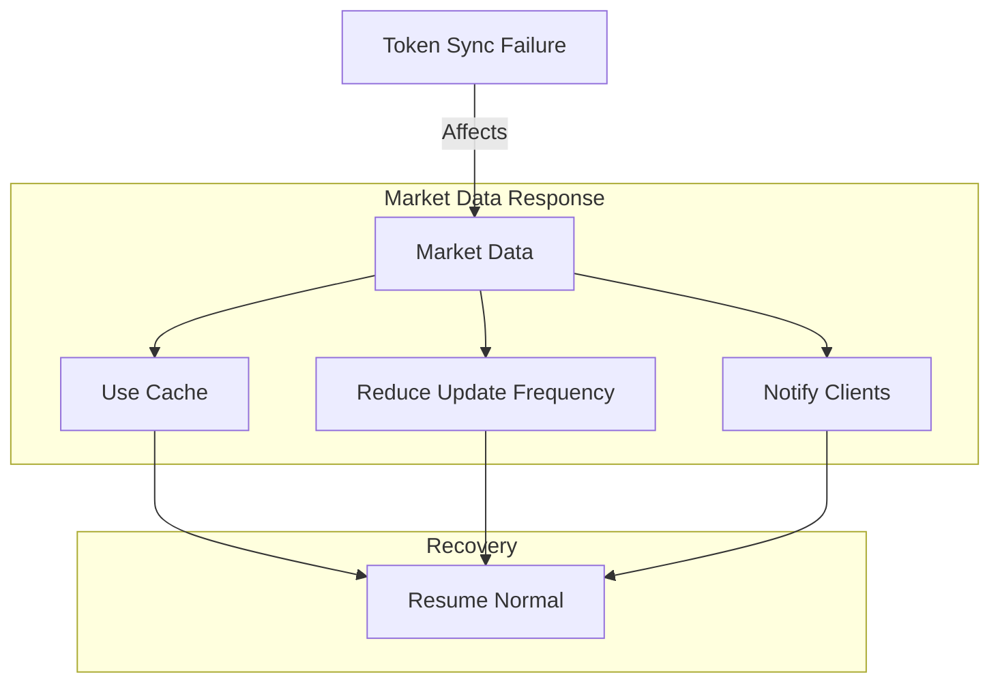

# Market Data Service Integration

## Service Relationships

The Market Data Service and Token Sync Service work together in a producer-consumer pattern to provide real-time market data to the DegenDuel platform.

### High-Level Integration


## Service Responsibilities

### Token Sync Service
- **Primary Role**: Data Acquisition & Storage


### Token Whitelist Service
- **Primary Role**: Token Validation & Management


### Market Data Service
- **Primary Role**: Real-Time Data Distribution


## Data Flow

### Price Update Flow


## Timing & Synchronization

### Update Frequencies
```javascript
{
    tokenSync: {
        priceUpdate: "30 seconds",
        metadataUpdate: "On change",
        validation: "Immediate"
    },
    marketData: {
        clientStreams: "100ms (10/sec)",
        cacheRefresh: "1 second",
        healthChecks: "1 minute"
    }
}
```

## Cache Coordination

### Cache Strategy


## Error Handling Coordination

### Error Propagation


## Performance Considerations

### Resource Sharing
```javascript
// Shared resource limits
{
    database: {
        maxConnections: 100,
        queryTimeout: 5000
    },
    cache: {
        maxSize: "1GB",
        cleanupInterval: "5 minutes"
    },
    network: {
        maxConcurrent: 200,
        timeout: 10000
    }
}
```

## Integration Points

### Database Schema Sharing
```sql
-- Shared tables
token_prices (
    id UUID PRIMARY KEY,
    token_id UUID REFERENCES tokens(id),
    price DECIMAL,
    updated_at TIMESTAMP,
    -- Used by all services
    last_sync_by VARCHAR(50),
    last_sync_at TIMESTAMP,
    is_whitelisted BOOLEAN DEFAULT false,
    whitelist_updated_at TIMESTAMP
)
```

### Cache Key Conventions
```javascript
// Shared cache key format
{
    price: `price:${symbol}:${timestamp}`,
    volume: `volume:${symbol}:${interval}`,
    sentiment: `sentiment:${symbol}:${timestamp}`
}
```

## Monitoring Integration

### Combined Health Metrics
```javascript
{
    dataHealth: {
        tokenSyncLatency: Number,
        marketDataLatency: Number,
        syncGap: Number  // Time between sync and distribution
    },
    cacheHealth: {
        tokenSyncHitRate: Number,
        marketDataHitRate: Number,
        sharedCacheSize: Number
    },
    systemLoad: {
        databaseLoad: Number,
        networkUtilization: Number,
        memoryUsage: Number
    }
}
```

## Failure Scenarios

### Cascading Failure Prevention


## Best Practices

### Service Coordination
1. **Data Consistency**
   - Token Sync is source of truth
   - Market Data provides real-time access
   - Whitelist Service manages token status
   - Coordinate cache invalidation

2. **Performance Optimization**
   - Share database connections
   - Coordinate cache cleanup
   - Balance resource usage

3. **Error Handling**
   - Coordinated circuit breakers
   - Shared fallback strategies
   - Unified error reporting

4. **Monitoring**
   - Cross-service metrics
   - End-to-end latency tracking
   - Combined health checks

### Deployment Considerations
1. **Service Order**
   - Token Sync must start first
   - Market Data depends on initial sync
   - Coordinate maintenance windows

2. **Scaling**
   - Scale services independently
   - Share resource limits
   - Maintain data consistency

3. **Updates**
   - Coordinate version compatibility
   - Plan for backward compatibility
   - Manage schema migrations

## Common Integration Issues

### Troubleshooting Guide

#### Data Synchronization Issues
**Symptoms:**
- Inconsistent prices
- Delayed updates
- Missing data

**Resolution:**
1. Check Token Sync status
2. Verify database connectivity
3. Review cache consistency
4. Monitor update frequencies

#### Performance Problems
**Symptoms:**
- High latency
- Cache misses
- Resource contention

**Resolution:**
1. Balance resource sharing
2. Optimize cache usage
3. Review update frequencies
4. Monitor system load

#### Communication Failures
**Symptoms:**
- Service disconnects
- Data gaps
- Inconsistent states

**Resolution:**
1. Check service health
2. Verify network connectivity
3. Review error logs
4. Test recovery procedures

---

*Last Updated: February 2024*
*Contact: DegenDuel Platform Team* 