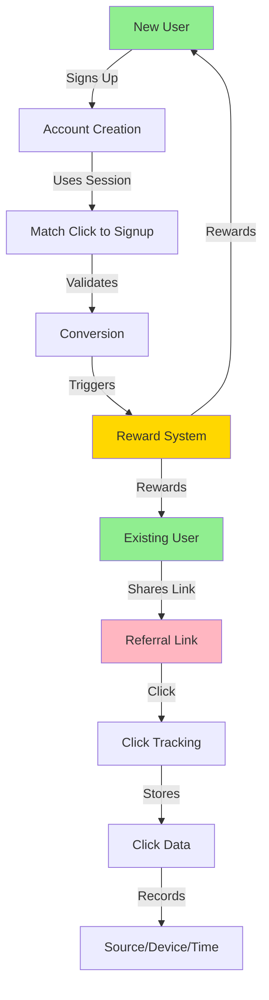
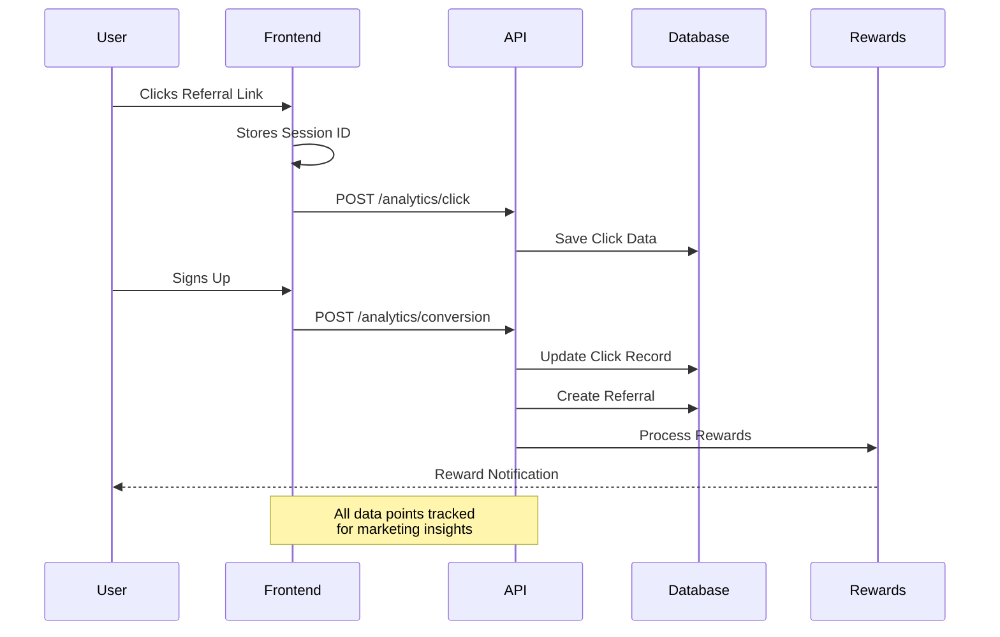

# DegenDuel Referral System

## Overview

DegenDuel's referral system is a comprehensive solution for tracking, analyzing, and rewarding user referrals. Think of it as a sophisticated tracking system that follows the entire journey of a user from the moment they click a friend's referral link to when they become an active user themselves.

### Simple Example
When Alice shares her referral link with Bob:
1. Bob clicks the link on Twitter
2. System tracks that click came from Twitter
3. Bob creates an account
4. Alice gets credit for referring Bob
5. Both Alice and Bob can earn rewards

### Referral Flow Visualization



### Data Collection Flow



## How It Works (Non-Technical)

### 1. The Referral Link
Think of a referral link as a special package that contains:
- Who shared it (the referrer)
- Where it was shared (Twitter, Discord, etc.)
- What campaign it's part of (if any)

### 2. Click Tracking
When someone clicks the link, we track:
- Where they came from (like clicking from Twitter vs. Discord)
- What device they're using (phone vs. computer)
- When they clicked
- A unique "session ID" (like a digital fingerprint)

This helps us understand:
- Which platforms bring the most users
- What times people are most likely to join
- Which devices our users prefer

### 3. Conversion Tracking
When someone creates an account:
- We match their signup to the original click
- This tells us how long people take to decide to join
- We can see which sources bring the most active users

## Core Features

### 1. Referral Code Generation
- Personalized codes based on username/nickname
- Fallback to random generation if needed
- Guaranteed uniqueness through collision handling
- Maximum length of 20 characters
- Uppercase format for consistency

### 2. Click Tracking
Captures detailed information about referral link clicks:
- Source of the click (direct, contest, profile)
- Landing page
- UTM parameters (source, medium, campaign)
- Device information
- Browser details
- IP address (for fraud prevention)
- User agent
- Session tracking
- Timestamp

### 3. Conversion Tracking
Monitors the entire referral journey:
- Click to signup conversion
- Qualification status
- Reward distribution
- Time to convert
- Session persistence

### 4. Analytics & Reporting
Provides comprehensive analytics:
- Click-through rates
- Conversion rates by source
- Device/browser statistics
- Geographic data
- UTM campaign performance
- Reward distribution metrics

## Technical Implementation

### Database Schema

#### Referrals Table
```sql
referrals {
  id               Int
  referrer_id      String
  referred_id      String
  referral_code    String
  status           ReferralStatus
  source           String?
  landing_page     String?
  utm_source       String?
  utm_medium       String?
  utm_campaign     String?
  device           String?
  browser          String?
  ip_address       String?
  user_agent       String?
  click_timestamp  DateTime?
  session_id       String?
  metadata         Json?
  created_at       DateTime
  qualified_at     DateTime?
  reward_paid_at   DateTime?
  reward_amount    Decimal?
}
```

#### Referral Clicks Table
```sql
referral_clicks {
  id              Int
  referral_code   String
  source          String
  landing_page    String
  utm_source      String?
  utm_medium      String?
  utm_campaign    String?
  device          String
  browser         String
  ip_address      String
  user_agent      String
  session_id      String
  timestamp       DateTime
  converted       Boolean
  converted_at    DateTime?
  referrer_id     String
}
```

### API Endpoints

#### 1. Track Referral Click
\`\`\`http
POST /api/referrals/analytics/click
Content-Type: application/json

{
  "referralCode": "USER123",
  "source": "twitter",
  "landingPage": "/contest/123",
  "utmParams": {
    "source": "social",
    "medium": "twitter",
    "campaign": "summer_2024"
  },
  "device": "mobile",
  "browser": "chrome",
  "sessionId": "uuid-v4"
}
\`\`\`

#### 2. Track Conversion
\`\`\`http
POST /api/referrals/analytics/conversion
Authorization: Bearer <token>
Content-Type: application/json

{
  "referralCode": "USER123",
  "sessionId": "uuid-v4"
}
\`\`\`

#### 3. Get Analytics
\`\`\`http
GET /api/referrals/analytics
Authorization: Bearer <token>

Response:
{
  "clicks": {
    "by_source": {
      "twitter": 50,
      "discord": 30
    },
    "by_device": {
      "mobile": 45,
      "desktop": 35
    },
    "by_browser": {
      "chrome": 40,
      "safari": 25
    }
  },
  "conversions": {
    "by_source": {
      "twitter": 10,
      "discord": 8
    }
  },
  "rewards": {
    "by_type": {
      "signup_bonus": "1000",
      "contest_bonus": "500"
    }
  }
}
\`\`\`

## Security Measures

### Rate Limiting
1. Click Tracking:
   - 100 requests per IP per 15 minutes
   - Prevents click spam and abuse

2. Conversion Tracking:
   - 10 attempts per IP per hour
   - Requires authentication
   - Prevents conversion fraud

### Data Protection
- IP addresses stored securely
- User agent data encrypted
- Session IDs using UUID v4
- HTTPS required for all endpoints

## Analytics Capabilities

### 1. Traffic Analysis
- Source attribution
- Campaign effectiveness
- Landing page performance
- Device/browser trends

### 2. Conversion Analysis
- Conversion rates by source
- Time to conversion
- Drop-off points
- Campaign ROI

### 3. Reward Analysis
- Total rewards distributed
- Reward types breakdown
- Average reward per referral
- Top referrers

## Best Practices

### For Frontend Implementation
1. Track clicks immediately when referral link is clicked
2. Store sessionId in localStorage
3. Pass sessionId during registration
4. Handle errors gracefully
5. Implement retry logic for failed requests

### For Marketing Teams
1. Use UTM parameters consistently
2. Create unique campaigns for different channels
3. Monitor conversion rates by source
4. A/B test landing pages
5. Track ROI by campaign

## Monitoring & Maintenance

### Performance Metrics
- API response times
- Database query performance
- Rate limit hits
- Error rates

### Data Integrity
- Regular data validation
- Duplicate detection
- Fraud pattern monitoring
- Data cleanup routines

## Future Enhancements

### Planned Features
1. Advanced fraud detection
2. Machine learning for conversion optimization
3. Real-time analytics dashboard
4. Enhanced reward algorithms
5. Multi-tier referral system

### Integration Opportunities
1. Social media automation
2. Email marketing integration
3. Discord bot integration
4. Wallet tracking integration

## Troubleshooting

### Common Issues
1. Rate limit exceeded
   - Solution: Implement exponential backoff
   - Prevention: Cache referral data

2. Missing conversion data
   - Solution: Check session persistence
   - Prevention: Implement redundant tracking

3. Analytics discrepancies
   - Solution: Cross-reference raw data
   - Prevention: Implement data validation

## Support

For technical support or feature requests:
1. Contact DevOps team via Discord
2. Submit GitHub issue
3. Email support@degenduel.me

## Conclusion

The DegenDuel referral system provides a robust foundation for tracking and analyzing user acquisition through referrals. Its comprehensive analytics capabilities enable data-driven decisions for marketing and growth strategies.

## Marketing Insights (For Non-Technical Teams)

### What You Can Learn
- Which social platforms bring the most users
- What times of day your links get the most clicks
- How many clicks it takes to get one signup
- Which campaigns are most successful
- What devices your users prefer

### Example Insights
```
Twitter Campaign Results:
- 1000 clicks led to 100 signups (10% conversion)
- Most clicks between 6-8pm
- 70% from mobile devices
- Average time to signup: 2.3 days
``` 