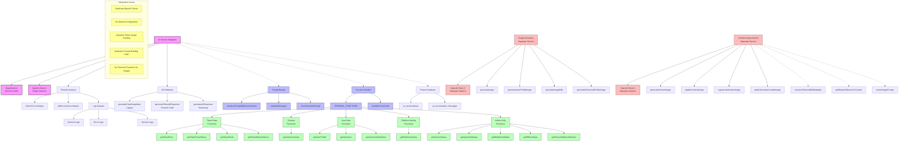

```mermaid
graph TD
    %% Main Component
    A[AI Service Singleton] --> B["BaseService<br/>(Service Suite)"]
    
    %% Core Components
    A --> M1[OpenAI Client 1<br/>Single Instance]
    A --> C[Periodic Analysis]
    A --> D[API Methods]

    %% Analysis Components
    C --> C1[Client Error Analysis]
    C --> C2[Admin Actions Analysis]
    C --> C3[Log Analysis]
    C3 --> C3A[General Logs]
    C3 --> C3B[Error Logs]
    C3 --> C3C[Service Logs]

    %% API Methods
    D --> D1[generateChatCompletion<br/><i>Legacy</i>]
    D --> D2[generateTokenAIResponse<br/><i>Function Calls</i>]
    D --> D3[generateAIResponse<br/><i>Streaming</i>]

    %% Utility Components
    A -.-> U1[Prompt Builder]
    U1 --> U1A[enhancePromptWithUserContext]
    U1 --> U1B[sanitizeMessages]
    U1 --> U1C[ensureSystemPrompt]

    A -.-> U2[Function Handler]
    U2 --> U2A[TERMINAL_FUNCTIONS]
    U2 --> U2B[handleFunctionCall]

    %% Database Integration
    A -.-> DB[Prisma Database]
    DB --> DB1[ai_conversations]
    DB --> DB2[ai_conversation_messages]

    %% Token Functions
    U2A --> F1[Token Data<br/>Functions]
    F1 --> F1A[getTokenPrice]
    F1 --> F1B[getTokenPriceHistory]
    F1 --> F1C[getTokenPools]
    F1 --> F1D[getTokenMetricsHistory]

    U2A --> F2[Contest<br/>Functions]
    F2 --> F2A[getActiveContests]

    U2A --> F3[User Data<br/>Functions]
    F3 --> F3A[getUserProfile]
    F3 --> F3B[getTopUsers]
    F3 --> F3C[getUserContestHistory]

    U2A --> F4[Platform Activity<br/>Functions]
    F4 --> F4A[getPlatformActivity]

    U2A --> F5[Admin-Only<br/>Functions]
    F5 --> F5A[getServiceStatus]
    F5 --> F5B[getSystemSettings]
    F5 --> F5C[getWebSocketStats]
    F5 --> F5D[getIPBanStatus]
    F5 --> F5E[getDiscordWebhookEvents]

    %% Image Generator (Separate)
    IMG[Image Generator<br/><i>Separate Service</i>] --> M2[OpenAI Client 2<br/>Separate Instance]
    IMG --> IMG1[generateImage]
    IMG --> IMG2[generateUserProfileImage]
    IMG --> IMG3[generateImageEdit]
    IMG --> IMG4[generateEnhancedProfileImage]

    %% Contest Image Service (Separate)
    CIS[Contest Image Service<br/><i>Separate Service</i>] --> M3[OpenAI Client 3<br/>Separate Instance]
    CIS --> CIS1[generateContestImage]
    CIS --> CIS2[updateContestImage]
    CIS --> CIS3[regenerateContestImage]
    CIS --> CIS4[getOrGenerateContestImage]
    CIS -.-> CIS5[enhanceTokensWithMetadata]
    CIS -.-> CIS6[getRelatedTokensForContest]
    CIS -.-> CIS7[createImagePrompt]

    %% Integration Issues
    subgraph "Integration Issues"
        I1[Duplicate OpenAI Clients]
        I2[No Shared Configuration]
        I3[Separate Token Usage Tracking]
        I4[Duplicate Prompt Building Logic]
        I5[No Terminal Functions for Images]
    end

    %% Color styling
    classDef core fill:#f9f,stroke:#333,stroke-width:2px;
    classDef util fill:#bbf,stroke:#333,stroke-width:1px;
    classDef func fill:#bfb,stroke:#333,stroke-width:1px;
    classDef separate fill:#fbb,stroke:#333,stroke-width:2px,stroke-dasharray: 5 5;
    classDef issue fill:#ff9,stroke:#333,stroke-width:1px,stroke-dasharray: 3 3;

    class A,B,M1 core;
    class U1,U2,U1A,U1B,U1C,U2A,U2B util;
    class F1,F2,F3,F4,F5,F1A,F1B,F1C,F1D,F2A,F3A,F3B,F3C,F4A,F5A,F5B,F5C,F5D,F5E func;
    class IMG,CIS,M2,M3 separate;
    class I1,I2,I3,I4,I5 issue;
```