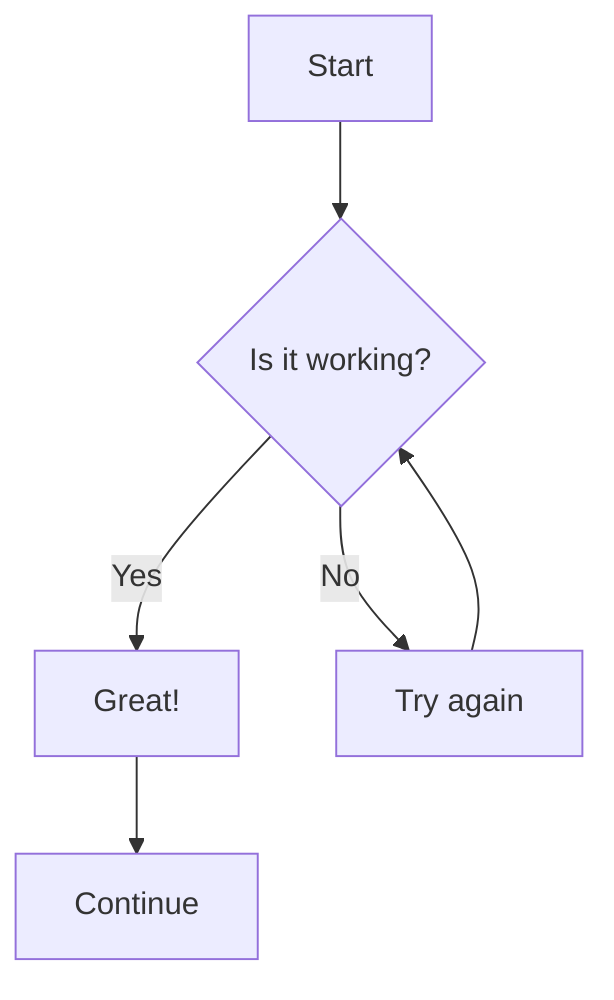
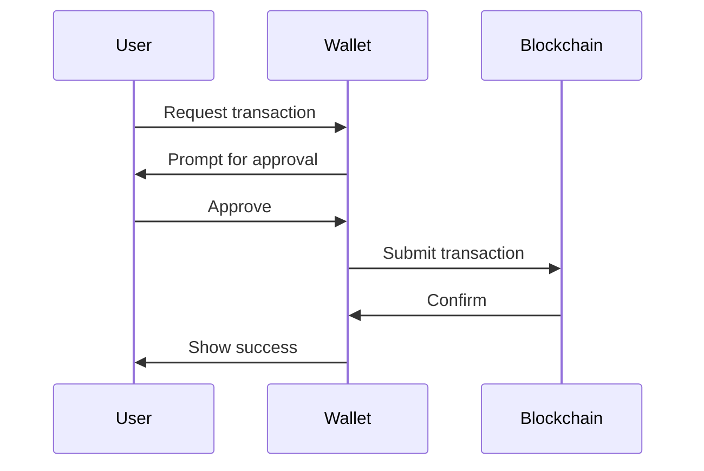
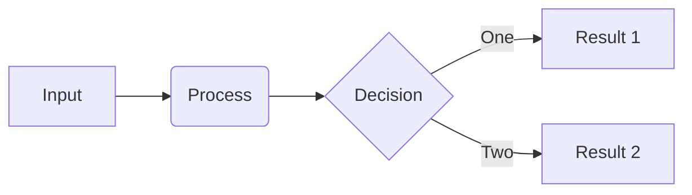

# Mermaid Example

Here's a simple diagram:

```mermaid
graph TD
    A[Start] --> B{Is it working?}
    B -->|Yes| C[Great!]
    B -->|No| D[Try again]
    C --> E[Continue]
    D --> B
```

Here's a sequence diagram:

```mermaid
sequenceDiagram
    participant User
    participant Wallet
    participant Blockchain
    
    User->>Wallet: Request transaction
    Wallet->>User: Prompt for approval
    User->>Wallet: Approve
    Wallet->>Blockchain: Submit transaction
    Blockchain->>Wallet: Confirm
    Wallet->>User: Show success
```

Here's a flowchart:

```mermaid
flowchart LR
    A[Input] --> B(Process)
    B --> C{Decision}
    C -->|One| D[Result 1]
    C -->|Two| E[Result 2]
```